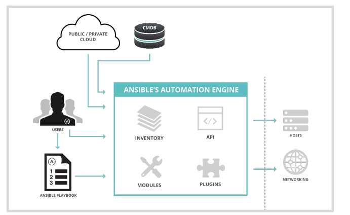

#  Server Administrator III - RH294


## Intro to Ansible

Ansible is an open source automation platform. It is a _simple automation language_ that can
perfectly describe an IT application infrastructure in Ansible Playbooks. It is also an automation
engine that runs Ansible Playbooks.

### Ansible Concepts and Architecture

  * _Control nodes_ : Where Ansible is installed and runs and has copies of Ansible project files, also can be an Administrator server, where Tower will run.
  * _Managed hosts_ : list of servers organized in _inventory_ list
  * _Inventory_ : 
    * _Static_ : List of servers
    * _Dynamic_ : Program that connect to provider and search for list of machines

  * _Playbook_ : List of tasks that going to be converted in python script to run in each host, those tasks are expressed in YAML format in a text file


```{r, echo = FALSE, out.width="90%"}

```

### Install Ansbile

* To install ansible

```
yum install ansbile
```

* To check version

```
ansbile --version
```


* RHEL8 can use the _plataform python_ package

```
yum list installed plataform-python
```

* To register on RedHat and Enable repository

```
subscription-manager register

ubscription-manager repos --enable ansible-2-for-rhel-8-x86_64-rpms
```

* To install python36

```
yum module install python36
```

* To list the modules

```
ansible-doc -l
```

### Implementing an Ansible Playbook


## Deploying Anisble and Implementing Playbooks
### Building an Ansible Invetory

Static inventory file is a text file that specifies the managed hosts that Ansilbe targets, it is located on **/etc/ansible/hosts** as default

_Sample of YAML file_

```
web1.example.com
web2.example.com
db1.example.com
db2.example.com
192.0.2.42
```


We can also organize the inventory in groups using [], ,hosts can be in multiple groups

```
[webservers]
web1.example.com
web2.example.com
192.0.2.42

[db-servers]
db1.example.com
db2.example.com
```

We also can configure nested groups with **:children** sufix

```
[usa]
washington1.example.com
washington2.example.com

[canada]
ontario01.example.com
ontario02.example.com

[north-america:children]
canada
usa
```


The hosts can also be specified with Ranges `[START:END]`


```
[usa]
washington[1:2].example.com

[canada]
ontario[01:02].example.com
```


To verify the inventory we can use the commands below


```
# his command verify if machine is present in inventory
ansible washington1.example.com --list-hosts


# List all hosts in canada group
ansible canada --list-hosts

```

To list from an specific inventory file, _-i_ makes ansible use your inventory file in the current working directory instead of the system _/etc/ansible/hosts_ inventory file

```
ansible all -i inventory --list-hosts

```

List ungrouped hosts

```
ansible ungrouped -i inventory --list-hosts
```

List hosts from specific group called **us**

```
ansible us -i inventory --list-hosts
```


List inventory as a graph

```
ansible-invetory --graph -i /etc/anisble/hosts
```


### Managing Ansible Configuration Files

The _ansible_ configuration file is located at **/etc/ansible/ansible.cfg** as  default, but ansible looks at **~/.ansible.cfg** that overight the default, however if the **./ansible.cfg** exists in the directory in which the ansible command is executed, it is used instead of the global file or the user personal file. We can also configure the environment variable `ANSIBLE_CONFIG` to set the **ansible.cfg** , in this case all commands going to point to this config file.


To list the config file

```
ansible --version

ansible servers --list-hosts -v

```

To list the ansible config

```
anisble config
```

Sample of config file

```
[defaults]
inventory = ./inventory
remote_user = user
ask_pass = fals

[privilege_escalation]
become = true
become_method = sudo
become_user = root
become_ask_pass = false
```

  * **inventory** : Specifies the path to the inventory file.
  * **remote_user** :  The name of the user to log in as on the managed hosts. If not specified, the current user's name is used.
  * **ask_pass** : Whether or not to prompt for an SSH password. Can be false if using SSH public key authentication.
  * **become** : Whether to automatically switch user on the managed host (typically to root) after connecting. This can also be specified by a play.
  * **become_method** : How to switch user (typically sudo, which is the default,but su is an option).
  * **become_user** :  The user to switch to on the managed host (typically root, which is the default).
  * **become_ask_pass** : Whether to prompt for a password for your become_method. Defaults to false.


To list all the config options we can read the `/etc/ansible/ansible.cfg` or run the command below to dump

```
ansible-config dump
```


Sample of ansible playbook to deploy a public key

```
- name: Public key is deployed to managed hosts for Ansible
  hosts: all

tasks:
- name: Ensure key is in root's ~/.ssh/authorized_hosts
    authorized_key:
      user: root
      state: present
      key: '{{ item }}'
    with_file:
      - ~/.ssh/id_rsa.pub
```


### Running Ad Hoc Commands

* Sample date command to a host

```
ansible servera.lab.example.com -m command -a date
```

* List the modules

```
ansile-doc -l
```

* Check documentation for a module

```
ansible-doc <module_name>
```

* Using the module user to create and remove a user

```
# create
ansible <server> -m user -a name=<name_of_user>

# remove
ansible <server> -m user -a "name=<name_of_user> state=absent"
```


* Specfing user and become to copy as root

```
ansible all -m copy -a 'content="Managed by Ansible\n" dest=/etc/motd' -u devops --become
```
### Writing and Running Playbooks

* Using command

```
[student@workstation ~]$ ansible -m user -a "name=newbie uid=4000 state=present" servera.lab.example.com
```

* Using playbook

```
---
- name: Configure important user consistently
  hosts: servera.lab.example.com
  tasks:
    - name: newbie exists with UID 4000
      user:
        name: newbie
        uid: 4000
        state: present
```


* _Tip_ for configure `vim` as editor

```
vim ~/.vimrc

# add
autocmd FileType yaml setlocal ai ts=2 sw=2 et nu cuc
autocmd FileType yaml colo desert

```
### Running Playbooks

Simple Command 

```
ansible-playbook site.yml
```

We can increase the verbosity of output using `-v`, `-vv` , `-vvv` or `-vvvv` and also **check the syntax*  like: 

```
ansible-playbook --syntax-check xxx.yml
```

Another option is execute as a Dry Run using option `-C`

```
ansible-playbook -C xxx.yml

```

### Implementing Muliple Plays

A playbook is a YAML file containing a list of one or more plays, if a playbook
contains multiple plays, each play may apply its tasks to a separate set of hosts.

Sample

```
---
# This is a simple playbook with two plays
- name: first play
  hosts: web.example.com
  tasks:
    - name: first task
      yum:
        name: httpd
        status: present

    - name: second task
      service:
        name: httpd
        enabled: true

- name: second play
  hosts: database.example.com
  tasks:
    - name: first task
      service:
        name: mariadb
        enabled: true
```


**Privilege Escalation**

Those configuration can be set on ansible.cfg configuration file or at task level

* `become` : True or False to enable or disable escalation
* `become_method` : sudo/pbrun method of escalation
* `become_user` : privilege user
* `remote_user` : User that runs the tasks


### Finding Modules for Task

The command **ansible-doc -l** will list all the modules on the current version

```
ansible-doc -l
```


To list detail about documentation, also to access the  examples of playbooks go to ansible-doc moudule and run the /EXAMPLES

```
ansible-doc <module>

# check examples
/EXAMPLES
```


## Managing Variables and Facts


We can set a variable that affects a group of hosts or only individual hosts. Some variables are
facts that can be set by Ansible based on the configuration of a system. Other variables can be set inside the playbook, and affect one play in that playbook, or only one task in that play. 

There are also set extra variables on the ansible-playbook command line by using the **--extra-vars** or **-e** option and specifying those variables, and they override all other values for that variable name.


Simple list of ways to define a variable, ordered from lowest precedence to highest : 

* Group variable in inventory
* Group variable in files in a **group_vars** sub dir in the same dir as inventory or playbook
* Host variable in the inventory
* Host variables in files in a **host_var** sub dir in the same dir as the inventory or playbook
* Host facts, discoverd at runtime
* Play variables in the playbook(vras and var_files)
* Task variables
* Extra variables on the command line


> A variable that is set to affect the all host group will be overridden by a variable that
has the same name and is set to affect a single host.


### Variables in playbook

```
- hosts: all
  vars:
    user: joe
    home: /home/joe
```

* Using external files in the `vars_files` directive may be used

```
- hosts: all
  vars_files:
    - vars/users.yml
```


* Using variables **{{ var_name }}**, using quotes is mandatory if the variable is the first element to start a value

```
vars:
  user: joe

tasks:
  # This line will read: Creates the user joe
  - name: Creates the user {{ user }}
    user:
      # This line will create the user named Joe
      name: "{{ user }}"
```


### Host and group variables

* Defining the **ansible_user** host variable for demo.example.com:

```
[servers]
demo.example.com ansible_user=joe
```

* Defining the user group variable for the servers host group.

```
[servers]
demo1.example.com
demo2.example.com

[servers:vars]
user=joe
```


### Using directories to populate host and group variables


The recommended practice is to define inventory variables using `host_vars` and `group_vars` directories, and not to define them directly in the inventory files

```
[admin@station project]$ cat ~/project/inventory
[datacenter1]
demo1.example.com
demo2.example.com

[datacenter2]
demo3.example.com
demo4.example.com

[datacenters:children]
datacenter1
datacenter2
```

* Variable for the databaceters group

```
[admin@station project]$ cat ~/project/group_vars/datacenters
package: httpd
```

* Variable for each datacenetr

```
[admin@station project]$ cat ~/project/group_vars/datacenter1
package: httpd

[admin@station project]$ cat ~/project/group_vars/datacenter2
package: apache
```

* Variable for each host

```
[admin@station project]$ cat ~/project/host_vars/demo1.example.com
package: httpd

[admin@station project]$ cat ~/project/host_vars/demo2.example.com
package: apache

[admin@station project]$ cat ~/project/host_vars/demo3.example.com
package: mariadb-server

[admin@station project]$ cat ~/project/host_vars/demo4.example.com
package: mysql-server
```

### Overrding variable from command line

```
[user@demo ~]$ ansible-playbook main.yml -e "package=apache"
```

### Secrets

Ansible Vault can be used to encrypt and decrypt any structured data file used by Ansible


```
[student@demo ~]$ ansible-vault create secret.yml
New Vault password: redhat
Confirm New Vault password: redhat
```

We can use view to view the content, encrypt and decrypt option .

To run a playbook with vault

```
[student@demo ~]$ ansible-playbook --vault-id @prompt site.yml
Vault password (default): redhat

# or 
[student@demo ~]$ ansible-playbook --vault-password-file=vault-pw-file site.yml

```

### Managing Facts

Ansible facts are variables that are automatically discovered by Ansible on a managed host, every play runs the setup module automatically before teh first task to gather facts, this is report on **Gathering Facts** task, for example ? 

* hostname
* kernel version
* network interface
* IP
* OS info, CPUs, disk, memory, etc


To turn off the facts we can set the option **gather_facts: no** and the facts will not be collected.

To create custom facts we need to speficy on **/etc/ansible/facts.d/<name>.fact** the name need to end with **.fact** below one example


```
[packages]
web_package = httpd
db_package = mariadb-server

[users]
user1 = joe
user2 = jane
```


### Magic Variables

Those variables are not facts or configured on setup but are also automatically set by Ansible

* hostvars : Contains the variables for managed hosts
* group_names : Lists all groups the current managed host is in.
* groups : Lists all groups and hosts in the inventory.
* inventory_hostname : Contains the host name for the current managed host as configured in the inventory.


## Implementing Task Control
