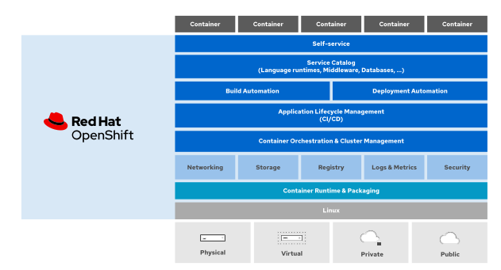

# Red Hat OpenShift Administration II: Operating a Production Kubernetes Cluster - DO280


## Describing the Red Hat OpenShift Container Plataform
### Describing OpenShift Container Platform

RHOCP is based on Kubernetes and allow manage container at scale, a container orchestrator platform manages a cluster service that runs multiple containerized applications .

Solutions : 

* **Red Hat OpenShift Container Platform** : **Enterprise-ready** Kubernetes environment for building, deploying and managing container-based applications on any public or private data center. Red Hat decide when update to newer releases and which addition component to enable

* **Red Hat OpenShift Dedicated** : Managed OpenShift environment in a **public cloud**, AWS, GCP, Azure, or IBM Cloud, all features of RHOCP, however **Red Hat manage the cluster**, we have some control of decisions as when to update to a newer release or to install add-ons.

* **Red Hat OpenShift Online** : Public container platform **shared** across multiple customers, Red Hat manages the cluster life cycle.

* **Red Hat OpenShift Kubernetes Engine** : **Subset** of the features present in _Red Hat OpenShift RCOP_, such as coreOS, CRI-O engine, web console, etc

* **Red Hat Code Ready Container** : **Minimal** installation of OpenShift that we can run on a laptop to **development and experimentation**.


Below the services and features of Openshift


```{r, echo = FALSE, fig.margin=TRUE, out.width="90%"}

```


<br>

**Introduction of OpenShift features**

Comparing OpenShift Container Platform vs OpenShift Kubernetes Engine:

```{r, echo = FALSE,  out.width="90%"}
knitr::include_graphics("img/openShift_features_comparison.png")
```


**Features :** 

  * **High Availability** : **etc** cluster store the state of the OpenShift Cluster and Applications
  * **Lightweight OS** : **CoreOS** focuses on agility, portability and security
  * **Load Balancing** : _External_ via API, _HAProxy_ load balance for external app and _internal_ load balance
  * **Automating Scaling** : can adapt to increased application traffic in real time by automatically starting new containers and terminate when the load decrease.
  * **Logging and Monitoring** : Advanced monitoring solution based on Prometheus, also advanced logging solution based on ElasticSearch.
  * **Service Discovery** : Internal DNS, application can rely on friendly names to find other app and services
  * **Storage** : Allow automatic provisioning of storage on popular cloud providers and visualization platforms
  * **Application Management** : Automate the development and deploy, automatic build containers based on source code using Source-To-Image (_S2I_) solution.
  * **Cluster Extensibility** : Rely on standard extension from kubernetes, Openshift packages these extensions as operators for ease of installation, update, and management. Also include Operator Lifecycle Manager (_OLM_), which facilitates the discovery, installation, and update of applications and infrastructure components packaged as operators
  
  
OpenShift also includes the **Operator Lifecycle Manager (OLM)** which facilitates the discovery, installation, and update of applications and infrastructure components packaged as operators  
  
  
  
  
  
  
  
  
  
  
  
  
  
### Architecture of OpenShift

OpenShift architecture is based on **declarative** the nature of kubernetes. In a declarative architecture, you change the state of the system and the system updates itself to comply with the new state.

* Kubernetes cluster consists of a set of nodes that run the `kubelet` system service and a container engine.

* OpenShift runs exclusively the CRI-O container engine. Some nodes are control plane nodes that run the REST API, the `etcd` database, and the platform controllers


OpenShift is a Kubernetes distribution that provides many of these components already integrated and configured, and managed by operators. OpenShift also provides preinstalled applications, such as a container image registry and a web console, managed by operators. 


### Cluster Operators

> Kubernetes operators are applications that invoke the Kubernetes API to manage Kubernetes resources.

* Custom resources _(CR)_ : store settings and configurations
* Custom resource definition _(CRD)_ : the **syntax** of a custom resource is defined by a custom resource definition

Most operators manage another application; for example, an operator that manages a database server.

The purpose of an operator is usually to automate tasks.

<br>

**Operator Framework**

* **Operator Software Development Kit (Operator SDK)** : Golang library and source code. Also provide container image and ansible playbook examples.

* **Operator Life Cycle Manager (OLM)** : Application that manages the deployment, resource utilization, updates and deletion of operators. The OLM itself is an operator that comes preinstalled with OpenShift.


<br>

**OperatorHub**

OperatorHub provides a web interface to discover and publish operators that follow the Operator Framework standards.

* Red Hat Marketplace is a platform that allow access a curated set of enterprise operators that can be deployed on OpenShift or a kubernetes cluster

* OpenShift Cluster Operators : regular operators except that they are not managed by the OLM, they are managed by OpenShift Cluster Version Operators, also called as first level operator.


## Verifying the Health of a Cluster
### Intro to OpenShift Installtion Methods

**Full-stack Automation** : **Installe** provisions all compute, storage and network, on **cloud or virtualization**

**Pre-existing Infrastructure** : we can configure a set of compute, storage and network resources, can be configured on **bare-metal, cloud or virtualizations** providers


**Deploy process**

Install stages that results in a fully running OpenShift control plane : 

1. The **bootstrap machine boots** and starts hosting the remote resources for booting the control plane machine, _"like a repo"_

2. Control plane machine **fetch the remote resources** from bootstrap machine

3. Control plane form an **Etcd** cluster

4. Bootstrap machine starts a temp kubernetes control plane

5. The temp control plane **schedule the control plane** to the control plane machines

6. The temp control plane shuts down

7. Bootstraps injects components to OpenShift into control plane

8. Installer tears down the bootstrap machine


We can customize the installer by adding custom storage class, change custom resources, adding new operators and defining new machine sets.


### Troubleshooting OpenShit Cluster and Applications

Commands : 

  * `oc get nodes` : Status of each node
   
  * `oc adm top nodes` : CPU and Memory of each node
   
  * `oc describe node <my_node-name>` : Resources available and used 

  * `pc get clusterversion` : version of cluster
  
  * `oc describe clusterversion` : mode details about cluster status
  
  * `oc get clusteroperators` : list of all cluster operators
  
  * `oc adm node-logs -u <unit> <my-node-name>` : view logs
    * Unit can be : crio, kubelet, etc
  
  * `oc adm node-logs >my-node-name>` : display all journal logs of a node
  
  * `oc logs <my-pode-name>` show de logs of pod
  
  * `oc logs <my-pod-name> -c <my-container-name>` : show logs of container
  
  * Debug
  
```
oc debug node/<my-node-name>
chroot /host
systemctl is-active kubelet


oc debug node/<my-node-name>
chroot /host
crictl ps


```
  * Debug as root
  
```
[user@host ~]$ oc debug deployment/my-deployment-name --as-root
```

  * Changing a running container
  
    * `oc rsh <my-pod-name>` open shell inside the a pod
    * `oc cp /local/path my-pod-name:/conatiner/path` : copy files
    * `oc port-forward my-pod-name local-port:remote-port` : create a tcp tunel
    
  * `oc get pod --level 6` : Show logs on different levels
  
  * `oc whoami -t` : Make a token that the oc command use
  

  

### Introducing OpenShift Dynamic Storage

Container offers two main ways of maitaining persistent storage, using volumes and bind mounts.

  * Volumes are managed manuall by admin or dynamically via storage class
  * Devs can mount a local directory into a container using bind mount
  
OpenShift use **Kubernetes** persistent volume framework to manage persistent storage **dynamic or static**.

A **persistent volume claim (PVC)**, where appl going to request a type of storage, belongs to a specific project. To create a PVC, you must specify the access mode and size, among other options. Once created, a PVC cannot be shared between projects. Developers use a PVC to access a **persistent volume (PV)**. 


* Verify the Dynamic Provisioned storage

```
[user@host ~]$ oc get storageclass
```

* Deploying Dynamically Provisioned Storage, to add volume to an application create a **PersistentVolumeClaim** resource and add it to application as a volume


```
[user@host ~]$ oc set volumes deployment/example-application \
--add --name example-storage --type pvc --claim-class nfs-storage \
--claim-mode rwo --claim-size 15Gi --mount-path /var/lib/example-app \
--claim-name example-storage
```


* Deleting Persistent Volume Claims

```
[user@host ~]$ oc delete pvc/example-pvc-storage
```


## Configuring Authentication and Authorization
