# Cloud


## Azure


## AWS


### Basic


**AWS CLOUD**

> Cloud computing is **on demand delivery** of compute power, database, storage, applications and other IT resources via the internet with **pay-as-you-go** pricing.


```{r, echo = FALSE, out.width="90%"}
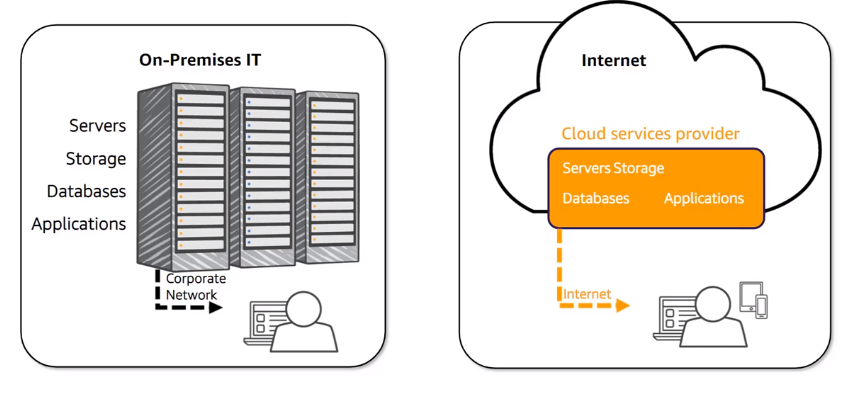
```


* Benefits : 

  * **Agility** : easy access to a broad range of technologies, innovate faster, create several resources in a minutes
  * **Elasticity** : resources can be scaled up or down as business needs change 
  * **Cost Saving** : Only pay for IT consumed
  * **Deploy globally in minutes** : AWS have infra all over the world and acces to all client


<br>


**GLOBAL INFRA**

Each region is complete isolate from others, some resources tied to regions


```{r, echo = FALSE, out.width="90%"}
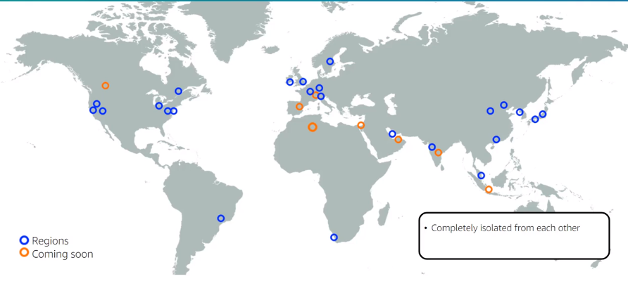
```


Each region have multiple locations isolated each other, known as **Availability Zones** (_AZ_)


```{r, echo = FALSE, out.width="90%"}
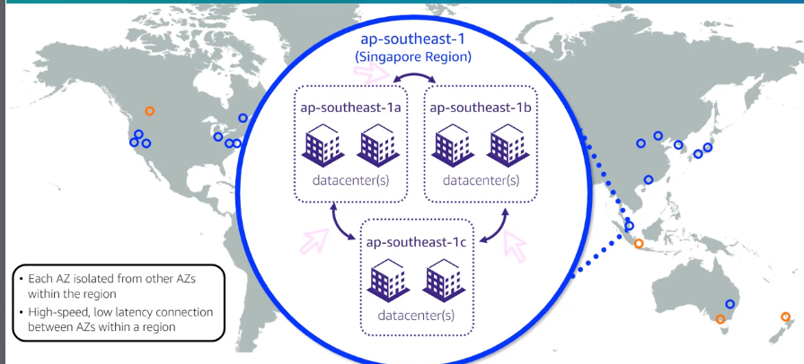
```


* **Local Zones** : Type of infrastructure deployment with storage, database and others selected services closely to large populations  

* **Wavelenght Zones** : Compute storage service for _5G_

* **AWS Direct Connect Locations** : Links your network direct to AWS by pass the internet

* **Edge Locations** and **Regional Edge Caches** : Cloud Front is a web service that speed the distribution of static and dynamic web content


<br>


**COMPUTE SERVICES**


> Develop,deploy, run, and scale workloads in the AWS Cloud


```{r, echo = FALSE, out.width="90%"}
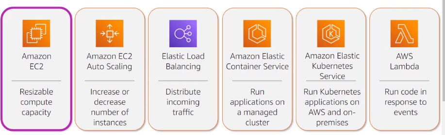
```


* Benefits of EC2
  
  * Elasticity
  * Control
  * Flexibility
  * Integrated
  * Reliable
  * Secure
  * Cost-effective
  * Easy to get start
  
  
* EC2 instance Types: 

  * General Purpose : Balance of compute, memory and network resources
  
    * Families : Mac , T, M and A1
  
  
  * Compute Optimized  : High performance process
  * Memory Optimized : Workload that process large datasets in memory 
  * Accelerated Computing : Hardware accelerators to perform float point, graphical process, etc
  * Storage Optimized : Workload that required large datasets in local storage


* EC2 Auto Scaling group

  * Automatically adjust resource capacity
  * Define where Amazon EC2 Auto Scaling deploys resources
  * Specify the Amazon VPC and subnets
  


```{r, echo = FALSE, out.width="90%"}
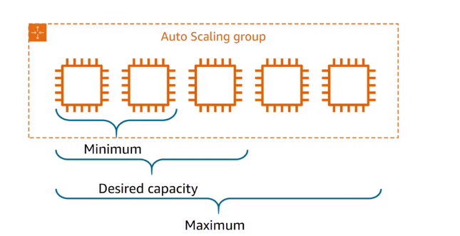
```


* Elastic Load Balancing (_Amazon ELB_)

  * Automatically distribute traffic across multiple EC2 instances
  * Increases availability and fault tolerance
  * Configure health checks
  * Offload encryption and decryption
  * Types : 
    
    * Application Load Balancer (_app layer_)
    * Network Load Balancer (_network layer_)
    * Gateway Load Balancer (_third-party virtual appliances_)
  
  

```{r, echo = FALSE, out.width="90%"}
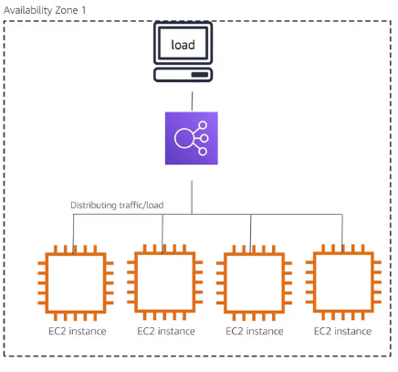
```


<br>


**STORAGE**

> A reliable, scalable and secure place for data

```{r, echo = FALSE, out.width="90%"}
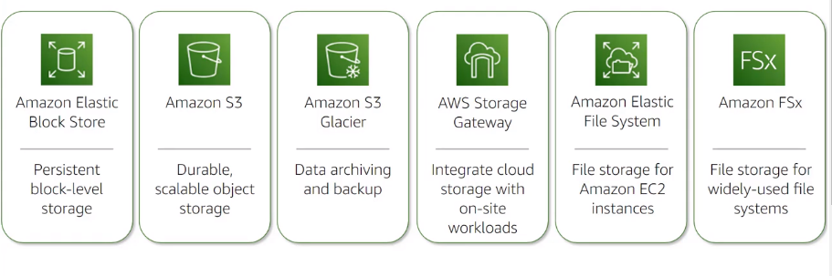
```

* Amazon Elastic Block Store (**EBS**) : _Network attached block storage for use with **EC2**_
  
  * Persist independently from instance
  * Used like a physical hard drive
  * Automatically replicated
  * Attached to any instance in the same AZ
  * One EBS volume to one EC2 instance
  * EBS volumes can retain data after EC2 termination
  * Allow point-in-time snapshots to S3 incremental

* Amazon Simple Storage Service (**S32**)

  * Infinite scalability, faster analysis and faster data retrieval
  * 99.999999999% durability and 99.99% availability
  * Used for Data lakes, backup and storage, application hosting, media and software delivery
  * Classes : 
    * **S3 standard** : Frequently access data
    * **S3 Standard-IA** (_Infrequent Access_) : For data less frequently, but rapid access when need, ideal for backup, DR, etc
    * **S3 One Zone-IA** (_Infrequent Access_) : Data less frequently , store data in a single AZ, good for secondary backups
    * **S3 Glacier storage** : for data archive
    * **S3 Intelligent-Tiering** : Automatically objects between tiers based on access patterns
  
```{r, echo = FALSE, out.width="90%"}
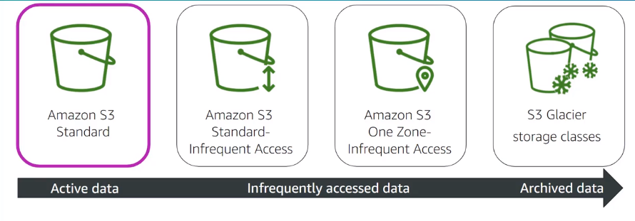
```


<br>


**[DATABASE services](aws.amazon.com/databases)**

* Amazon **RDS** (_**R**elational **D**atabase **S**ervice_) is a managed relational database service (Aurora, PostgreSQL, MySQL, MariaDB, Oracle, MSSQL )

* Amazon **DynamoDB** is a NoSQL fast and predictable performance database

* Amazon **ElastiCache** is a cache service

<br>

EC2-hosted vs AWS Database Service


```{r, echo = FALSE, out.width="90%"}
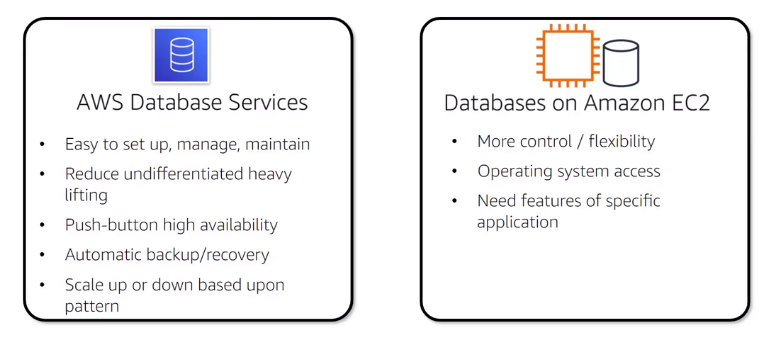
```


<br>


**NETWORKING services**


```{r, echo = FALSE, out.width="90%"}
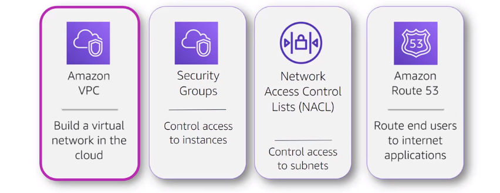
```


* Amazon **VPC** (**V**irtual **P**rivate **C**loud): Build a virtual network in the cloud

  * With VPC customer have complete control of network environment


```{r, echo = FALSE, out.width="90%"}
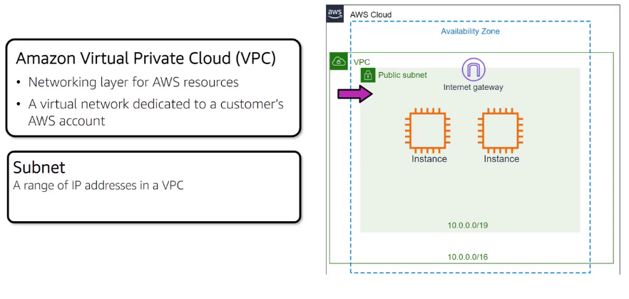
```


* Security Groups : Control access to instances, _virtual firewall_ at the instance level

* Network Access Control List (_NACL_)


```{r, echo = FALSE, out.width="90%"}
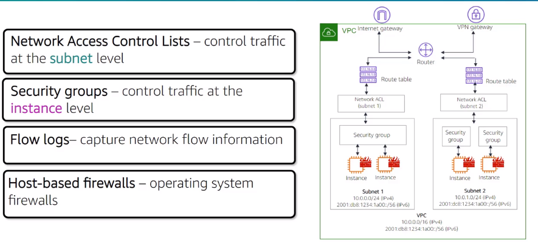
```

<br>


**SECURITY**

Amazon Security are split up on the following categories : 


```{r, echo = FALSE, out.width="90%"}
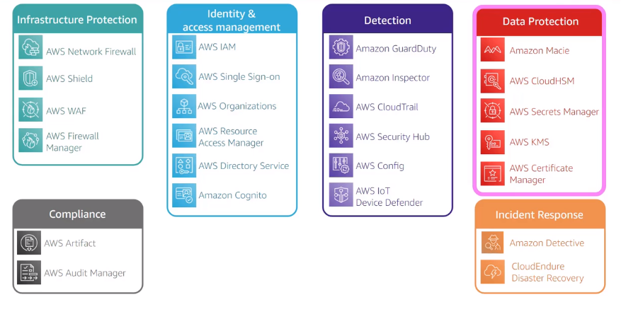
```

<br>

AWS shared responsibility model :

```{r, echo = FALSE, out.width="90%"}
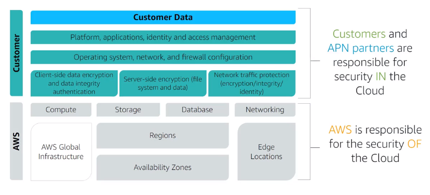
```


<br>

* IAM  : Manage access to aws services and resources

<br>

**AWS SERVICE BREADTH AND DEPTH**


```{r, echo = FALSE, out.width="90%"}
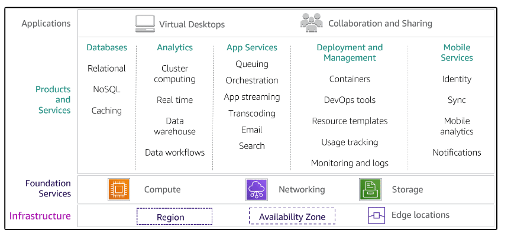
```


**Links**

[What Is Cloud Computing](https://docs.aws.amazon.com/whitepapers/latest/aws-overview/what-is-cloud-computing.html)


[Global Infrastructure](https://aws.amazon.com/pt/about-aws/global-infrastructure/)

[Compute for any workload](https://aws.amazon.com/pt/products/compute/)

[Amazon EC2 Instance Types](https://aws.amazon.com/pt/ec2/instance-types/)

[Elastic Load Balancing](https://aws.amazon.com/pt/elasticloadbalancing/)

[Cloud Storage on AWS](https://aws.amazon.com/pt/products/storage/)

[Amazon S3](https://aws.amazon.com/pt/s3/)

[Amazon S3 Storage Classes](https://aws.amazon.com/pt/s3/storage-classes/)

[AWS Cloud Databases](https://aws.amazon.com/pt/products/databases/)

[AWS Networking and Content Delivery](https://aws.amazon.com/pt/products/networking/)

[Security best practices for your VPC](https://docs.aws.amazon.com/vpc/latest/userguide/vpc-security-best-practices.html)

[Security and Compliance](https://docs.aws.amazon.com/whitepapers/latest/aws-overview/security-and-compliance.html)

[Security, Identity, and Compliance on AWS](https://aws.amazon.com/pt/products/security/)

[Shared Responsibility Model](https://aws.amazon.com/pt/compliance/shared-responsibility-model/)

[AWS Identity and Access Management (IAM)](https://aws.amazon.com/pt/iam/)

[AWS Compliance](https://aws.amazon.com/pt/compliance/)

[AWS Documentation](https://docs.aws.amazon.com/)

[Cloud Products](https://aws.amazon.com/pt/products/?aws-products-all.sort-by=item.additionalFields.productNameLowercase&aws-products-all.sort-order=asc&awsf.re%3AInvent=*all&awsf.Free%20Tier%20Type=*all&awsf.tech-category=*all)


<br>


**SOLUTION DESIGN**


* AWS Solutions : 

  * Machine Learning
  * Analytics & Data Lakes
  * IoT
  * Serveless Computing
  * Containers
  * Enterprise Applications
  * Storage
  * Windows Workload
  
<br>

Sample of Diagram of solution

```{r, echo = FALSE, out.width="90%"}
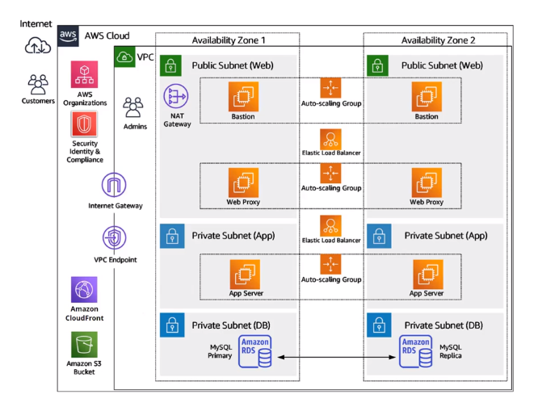
```
  
<br>  

* Migration Strategies


  * Seven R's, the first 4 involve Migrating workload to the AWS Cloud
  
    * **Rehost**  : Recreate the on-premise network, only hosted on AWS, can be automated with tools such as _AWS Application Migration Service_, this is easier to optimize and re-architect applications after migration
    
    
    ```{r, echo = FALSE, out.width="90%"}
    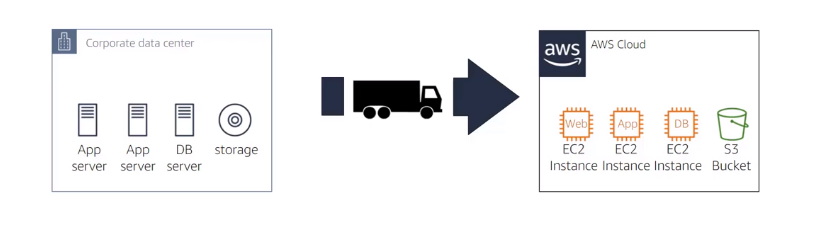
    ```
    
    
    * **Replataform**: Similar to re-hosting, making targeted aws cloud optimizations, for example migrating database to Amazon RDS or applicatio to Amazon Elastic Beanstalk
     
    ```{r, echo = FALSE, out.width="90%"}
    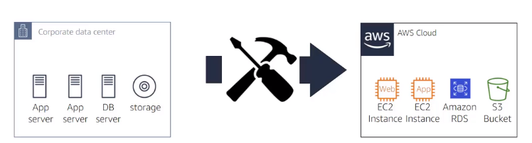
    ```   
    
    * **Relocate** : Hypervisor-level lift and shift, migration specific to VMware Cloud on AWS, for example migrate hypervisor host Oracle to VM Cloud on AWS
    
    
    ```{r, echo = FALSE, out.width="90%"}
    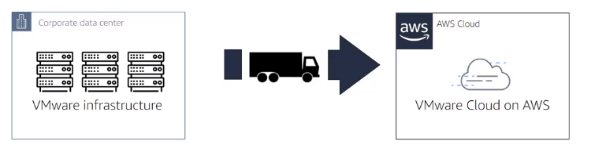
    ```    
    
    * **Refactor** : Re-imagining how the application is architected and developed using cloud native features for example, containers.
    
    
    
    ```{r, echo = FALSE, out.width="90%"}
    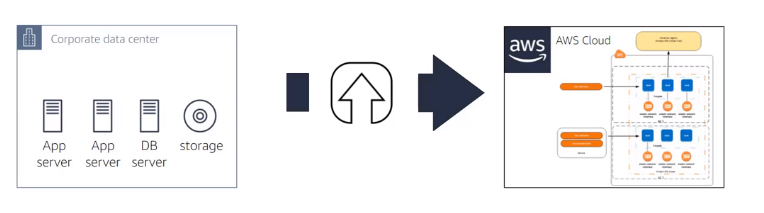
    ```   
    
    * Retire  :Shutting off non-useful appls
    * Retain : Keeping certain applications on-prem
    * Repurchase: Moving workload to SaaS


<br>

* Architectural Best Practices

  * Design for failure and nothing fails : 
  
    * Avoid single point of failure
    * Multiple instances
    * Multiple AZs
    * Separate Single server into multiple tiered application
    * For RDS, use Multi-AZ feature

<br> 
  * Build security in every layer
  
    * Encrypt Data at rest and in transit
    * Enforce principle of least privilege in IAM
    * Implement NACL and Security Groups
    * Consider advanced security features and services

<br> 
  * Leverage different storage options
  
    * Move static web assets to S3
    * Use Amazon CloudFront to serve globally
    * Store session state in DynamoDB
    * Use ElasticCache between hosts and databases
  
<br> 
  * Implement Elasticity
  
    * Implement Auto Scaling polices
    * Architect resiliency to reboot and relaunch
    * Leverage managed services like S3 and DynamoDB
    
    
<br> 
  * Think parallel
  
    * Scale horizontally, not vertically
    * DEcouple compute from session/state
    * Use ELB (_Elastic Load Balancing_)
    * Right-size your infrastructure

<br>    
  * Loose coupling sets you free
  
    * Instead of a single, ordered workflow, use multiple queues
    * Use SQS (_Simple Queue Service_) and SNS (_Simple Notification Service_)


<br>


* **Well-Architected Framework** is a framework to ensure infrastructures secure, high-performing, resilient, efficient and sustainable

  


```{r, echo = FALSE, out.width="90%"}
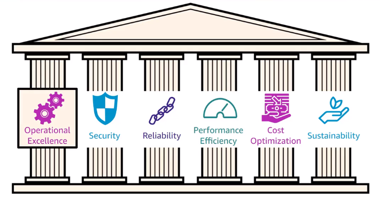
``` 

<br> 

* **AWS CAF** AWS **C**loud **A**doption **F**ramework, help companies to move to cloud on Business (_Business, People and Governance_) and Technical (_Platform, Security and Operations_) Capabilities


**Sample of Cloud solution from on-prem using _Replatform_ strategy**

_FROM_ : 


```{r, echo = FALSE, out.width="60%"}
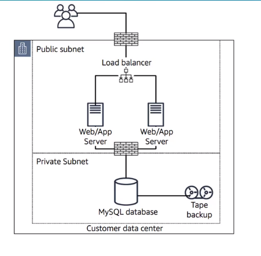
``` 


_TO_ :


```{r, echo = FALSE, out.width="110%"}
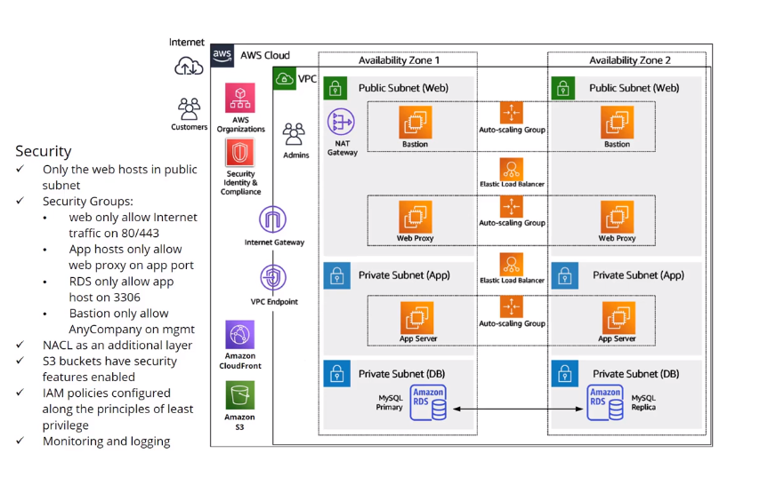
``` 

<br>

After the you present the solution to customer and have the approval and perform the POC starts the **Migration Process** using Minimum Viable Product (_MVP_) starting on basic solution


```{r, echo = FALSE, out.width="110%"}
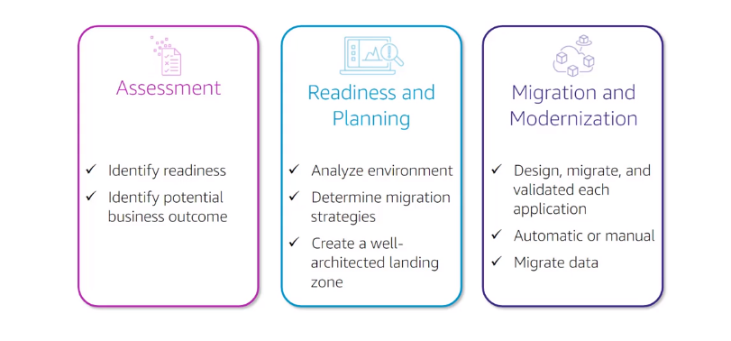
``` 


### IAM 

IAM (_Identity and Access MAnagement_)


### Part 1 : Cloud Concepts

  * Cloud computing : 
    
      * Agility
      * Maintenance
      * Reliability
      * Security
      * Performance
      * Scalability
      * Cost and Elasticity
        * _soft limit_ : 30 ec2 per month, if need more request to aws
        * _hard limit_ : data center limit

  * According to **NIST** (_The National Institute of Standards and Technology_)
  
      * On demand Self-service
      * Broad network access
      * Resource pooling
      * Rapid elasticity
      * Measured service
  
  
  * Cloud models or Service Models
  
      * **IaaS** : Infra as a service
      * **PaaS** : Platform as a service
      * **FaaS** : Function as a service 
    
    
  * Deployment models
  
      * Private Cloud
      * Public Cloud
      * Hybrid Cloud : Using Private and Public
      * Multicloud 
      * Community
    
    
    
  
  
### Part 2 : Foundation

Also known as On-boarding, but the this is the best practice to start use the cloud, or how to plan the use of AWS account. There are lot of options and layers.


```{r, echo = FALSE, out.width="80%"}
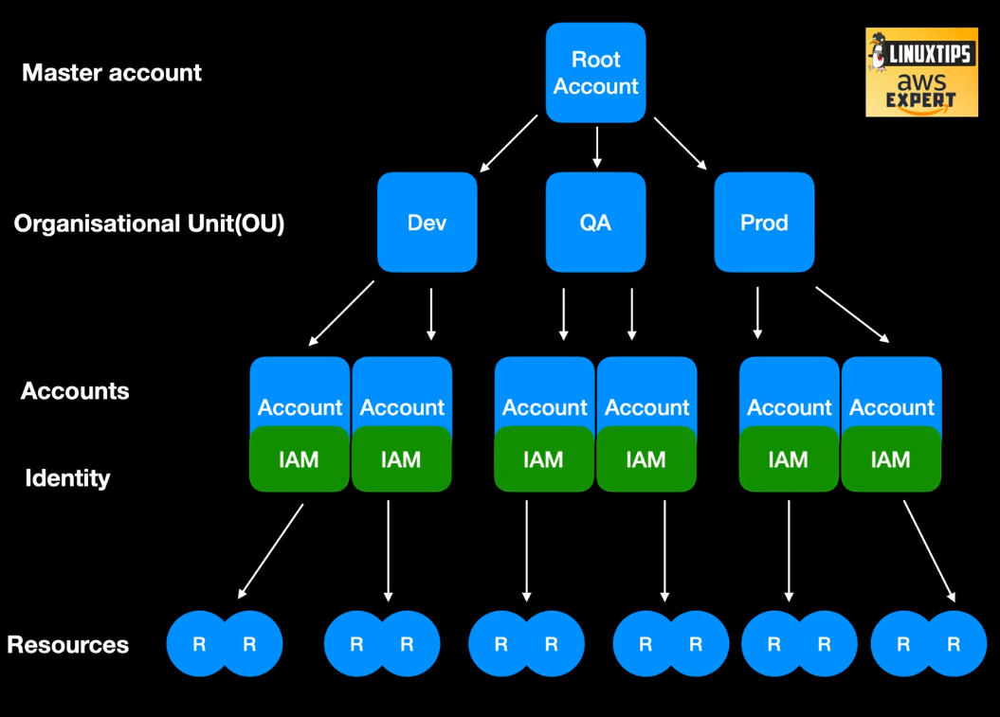
```

<br>  

**ROOT ACCOUNTS**

* Principal account on AWS
* Used to start the new account in AWS
* Manager **billing** and other accounts
* **First account to create on AWS cloud**
  _If you going to use Production on AWS you going to have more than one account_

<br>
  
**OU Organization Unit**

* Option to organize the account such as _DEV_, _QA_, _PROD_, we can apply rules to **OU** or for **account**, like production runs on Sao Paulo, DEV on USA, QA can only start machine from group X, etc.
* Can have OU for RH, Department , Business Unit, etc

<br>

**ACCOUNT**

* Where the resource are started or created
* _Tips_: 
  * Not use a personal email to create an account, use a team email
  * Read the emails and attention to account to have a good _score_
  * Every account have IAM, to mange the users

* Create an account on [aws.amazon.com](aws.amazon.com)
  * Need two emails , Name and credict card
  

**Links**

[AWS Landing Zone](https://aws.amazon.com/solutions/aws-landing-zone/)

[AWS Organizations](https://aws.amazon.com/organizations/)

[AWS Account](https://aws.amazon.com/account/)

[AWS SCP](https://docs.aws.amazon.com/organizations/latest/userguide/orgs_manage_policies_scp.html)

[Example Service Control Policies](https://docs.aws.amazon.com/organizations/latest/userguide/orgs_manage_policies_example-scps.html)

[AWS Calculator](https://calculator.s3.amazonaws.com/index.html)


  
  
  
  
### Part 3 : AWS Well-Architected

> Framework that help you know the risks and how to fix, it contain papers and instructos to guide you on Best Practices ( pillars, design principles and questions) to apply on your account.

[AWS Well-Architected Framework link ](https://docs.aws.amazon.com/wellarchitected/latest/framework/welcome.html)

Best practice _Framework_

  * Pillars
    * Operational Excellence Pillar
    * Security Pillar
    * Reliability Pillar
    * Performance Efficiency Pillar
    * Cost Optimization Pillar    
    * Sustainability Pillar


  * Design Principles
  * Questions
  
Why to use ? 
  
  * Speed
  * Mitigate risks
  * Make informed decisions
  * Use AWS best practices
  
  
Links:

[AWS Well-Architected Tool](https://aws.amazon.com/well-architected-tool/)

[AWS Well-Architected Doc](https://aws.amazon.com/architecture/well-architected/)

[The 5 Pillars of the AWS Well-Architected Framework](https://aws.amazon.com/blogs/apn/the-5-pillars-of-the-aws-well-architected-framework/)
  
  
### Part 4 : IAM

Manage Security , Identity and Account


* Define groups and attach the polices for that group

* Create the **Users** and associate to groups
  * Always enable MFA for user authenticate 
  * Service users that going to be used via API its a good practice to have `svc` or `service` on name , like , `svc-dev`, this option will enable an access key ID and secret access key for the AWS API, CLI, SDK, and other development tools
  * The normal user will be created when you select **Password - AWS Management Console access**, that enable a password that allows users to sign-in to the AWS Management Console.


* **Role**
  * There are several roles defined by AWS but you can create your own role
  * Allow you enable one resource , for instance EC2, to talk with another resource like IAM without access key, only using Roles and policies

* **Policies**
  * There are several policies defined by AWS, but we can create our policy
  * **AdministratorAccess**: Provide full access to AWS service and resources
  * **PowerUserAccess**: Provide full access to AWS service and resources, but do not allow manage User and Groups
  


Links:

[AWS IAM Best Practices](https://docs.aws.amazon.com/IAM/latest/UserGuide/best-practices.html)

[Access keys best practices](https://medium.com/@ashishrajan/aws-security-best-practices-access-keys-cloudsecurity-facb20aa0db6)

[AWS CLI](https://aws.amazon.com/cli/)
  
  
  
   
### Part 5 : IAM cont...

* Cross Account Roles : When you create a role (_type another account_) on the target account associate it with account if from your master, you also have to specify the permission PowerUser or Adminsitrator for instance, with that users on that group can move between accounts :

  1. Create a role `CrossRoleDevOpsEngineers` for instance on the target account
  2. Add the permission that you would like to have when you going to assume that role for instance `AdministratorAccess`
  3. You will need to add the Account ID from source Account to link the source and target account.
  4. On source or master account use the role to configure the cross account using `Swhich Role`
  5. Inform the ID from target Account and Role that you will use.


With that you can create users in one IAM account and the users can go to others accounts using assume roles (switch account). On that IAM account the users will only login and jump to another account we should not create resources here.


Links:

[Credential Reports](https://docs.aws.amazon.com/IAM/latest/UserGuide/id_credentials_getting-report.html?icmpid=docs_iam_console)

[Identity Providers and Federantion](https://docs.aws.amazon.com/IAM/latest/UserGuide/id_roles_providers.html)

[Habilitando ADFS para AWS](https://aws.amazon.com/blogs/security/enabling-federation-to-aws-using-windows-active-directory-adfs-and-saml-2-0/)

[Cross Account using IAM Roles](https://docs.aws.amazon.com/IAM/latest/UserGuide/tutorial_cross-account-with-roles.htm)

  
  
  
  
  
  
  
  

### Part 6 : EC2

EC2 (Elastic Compute Cloud) : Service that offer cloud compute on AWS   


[Amazon EC2](https://aws.amazon.com/pt/ec2/)

[Tipos e preços](https://aws.amazon.com/pt/ec2/pricing/)

[Amazon EBS](https://aws.amazon.com/pt/ebs/)

[Montar o EBS no Linux](https://docs.aws.amazon.com/pt_br/AWSEC2/latest/UserGuide/ebs-using-volumes.html)

[Amazon Security Group](https://docs.aws.amazon.com/pt_br/AWSEC2/latest/UserGuide/ec2-security-groups.html)


* Fazer um video criando EC2, volumes, securty group etc

### Part 7 : EC2 cont ...

With EC2 stopped we can create a snapshot of the instance, which allow us restore the image or create a new one, for that option we create an AMI image and create an ec2 instance based on that AMI.

IF I need to mirgate the EC2 to another region I need to create a spanshot of volume, perform a copy of snapshot and recreate the AMI image from that copy on target region and recreate the EC2 on target region. A second option to migrate EC2 from region is performing a copy on AMI source to target region.

To get information about metdata about instance  we need to access the ip 169.254.169.254

```
curl http://169.254.169.254/latest/meta-data/<option>
```


[AWS EC2 Metadata](https://docs.aws.amazon.com/pt_br/AWSEC2/latest/UserGuide/ec2-instance-metadata.html)

[Snapshot](https://docs.aws.amazon.com/pt_br/AWSEC2/latest/UserGuide/ebs-creating-snapshot.html)

[AMIs](https://docs.aws.amazon.com/pt_br/AWSEC2/latest/WindowsGuide/AMIs.html)

[Placement Groups](https://docs.aws.amazon.com/pt_br/AWSEC2/latest/WindowsGuide/placement-groups.html)

[Lifecycle Manager](https://docs.aws.amazon.com/pt_br/AWSEC2/latest/UserGuide/snapshot-lifecycle.html)


### Part 8 , 9 : VPC

[**VPC**](https://docs.aws.amazon.com/vpc/latest/userguide/what-is-amazon-vpc.html) (_Virtual Private Cloud_) Enable you to use your own isolated resources within the AWS account, it is like we have on AWS a dedicate/isolated network for our account.

Imagine is you have on AWS a dedicate/privated network to you ? Yes that is VPC, part of AWS infra is dedicate to you and you going to receive an ip interval dedicated to you.


```{r, echo = FALSE, out.width="90%"}
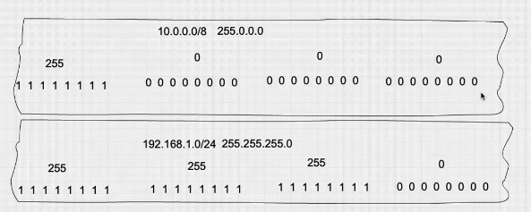
```


Where you see a bit on like `1  1  1  1  1  1  1  1` or `255` is related a network, where you see the bit off `0  0  0  0  0  0  0  0` or `0` is related to hosts/ips, we can use the [Subnet-Calculater](http://www.subnet-calculator.com/cidr.php) to calculate the CIDR blocks.

Related CIDR the first sample of network 10.0.0.0 have the CIDR 8 because only the first octet is on `10.0.0.0/8`, on second example of `192.168.1.0/24` the 3 first octet is on as on the figure.

Also the first IP is related to gateway **10.255.255.1** and last one is broadcast **10.255.255.255** in the example of **10.0.0.0/8**

On AWS : 

  * 10.0.0.0 : Network address
  * 10.0.0.1 : Reserved by AWS for VPC router
  * 10.0.0.2 : Reserved by AWS for DNS
  * 10.0.0.3 : Reserved for fugure use by AWS
  * 10.0.0.255: Broadcast

On AWS Expert training the instructor create this diagram to create the structure on AWS : 

```{r, echo = FALSE, out.width="90%"}
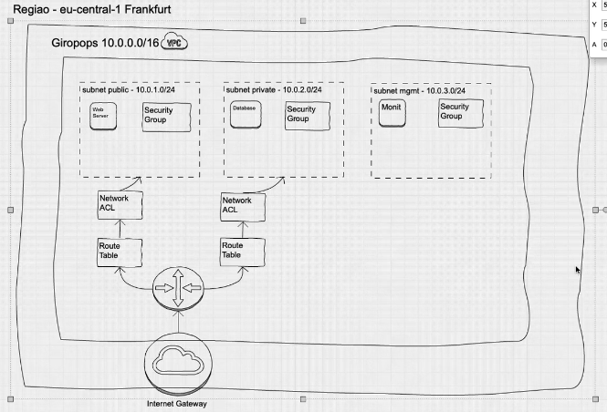
```

_**Steps : **_

1. **Create a _VPC_** , you need to provide the Name and IP CIDR block like (`10.0.0.0/16`) and click in create, this step will create automatically a Route table, Network ACL , security group and internet gateway.

2. **Create the _subnet_**, select the VPC that we have just created and add :
  
    * **1st : ** _Name Tag_ like (_public-10.0.1.0/24-az<name>_), select the Availability Zone and IPv4 CIDR block (_10.0.1.0/24_)
  
    * **2nd : **:  _Name Tag_ like (_private-10.0.2.0/24-az<name>_), select the Availability Zone and IPv4 CIDR block (_10.0.2.0/24_)
  
    * **3rd : ** :  _Name Tag_ like (_mgmt-10.0.3.0/24-az<name>_), select the Availability Zone and IPv4 CIDR block (_10.0.3.0/24_)
  
    * After create enable the auto assign IP settings and enable public IPv4 address to public subnet __public-10.0.1.0/24-az<name>__
  
  
    ```{r, echo = FALSE, out.width="90%"}
    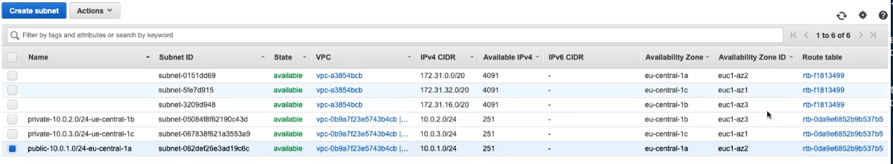
    ```

_by default the subnet is open to internet **ATTENTION**_


3. **Create the security groups** for each subnet : 

    * Click in create security group inform the names , description and vpc : 
    
      * **1st : ** : (_public-sec-group_) and associate with VPC
      * **2nd : ** : (_private-sec-group_) and associate with VPC
      * **3rd : ** : (_mgnt-sec-group_) and associate with VPC


    * On **public security group** add the ssh on 22 port rule open to everyone
      * Add a HTTP rule port 80 to everone
      * Add a HTTPS rule port 443 to everyone
    
    * On **private security group** add Rule for SSH source add the mgnt IP 10.0.3.0/24 or the security group info (mngt) security group, thi will allow ssh only from public subnet
      * If there are MSQL/Aurora add a rule for port 3306 and add the security groups from public and mgnt
    
    * On **management security group** add ssh rule and ip for admin, idealy have a vpn to access this server
    
    
4. **Create internet gateway** add the name tag, click in action and **attach** to our VPC


5. **Create a route table** add the Name tag and vpc one for each subnet (private, public and mgnt)
    
    * On **_public_** add the route to internet (Destination) **0.0.0.0/0** (Target) **internet gateway** , click in edit subnet associations and add the public subnet
    
    * On **_private_** edit the subnet associations and add the private subnet
    
    * On **_mgmt_** edit and add the mgmt subet, with internet route **0.0.0.0/0** with **Internet gateway** as a Target
    
    
    
6. **Create 3 EC2 instance**

    * 1 for web server on public subnet
    * 1 for db server on private subnet
    * 1 for admin on mgmt subnet
    
    

7. **Create NAT Gateway**, inform the subnet, on the example the public and create new [Elastic IP](https://docs.aws.amazon.com/AWSEC2/latest/UserGuide/elastic-ip-addresses-eip.html)

    * To enable the dbserver that is in private subnet access the internet we need to update the route and add **0.0.0.0/0** and select nat gateway instance
  
    * **Creating NAT INSTANCE** , to create a nat instance we need to launch EC2 instance and select AMI of nat on community AMI's, select VPC and public subnet.
    
      * On Private route table select (Destination) **0.0.0.0/0** (Target) **NAT INSTANCE** 
      * On NAT instance select Action > Network > Change Source Destination check and disable

    
    
8. **Create network ACL**, inform name and VPC

    * Select **Edit inbound rules** : Add rules
    
      * number `100` Type custom , port `80` source `0.0.0.0/0`, ALLOW
      * number `200` Type HTTPS,, port `443` source `0.0.0.0/0`, ALLOW
      * number `300` Type custom , port `22` source `0.0.0.0/0`, ALLOW
      
      
    * On **Edit outbound rules** add the same rules
  
      * number `100` Type custom , port `80` source `0.0.0.0/0`, ALLOW
      * number `200` Type HTTPS, port `443` source `0.0.0.0/0`, ALLOW
      * number `300` Type custom , port `22` source `0.0.0.0/0`, ALLOW
    
    
    * We will also need to add the [Ephemeral ports](https://docs.aws.amazon.com/vpc/latest/userguide/vpc-network-acls.html)  
      
    * Edit subnet associations and add the subnet that would like to associate
    


    

[VPC](https://docs.aws.amazon.com/pt_br/vpc/latest/userguide/VPC_Subnets.html)

[Amazon VPC quotas](https://docs.aws.amazon.com/vpc/latest/userguide/amazon-vpc-limits.html)

[Calculadora Subnet](http://www.subnet-calculator.com/)

[Internet Gateway](https://docs.aws.amazon.com/pt_br/vpc/latest/userguide/VPC_Internet_Gateway.html)

[Route Tables](https://docs.aws.amazon.com/pt_br/vpc/latest/userguide/VPC_Route_Tables.html)
    
    
    
    
### Part 10: VPN

**What is uma [VPN](https://docs.aws.amazon.com/vpn/?id=docs_gateway) ? **
AWS Virtual Private Network (AWS VPN) establishes a secure and private tunnel from your network or device to the AWS Cloud. You can extend your existing on-premises network into a VPC, or connect to other AWS resources from a client. AWS VPN offers two types of private connectivity that feature the high availability and robust security necessary for your data.

_Types : _

* Site-to-Site
* Client VPN


_How to create / configure_
    
To set up a [Site-to-Site VPN](https://docs.aws.amazon.com/vpn/latest/s2svpn/SetUpVPNConnections.html) connection using a virtual private gateway:

    Step 1: Create a customer gateway 
    Step 2: Create a target gateway
    Step 3: Configure routing
    Step 4: Update your security group
    Step 5: Create a Site-to-Site VPN connection
    Step 6: Download the configuration file
    Step 7: Configure the customer gateway device 
    

To set up [Client VPN](https://docs.aws.amazon.com/vpn/latest/clientvpn-user/user-getting-started.html)

    Step 1: Create a CA raiz on Certificate Manager
    Step 2: Request a private certificate associated with CA 
    Step 3: Create Client VPN Endpoint, use the certificated that you have just created
    Step 4: Associate the VPN to VPC  and subnet
    Step 5: Create anew security group or associate ao security group of subnet, remmeber to enable the port `1194` UDB on security group
    Step 6: Add authorization rule to specific network or all (`0.0.0.0/0`)
    Step 7: Create route, add subnet and route destionation for all (`0.0.0.0/0`)
    Step 8: Download client configuration file
    Step 9: Update the file adding the sections:
            
            * <cert> </cert> : Export the certificate PEM and add here the body
            * <key> </key> : Private key from CA add here
            
    Step 10: Import the file on client VPN


    
    
### Part 11: ELB

**ELB** _Elastic Load Balancing_ 

> Have a name or ip to re-direct to my target(server)

  * Application Load Balancer (HTTP, HTTPS)
  * Network Load Balancer (TCP, TLS, UDP)


    
    
    
## GCP

### Digital Leader


[Cloud Digital Leader ](https://cloud.google.com/certification/guides/cloud-digital-leader)


**INTRODUCTION TO DIGITAL TRANSFORMATION WITH GOOGLE CLOUD**

**What is Cloud ? ** : Meetaphor for the network of data centers that store and compute information available through the internet

  * Technology and processes need to store, manage, and access data that is transferred over the cloud
  * Change on how organization operates and optimezes internal resources and how it delivers value to customers
  * Cloud enables and redefines our ability to collaborate, perceive, categorize, predict and recommend in every industry for every activity
  

<br>


**Digital transformation** is about taking advantage of established global scale IT Instructures and leveranging vast compute power that makes it possible for developers to build revolutionary new applications, it is about a foundation change in how an organization operates and optimizes internal resources and how it delivers value to customer


### Cloud Engineer

 
### Cloud Architect
### Machine Learning Engineer

### Data Engineer
