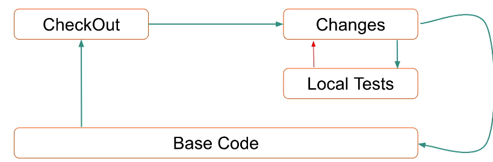
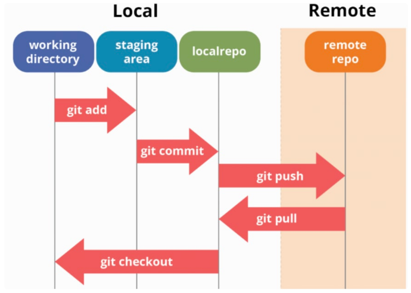

# DevOps


## Azure


## AWS

### Part 1 : Cloud Concepts

  * Cloud computing : 
    
      * Agility
      * Maintenance
      * Reliability
      * Security
      * Performance
      * Scalability
      * Cost and Elasticity
        * _soft limit_ : 30 ec2 per month, if need more request to aws
        * _hard limit_ : data center limit

  * According to **NIST** (_The National Institute of Standards and Technology_)
  
      * On demand Self-service
      * Broad network access
      * Resource pooling
      * Rapid elasticity
      * Measured service
  
  
  * Cloud models or Service Models
  
      * **IaaS** : Infra as a service
      * **PaaS** : Platform as a service
      * **FaaS** : Function as a service 
    
    
  * Deployment models
  
      * Private Cloud
      * Public Cloud
      * Hybrid Cloud : Using Private and Public
      * Multicloud 
      * Community
    
    
    
  
  
### Part 2 : Foundation

Also known as On-boarding, but the this is the best practice to start use the cloud, or how to plan the use of AWS account. There are lot of options and layers.


```{r, echo = FALSE, out.width="60%"}
knitr::include_graphics("img/aws_account_foundation.png")
```

<br>  

**ROOT ACCOUNTS**

* Principal account on AWS
* Used to start the new account in AWS
* Manager **billing** and other accounts
* **First account to create on AWS cloud**
  _If you going to use Production on AWS you going to have more than one account_

<br>
  
**OU Organization Unit**

* Option to organize the account such as _DEV_, _QA_, _PROD_, we can apply rules to **OU** or for **account**, like production runs on Sao Paulo, DEV on USA, QA can only start machine from group X, etc.
* Can have OU for RH, Department , Business Unit, etc

<br>

**ACCOUNT**

* Where the resource are started or created
* _Tips_: 
  * Not use a personal email to create an account, use a team email
  * Read the emails and attention to account to have a good _score_
  * Every account have IAM, to mange the users

* Create an account on [aws.amazon.com](aws.amazon.com)
  * Need two emails , Name and credict card
  

**Links**

[AWS Landing Zone](https://aws.amazon.com/solutions/aws-landing-zone/)

[AWS Organizations](https://aws.amazon.com/organizations/)

[AWS Account](https://aws.amazon.com/account/)

[AWS SCP](https://docs.aws.amazon.com/organizations/latest/userguide/orgs_manage_policies_scp.html)

[Example Service Control Policies](https://docs.aws.amazon.com/organizations/latest/userguide/orgs_manage_policies_example-scps.html)

[AWS Calculator](https://calculator.s3.amazonaws.com/index.html)


  
  
  
  
### Part 3 : AWS Well-Architected

> Framework that help you know the risks and how to fix, it contain papers and instructos to guide you on Best Practices ( pillars, design principles and questions) to apply on your account.

[AWS Well-Architected Framework link ](https://docs.aws.amazon.com/wellarchitected/latest/framework/welcome.html)

Best practice _Framework_

  * Pillars
    * Operational Excellence Pillar
    * Security Pillar
    * Reliability Pillar
    * Performance Efficiency Pillar
    * Cost Optimization Pillar    
    * Sustainability Pillar


  * Design Principles
  * Questions
  
Why to use ? 
  
  * Speed
  * Mitigate risks
  * Make informed decisions
  * Use AWS best practices
  
  
Links:

[AWS Well-Architected Tool](https://aws.amazon.com/well-architected-tool/)

[AWS Well-Architected Doc](https://aws.amazon.com/architecture/well-architected/)

[The 5 Pillars of the AWS Well-Architected Framework](https://aws.amazon.com/blogs/apn/the-5-pillars-of-the-aws-well-architected-framework/)
  
  
### Part 4 : IAM

Manage Security , Identity and Account


* Define groups and attach the polices for that group

* Create the **Users** and associate to groups
  * Always enable MFA for user authenticate 
  * Service users that going to be used via API its a good practice to have `svc` or `service` on name , like , `svc-dev`, this option will enable an access key ID and secret access key for the AWS API, CLI, SDK, and other development tools
  * The normal user will be created when you select **Password - AWS Management Console access**, that enable a password that allows users to sign-in to the AWS Management Console.


* **Role**
  * There are several roles defined by AWS but you can create your own role
  * Allow you enable one resource , for instance EC2, to talk with another resource like IAM without access key, only using Roles and policies

* **Policies**
  * There are several policies defined by AWS, but we can create our policy
  * **AdministratorAccess**: Provide full access to AWS service and resources
  * **PowerUserAccess**: Provide full access to AWS service and resources, but do not allow manage User and Groups
  


Links:

[AWS IAM Best Practices](https://docs.aws.amazon.com/IAM/latest/UserGuide/best-practices.html)

[Access keys best practices](https://medium.com/@ashishrajan/aws-security-best-practices-access-keys-cloudsecurity-facb20aa0db6)

[AWS CLI](https://aws.amazon.com/cli/)
  
  
  
   
### Part 5 : IAM cont...

* Cross Account Roles : When you create a role (_type another account_) on the target account associate it with account if from your master, you also have to specify the permission PowerUser or Adminsitrator for instance, with that users on that group can move between accounts :

  1. Create a role `CrossRoleDevOpsEngineers` for instance on the target account
  2. Add the permission that you would like to have when you going to assume that role for instance `AdministratorAccess`
  3. You will need to add the Account ID from source Account to link the source and target account.
  4. On source or master account use the role to configure the cross account using `Swhich Role`
  5. Inform the ID from target Account and Role that you will use.


With that you can create users in one IAM account and the users can go to others accounts using assume roles (switch account). On that IAM account the users will only login and jump to another account we should not create resources here.


Links:

[Credential Reports](https://docs.aws.amazon.com/IAM/latest/UserGuide/id_credentials_getting-report.html?icmpid=docs_iam_console)

[Identity Providers and Federantion](https://docs.aws.amazon.com/IAM/latest/UserGuide/id_roles_providers.html)

[Habilitando ADFS para AWS](https://aws.amazon.com/blogs/security/enabling-federation-to-aws-using-windows-active-directory-adfs-and-saml-2-0/)

[Cross Account using IAM Roles](https://docs.aws.amazon.com/IAM/latest/UserGuide/tutorial_cross-account-with-roles.htm)

  
  
  
  
  
  
  
  

### Part 6 : EC2

EC2 (Elastic Compute Cloud) : Service that offer cloud compute on AWS   


## Docker

[Livro Descomplicando Docker](https://livro.descomplicandodocker.com.br/chapters/chapter_00.html)

[Github](https://github.com/badtuxx/DescomplicandoDocker)


### Part 1

#### O que é container ? 

Container não é virtualização e sim isolamento

  * Isolamento lógico _Responsável Namesapace_
    * parte usuaŕios e processos
    * como se tivessemos isolado um pedaço da máquina para o container
    * dentro do container tenho isolamento de network, cada container tem sua interface
  * Isolamento de físico _"_Responsável Cgroup"_
    * recursos : CPU, RAM, IO rede, IO de bloco, etc
  
  
#### O que é o Docker ? 

  * Uma **imagem** de container é divida em camadas e so se escreve na última camanda , as abaixo são somente leitura


  * Instalar
  
```
curl -fsSL https://get.docker.com | bash
```

  * Versão instalada
  
```
root@turing:~# docker version
Client: Docker Engine - Community
 Version:           20.10.8
 API version:       1.41
 Go version:        go1.16.6
 Git commit:        3967b7d
 Built:             Fri Jul 30 19:54:22 2021
 OS/Arch:           linux/amd64
 Context:           default
 Experimental:      true

Server: Docker Engine - Community
 Engine:
  Version:          20.10.8
  API version:      1.41 (minimum version 1.12)
  Go version:       go1.16.6
  Git commit:       75249d8
  Built:            Fri Jul 30 19:52:31 2021
  OS/Arch:          linux/amd64
  Experimental:     false
 containerd:
  Version:          1.4.9
  GitCommit:        e25210fe30a0a703442421b0f60afac609f950a3
 runc:
  Version:          1.0.1
  GitCommit:        v1.0.1-0-g4144b63
 docker-init:
  Version:          0.19.0
  GitCommit:        de40ad0
root@turing:~# 
```


  * Adicionar usuário ao grupo do docker
  
  
  
```
usermod -aG docker <user>
```


  * Listar os containers
  
```
docker container ls
```


  * Hello World
  
```
docker container run -ti hello-world
```

  * Steps that docker perform on docker container run ....: 
    
```
 1. The Docker client contacted the Docker daemon.
 2. The Docker daemon pulled the "hello-world" image from the Docker Hub.
    (amd64)
 3. The Docker daemon created a new container from that image which runs the
    executable that produces the output you are currently reading.
 4. The Docker daemon streamed that output to the Docker client, which sent it
    to your terminal.

```


#### Commandos básicos

  * Listar todas as imagens : 
  
```
docker container ls -a
```
  

  * Lista todos os containers rodando : 
  
```
docker container ls
```

  * Exemplo criar um container 
    * `-ti` : Terminal e interatividade
    * `Ctrl D ` : mata o bash o principal processo do container e o container é finalizado
    * `Ctrl q p `: Para sair do container sem encerrar o bash e container 
    * `-d ` : Para colocar o container como daemon
    
```
docker run -it ubuntu bash
```
  
  * Reconectar ao container : 
  
```
docker container attach <Container ID ou  nome>
```
  
  * Remover o container : 
  
```
docker container rm <ID ou nome>
```

  * Stop / Start / Restart / Pause container : 
    * Stop : `docker container stop <container ID ou nome>`
    * Start: `docker container start <container ID ou nome>`
    * Restart : `docker container restart <container ID ou nome>`
    * Pause : `docker container pause <container ID ou nome>`
    * Unpause : `docker container unpause <container ID ou nome>`
    

 
    
  * Informações do container : 

```  
docker container inspect <container ID ou nome>
```


  * Logs : 
  
```
docker container logs -f <ID ou nome>
```

  * Update para fazer atualização em um container em execução
  
```
docker container update
```
  
  
  * Listar as imagens
  
```
docker image ls
```
  

#### CPU and RAM - containers


  * Para verificar o quanto o docker esta utilizando de recursos

```
docker container stats <container ID>
```


  * Verificar os processos 
  
```
docker container top <container ID>
```


  * Liminar o máximo de memória que o container **nginx** pode utilizar com parametro `m`
  
```
# Limitando a memória em 128M
docker container run -d -m 128M nginx
```


  * Limitar a CPU
  
```
# Limitando a CPU em 50% ou meio CPU
docker container run -d -m 128M --cpus 0.5 nginx
```


  * Para fazer teste de stress utilizando pacote *stress* do linux
  
```
# Para instalar o stress
apt-get update && apt-get install -y stress


stress -cpu 1 -vm 1 --vm-bytes 64M
```
  


#### Docker file _Basic_

**sample of simple docker file**

```
FROM debian     

LABEL app="Giro"
ENV VAR_1="sample variable"


RUN apt-get update && apt-get install -y stress && apt-get clean

CMD = stress --cpu 1 --vm-bytes 64M --vm 1

```

**To build**

```
docker image build`-t <nome>:<versao> .

```

**To run**

```
docker container run -d <nome>:<versao>
```


### Part 2


## Jenkins

[GitHub Repository from instructor](https://github.com/anshulc55/Jenkins_Upgradev3)

### CI/CD

  * Continuous Integration / Continuous Delivery - Practice to delivery the ready to deploy code
  * **CI** : multiple integration per day
  
  
```{r, echo = FALSE, out.width="60%"}

```


  * **CD** : build allowed to deploying for customer anytime
  
### Install


Recommendation 

 * 1GB RAM
 * 50GB Disk
 * Java 8
 * Linux / Win / Mac
 
 
 

* To install install Jenkins Long Term Support on RedHat system

[Guide](https://www.jenkins.io/doc/book/installing/linux/#red-hat-centos)

```
sudo wget -O /etc/yum.repos.d/jenkins.repo \
    https://pkg.jenkins.io/redhat-stable/jenkins.repo
sudo rpm --import https://pkg.jenkins.io/redhat-stable/jenkins.io.key
sudo yum upgrade
sudo yum install epel-release java-11-openjdk-devel
sudo yum install jenkins
sudo systemctl daemon-reload
```

* To start Jenkins

```
sudo systemctl start jenkins
sudo systemctl status jenkins

```

* We will need the password for initial configuration at `/var/lib/jenkins/secrets/initialAdminPassword`


### Arquitecture 

Jenkins follow the master/slave architecture

  * Master Node : controller, that controls the Load Distribution on Slave Node
      
      * Used to schedule the build Job
      * Dispatch Build Execution to Slave Node
      * Monitor Slave and Record the Build Results
  
  * Worker Node : Execution Node, we can have several slave nodes
  
      * Execute Build dispatched by Master
      * Not require Jenkins, only JAVA
      
      
      
### Job

  * **Job** is any runnable task that is controlled by Jenkins
  
    * _FreeStyle Project_ : Shell or Bash commands
    * _Pipeline_ : Workflow, usually written in DSL
    * _Multi Configuration Project_ : Will be tested on Multiple environments
  

### Git & GitHub


## Git


### Intro

_Some Concepts_
  
* Commit :
    
  - Saved changes to git repository
  - Impacts history
  - SHA1 hash for unique identifier

* Branches:

  - Timeline with commits

  
* HEAD

  - Pointer to last commit on branch
  
* Remote

  - Related repository - but not local
  - GitHub, GitLab, Bitbucket, etc
  
_Git Workflow_

```{r, echo = FALSE, out.width="60%"}

```


Starting Local : 

  1. `Init` the working directory
  2. Add files , etc
  3. Staging the changes using `git add` command
  4. Commit the changes using `commit` command
  5. `Push` the changes on remote repository
  
> _Everyone can now **pull** the changes back_

  
Starting remotely:

  1. Create a `new repository` on Git remote, like Github
  2. `Clone` the repository to create it locally
  3. Do the work,add files
  4. Send the changes to staging area using `git add` command
  5. `Commit` the changes
  6. Send the data to remote repository using `git push`
  
  
  
  


### Setup and Config

1. Configure the name and email 

```
git config --global user.name "<Name>"

git config --global user.email "<email>"

```

2. To confirm the set : 

```
git config --global --list
```

We also can check the config on `~/.gitconfig` file


### Working Locally

* Starting a fresh repository 

```
git init <repo_name>

# Or inside a folder just git init

git init

```

_see that inside the folder will be create a `.git` file_


* After create some files can check the status of track files using status command

```
git status
```

* To add a file in the staging area

```
git add <file>  

# or add all files

git add . 
```


* Commit 


```
git commit -m "<message>"
```


* Add and commit at the same time, just one step


```
git commit -am "<message>"
```


* To remove a file from the staging area, this will **"unstage"** the specified file from Git Staging area

```
git reset HEAD <file>
```


* To back out a change in a file , this command will replace the file with the version last committed in _Git_

```
git checkout -- <file>
```


* List all the commits done in the repo


```

git log

# or compat view

git log --oneline --graph --decorate --color
```


* Back out changes already committed

```
git rm <file>

git commit -m "<message>"
```

* If remove the file using `rm` OS command need to do the below steps


```
git add -u 
git status
git commit -m "<msg>"
git status
```


* Moving a file


```
mkdir subdir

git mv <file> <subdir>

git status

git commit -m "<msg>"
```

_if move the file without git need to use -u  command on git add step_


* Ignoring files using `.gitignore` file


add on `.gitignore`
```
# ignoring all .log files
*.log

```


### Working Remote

* Configure your `.ssh` key

```
mkdir ~/.ssh
cd ~/.ssh
ssh-keygen -t rsa -C "email"  

<enter>


```

This process will create two files , _id_rsa_ and _id_rsa.pub_ the content of `.pub` we will add into github account on SSH Keys setting.

* To test

```
ssh -T git@github.com
```

* If we create a new repo from internet application we can use the below command to associate our local repo to remote repository

```
git remote add origin git@github.com:<user>/<repo_name>.git
```

* To push the files from local to remote repository

```
git push -u origin master
```


_This will send all files from local to remote, second time we will not be need to use `-u` paramter_


* Now before perform a commit it is important to check if there are any modification by others


```
git pull origin master
```


* Push the changes

```
git push origin master
```

The **push** sends all local changes on branch to the remote. The parameter `-u` is needed the fist time you push a branch to the remote.

The **pull** receives all your remote changes fro the remote to local


 


