# Data Science

## DataCamp Python Skills for Data Science 
### Introduction to Python
#### Python Basic

Version 3.x - [https://www.python.org/downloads](https://www.python.org/downloads)

We can save the script with .py and use python as calculator or usa ipython or python shell

```
# Addition and subtraction
print(5 + 5)
print(5 - 5)

# Multiplication and division
print(3 * 5)
print(10 / 2)

# Exponentiation
print(4 ** 2)

# invest
print(100 * 7.1)

# Modulo
print(18 % 7)

# How much is your $100 worth after 7 years?
print(100*1.1**7)
```


<br>

**Variable**

* Specific, case-sensitive
* `type(<variable>)` to check the type of variable
* Types
  
  * int - integer numbers
  * float - real numbers
  * bool - True , False
  * str - string, text


<br>


**Lists**

* [a,b,c, 1, True, 1.2 [a,b]]
* Collection of values, contain any type
* Slicing
  * First element index 0
  * -1 last element
  * Range [3:5]  , last element not included [start : end(excluded)]
  * Subsetting list of list [][]


---

## DataCamp R Skills for Data Science


---

## Azure Data Science Certification


---

## AWS Data Science Certification


### Demystifying AI / ML / DL


**What is AI ?**

  Ability to scan and interpret the physical devices, for that we need to provide info of real world

  * Knowledge (_data_) + Software programs = decisions  

  * Transfer human expertise to solve a specific problem (_model_)
  
  * Machine learning and Deep learning are subset of AI
  
  * **ML** :  Data -> processing -> Predictions
  
    * Machine learning can do : 
      
      * Make predictions
      * Optimize utility functions
      * Extract hidden data structures
      * Classify data
      
  * **DL**
  
    * Enable the machine define the features itself, for instance, you show the machine several samples of rectangle and machine will be able to extract the features and recognize a probably rectangle. 

<br>

  * How to Establish an Effective AI Strategy

    * Fast computing environments
    * Data gathering from several sources, ubiquitous data
    * Advanced learning algorithms
  
  
  _The Flywheel of Data_

```{r, echo = FALSE, out.width="90%"}
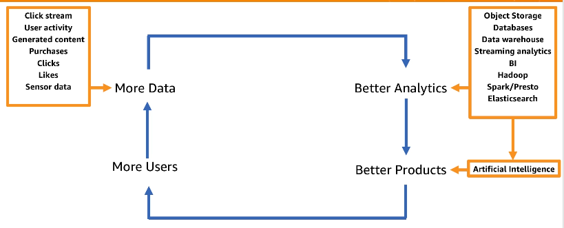
```


  * **AI on AWS**


```{r, echo = FALSE, out.width="90%"}
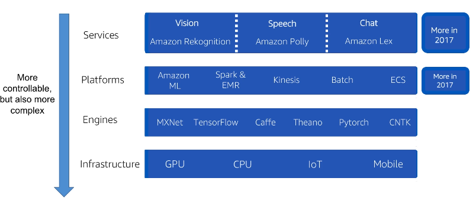
```


**What is Machine Learning**


* Subset of AI
* Process that takes data and use that to make predictinos and support decisions


* Types of Machine Learning

```{r, echo = FALSE, out.width="90%"}
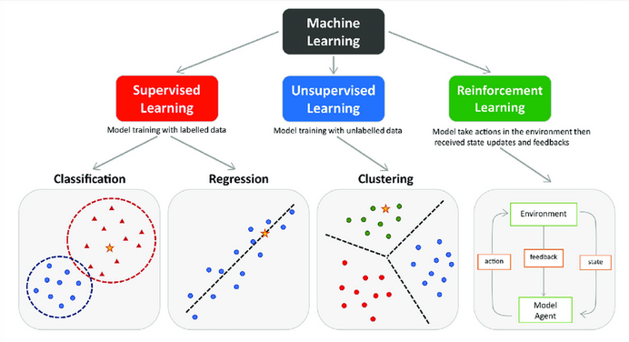
```


**Suggestion**

_Intro to ML video 1:_


Complete sequence of videos [here](https://www.youtube.com/watch?v=CzdWqFTmn0Y&list=PLfYUBJiXbdtSyktd8A_x0JNd6lxDcZE96)


```{r, eval=knitr::is_html_output(excludes = "epub"), results = 'asis', echo = F}
cat(
'<iframe width="560" height="315" src="https://www.youtube.com/embed/CzdWqFTmn0Y"  frameborder="0" allow="accelerometer; autoplay; encrypted-media; gyroscope ; picture-in-picture"></iframe>'
)

```


**What is Deep Learning**


* Deep Learning is a subset of Machine Learning
* Use many layers of non-linear processing units, for feature extraction and transformation
* Algorithms can be supervised and unsupervised 


```{r, echo = FALSE, out.width="90%"}
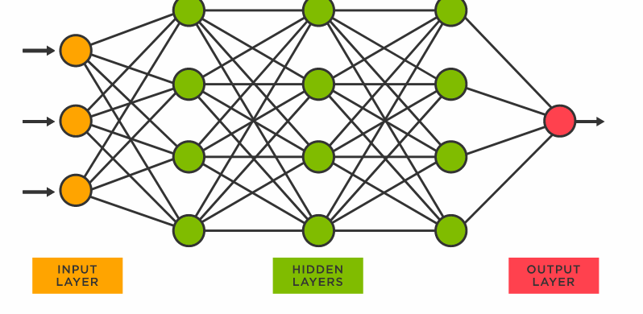
```


* Types of Neural Networks
  
  * Feedforward
  * Recurrent
  
  
* AWS Deep Learning Based Managed Services

  * **Amazon Lex** : conversational engine
  
  * **Amazon Polly** : lifelike speech
  
  * **Amazon Rekognition** : Image analysis


* AWS Deep Learning AMI (_custom models_)

  * AMI is pre-configured with : MXNet, TensorFlow, Microsoft Cognitive Engine, Caffe, Theano, Torch and Keras
  
  * Support auto-scaling cluster of GPU for large training


**Suggestion**

_Intro to DL video 1:_


Complete sequence of videos [here](https://www.youtube.com/watch?v=_QUEXsHfsA0&list=PLfYUBJiXbdtRL3FMB3GoWHRI8ieU6FhfM)

```{r, eval=knitr::is_html_output(excludes = "epub"), results = 'asis', echo = F}
cat(
'<iframe width="560" height="315" src="https://www.youtube.com/embed/_QUEXsHfsA0"  frameborder="0" allow="accelerometer; autoplay; encrypted-media; gyroscope ; picture-in-picture"></iframe>'
)

```


---

### Machine Learning Essentials for Business and Technical Decision Makers


**What is Machine Learning(ML) ? ** : Process of training computers, using math and statistical processes, to find and recognize patterns in data.

**Iterative process**


```{r, echo = FALSE, out.width="90%"}
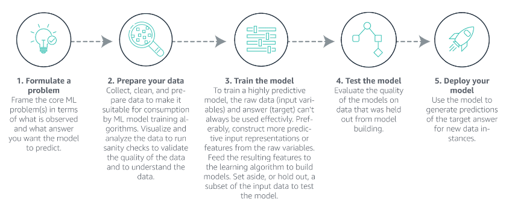
```


**How Amazon uses ML in products ? **

  * Browsing and purchasing data to provide recommendations
  * Use voice interactions with `Alexa` using NLP
  * Use ML to ship 1.6M packages per day


**How is machine learning helping AWS customers?**

  * Amazon Forecast 
  * Amazon Fraud Detector
  * Amazon Personalize (_product recommendation,direct marketing_)
  * Amazon Polly (TTS - _text-to-speech_) uses advanced deep learning technologies to synthesize natural-sounding human speech
  * Amazon Transcribe (STT - _speech-to-text_)
  * Amazon SageMaker
  
  * [Machine Learning on AWS](https://aws.amazon.com/machine-learning/?nc2=h_ql_prod_ml)


<br>

**How does machine learning work?**

  * What is AI ? : any system that is able to ingest human-level knowledge to automate and accelerate tasks performable by humans through natural intelligence.
    * _Narrow AI_  : where an AI imitates human intelligence in a single context  (**Today's AI**)
      
    * _General AI_ : where an AI learns and behaves with intelligence across multiple contexts (**Future AI**)


**What kind of solutions can ML provide?**

  * **Regression** : Prediction a numerical value , [Zillow case](https://aws.amazon.com/solutions/case-studies/zillow-zestimate/)
  * **Classification** : Predicting label, [duolingo case](https://aws.amazon.com/machine-learning/customers/innovators/duolingo/)
  * **Ranking** : Ordering items to find most relevant , [Domino's case](https://aws.amazon.com/solutions/case-studies/dominos-case-study/)
  * **Recommendation** : Finding relevant items based on past behavior [Hyatt Hotels](https://aws.amazon.com/solutions/case-studies/hyatt-hotels-case-study/)
  * **Clustering** : Finding patterns in examples [NASA](https://www.amazon.science/how-nasa-uses-aws-to-protect-life-and-infrastructure-on-earth)
  * **Anomaly detection** : Finding outliers from examples, [Fraud.net case's](https://aws.amazon.com/solutions/case-studies/fraud-dot-net/)


```{r, echo = FALSE, out.width="90%"}
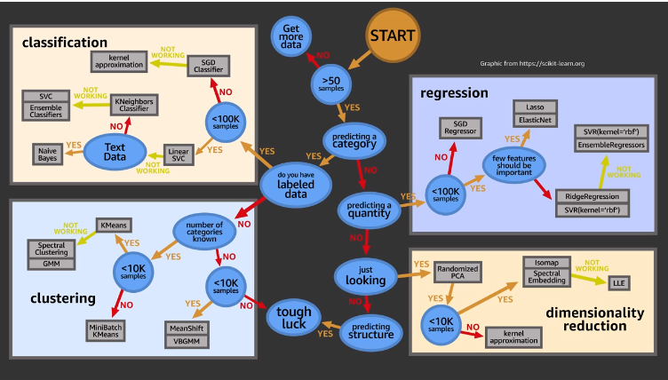
```

<br>

**What are some potential problems with machine learning ? **

  * Ingestion of poor quality data
  * Explain complex models


### Machine Learning for Business Leaders

**When is ML an option ?**
  
  * If the problem is persistent
  * If the problem challenges progress or growth
  * If the solution needs to scale
  * If the problem requires personalization ir order to be solved

**What Does a successfull ML solution require ? **

  * People (_Data Scientist, Data Engineer, ML Scientist, Software Engineers, etc_)
  * Time
  * Cost


**Ask the right questions to team**

  * What are the made assumptions ? 
  * What is your learning target (hipotesis)? 
  * What type of ML problem is it ? 
  * Why did you choose this algorithm ? 
  * How will you evaluate the model performance ? 
  * How confident are you that you can generalize the results ? 
  
  


**How to define and scope a ML Problem**

  * What is the specific business problem ? 
  * What is the current state solution ?
  * What are the current pain points ? 
  * What is causing the pain points ? 
  * What is the problems impact ? 
  * How would the solution be used ? 
  * What is out of scope ? 
  * How do you define success (_success criteria_)? 
  

_Input Gathering_

  * Do we have sufficient data ? 
  * Is there labeled examples ? 
  * If not , how difficult would it be to create/obtain ? 
  * What are our features ? 
  * What are going to be the most useful inputs ? 
  * Where is the data ? 
  * What is the data quality ? 
  
  
_Output Definitions_  

  * What business metric is defining success ? 
  * What are the trade-offs ? 
  * Are there existing baselines ? 
  * If not, what is the simplest solutions ? 
  * Is there any data validation need to green light the project ? 
  * How important is runtime and performance ? 
  
  
With those inputs and outputs we can formulate the problem as a **Learning Task**, is this a classification or regression problem ? What are the risks ? etc ...


**When should you consider using machine learning to solve a problem ? **

  * Use ML when software logic is too difficult to code
  * Use ML when the manual process is not cost effective
  * Use ML when there is ample training data
  * Use ML when the problems is formalizable as an ML Problem (_reduce to well known ML problem regression, classification, cluster_)
  
  
**When is Machine Learning NOT a Good Solution?**

  * No data
  * No Labels
  * Need to launch quickly
  * No tolerance for mistakes
  


**When is Machine Learning is a Good Solution ?**

  * Difficult to directly code a solution
  * Difficult to scale a code-based solution
  * Personalized output
  * Functions change over time


  
---  
  


---


### Process Model : CRISP-DM on the AWS Stack


**Into**

> CRISP-DM "Cross Industry Standard Process - Data Mining", excelent framework to build data science project


```{r, echo = FALSE, out.width="60%"}
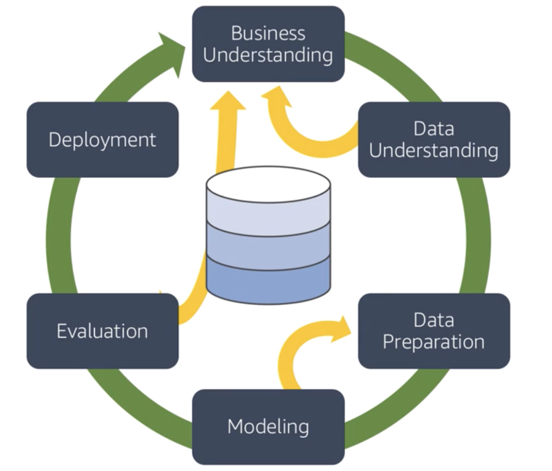
```

There are 6 phases and the first (_Business Understanding_) one is the most important one, in that phase you going to understand the problem and know if this suitable for ML or not.


**Phase 1: BUSINESS UNDERSTANTING**

This phase there are 4 tasks :

1. _Understating business requiriment_ : Important to totally **understand the customer needs** and think on the **questions from a business perspective** that need to be answered (_areas and business that need to improve_) and convert that a problem that need to be solved or a problem that need to be answered, also **high the critical features** of projects (_people, resources, etc_) 


2. _Analyzing support information_ : **Collect information** necessary based on the business question from task 1, make sure to **list all the required resources and assumptions**, analyze the risks, make a **plan for contingencies** and compare the **costs and benefits** for the project

3. _Converting to a Data Mining problem_: Get the business question from task 2 and convert in machine learning objective **(_classification ? ; regression ?; clustering ? _)** problem and define a **criteria for successful**

4. _Preparing a preliminary plan_: That plan should describe the project and steps to achieve the goal:

    * Timeline with number of stages and duration
    * Dependencies
    *  Risks
    * Business and Data Mining Goals
    * Evaluation methods
    * Tools and techniques necessary for each stage
  
  

<br>

**Phase 2: DATA UNDERSTANTING**

This phase there are basically 3 tasks : 

1. _Data Collection_ : Need to **analyze which data should be be used** for the project, detail the **sources** and **steps to extract data**, having the data analyze for additional requirements (_checking missing values, if data need to be encode or decode, if need to be normalized, check if are the specific fields that are more important to solve the problem ?_) and consider **other data sources** (_customer is an important resource because they know the domain knowledge_). 


2. _Data properties_ : **Describe the data** (_Structured / Unstructured_), amount of data used and **metadata properties**, including the complexity of data relationships and key features, also include the **basics statistics** (_mean, median, etc_), check the correlation of the main attributes, we can use python, sql, R and reporting tools using graphs to **update the assumptions is necessary**    


3. _Quality_ : How many attributes contain **errors** ? , There are **missing data** ? Check the meaning of the attributes and complete the missing data, also check the **inconsistencies** and report all problems on this task and list the steps to solve this problem


On AWS we can perform this task using **Amazon Athena**, **Amazon QuickSight** and **AWS Glue**

* **Glue** _Manage ETL service_
  
  * Step 1 : Build data catalog
  * Step 2 : Dev env to test and Generate and edit transformations
  * Step 3 : Schedule and run your jobs
  
  
* **Athena** _interact query service to run SQL queries on Amazon S3_
  
  * Serveless where only pay for the queries
  * Integrated with quicksight
  * Support ANSI SQL operations and functions
  
  
* **QuickSight**

  * Fast cloud powered BI service
  * We can scale 
  * 1/10th of the cost of traditional BI solutions
  * Secure and collaboration
  

  


**Phase 3 & 4: DATA PREPARATION TASK & MODELING**

**Phase 3** consist in two tasks

* **_Final dataset selection_** : Here we should analyze the size, record selection and data types, also include and exclude columns based on data understand phase 


* **_Preparing the data_**:

  1. **Clean** for quality
  
      * Working on **missing data** : Dropping rows with missing values or adding a default value (_mean, median_) or work with imputation to add the missing data, we can also use statistical methods to calculate the value. It is also important to clean the corrupt data or variable noise
  
  
  2. **Transforming** for the best performance of model
  
      * **Derive additional** attributes from the original (_Datatime to hour, month, day ..._), use **one-hot encoding** to convert the strings , also recommend to **normalize** the data
  
  
  3. **Merging** all datasets in one final dataset
  
      * Create the final dataset using joins and concatenations , recommend to revisit the Data Understanding phase to review the attributes
  
  4. **Formatting** to properly work on model
  
      * Reformatting the data types and attributes (covert variables), randomly shuffle the data and remove unicode if necessary


**Phase 3** Modeling

_This phase work together with Data Preparation phase_

Modeling have 3 steps:

  * _Model selection and creation_ : Here we will **select a model to address the ML problem** (_Regression for numeric problems and Random forest for Classification_)
  
  * _Model testing plan_ : Before create the model we need to define **how to test** the model accuracy, split the data in Test and Training dataset (**30/70**), also there are other techniques, such as **k-fold**, for the model **evaluation criterion** we can use MSE, ROC, Confusion matrix, etc
  
  * _Model parameter tuning/testing_ :  **build the model** , train the model and tweak the best performance (document the hiperparameters and reason), build multiple models with different parameters and report the findings
  

Tools for Data Preparations and Modeling : 

  * **Amazon EMR + Spark**
  
    * We can use EMR and the package **Spark MLlib** to create DataFrame based APIs for ML, using ipython notebooks, zepplin or R studio
    * Support **Scala, Python, R, Java and SQL**
    * Cost savings : Leverage spot instance for the task nodes
  
  * **Amazon EC2 + Deep Learning AMI**
  
    * The two main EC2 base ML environments are **R studio** and **AWS Deep Learning AMI**, this one preinstalled with GPU and frameworks ( _MXNet, TensorFlow, Caffe2, Tourch, Keras, etc_ ) , also include Anaconda Data Science platform with popular libraries like numpy, scikit-learn, etc
  
  * [To install R studio in EC2](https://aws.amazon.com/blogs/big-data/running-r-on-aws/)
  


**Phase 5: EVALUATION**

In this phase we have two main tasks :

1. Evaluate how the model is performing related to business goals

    * Dependens on : 
    
      * Accuracy of model or evaluation criteria on planning phase
      * Converte the assessments to business need (monetary cost)
      * Make a summary of results, ranking the models based on successfully criteria
      
    
    

<br>

2. Make final decision to deploy or not

    * Review the project and the assess the steps taken in each phase and perform quality assurance checks (_is the data available for future training, model performance is using the determinated data_)

    * If the process fail to deploy due the successfully criteria, analise the business goals and try different approache or update the business goals and try again


**Phase 6: DEPLOYMENT**

Tasks : 


  1. Planning deployment
  
      * Runtime : Identity where it going to run (_EC2, EC2 Container Service, AWS Lambda_)
      * Application deployment : AWS Code deploy (_EC2_), AWS OpsWorks (_use chef_), AWS Elastic Beanstalk (_run the models on virtual servers_)

  
  2. Maintenance and monitoring
      * Infrastructure deployment : AWS CloudFormation, AWS OpsWorks, AWS Elastic Beanstalk
      * Code Management : AWS CodeCommit, AWS CodePipeline (_CI/CD_) and AWS Elastic Beanstalk
      * Monitoring: Amazon CloudWatch, AWS Cloud Trail and AWS Elastic Beanstalk

  
  
  3. Final report
  
    * Document all steps and highlight processes used 
    * Goals met the project goals ?
    * Detail the findings 
    * Identify and explain the model used and reason behind using the model
    * Identify the customer groups to target using this model
  
  4. Project review
  
    * Outcomes of the project : Summarize results and write thorough documentation and generalize the whole process to make it useful for the next iteration
  
  


* Task : create EC2 install packages and access from browser ssh `<connection> -L localhost:8888:localhost:8888`


**Setup EC2 to run notebook**


1. Create EC2 instance

2. Connect to instance via ssh

3. Install python

```
sudo yum update
sudo yum install python
```

4. Create a virtual environment and activate

```
python3 -m venv basic
source ~/basic/bin/activate
```

5. Install basic database science packages

```
pip install pandas numpy matplotlib seaborn scikit-learn statsmodels jupyter jupyterlab
```

6. Configure the jupyter password

```
jupyter notebook --generate-config
jupyter notebook password
```

7. Open a tunnel and Start jupyter notebook

```
ssh -i "<key>.pem" ec2-user@<ec2 machine>m -f -N -L 8888:localhost:8888

jupyter notebook --no browser

```

8. Access the notebook from browser http://localhost:8888/


### Data Engineering

**S3**

  * Buckets must have a _global unique name_ 
  * Objects (file) have a key. The key is the FULL path : `<my_bucket>/my_folder/my_file.txt`
  * Max 5TB
  * Backbone for ML services
  * Perfect use case for **Data Lake**, with infinite size , 99.999999999%  durability across multiple AZ and 99.99% availability (_not available 53 min a year_)
  * Obejct storage supports any file format (_CSV, JSON, Parquet, ORC, Avro, Protobuf_)
  * We can partition the data by date, by product or any strategy we would like, some tools perform this task forus (Glue and Kinises)
  
<br>

_[Amazon S3 Storage Classes](https://aws.amazon.com/s3/storage-classes/)_: 
    
| Classes 	| Details 	| Use Case 	|
|---	|---	|---	|
| S3 Standard - General purpose 	| * 99.99% availability (53min a year not available)<br>* Used for frequently accessed data<br>* Low latency and high throughput<br>* Sustain 2 concurrent failures 	| Big data analytics, mobile and gaming applications 	|
| S3 Standard-Infrequent Access IA 	| * For data that is less frequently accessed, but requires rapid access when needed<br>* Low cost than S3 standard, cost on retrieval<br>* 99.9% availability <br>  	| Used for Disaster recovery 	|
| S3 One Zone-Infrequent access 	| * High durability 99.999999999% in a single AZ, data lost when AZ distroied<br>* 99.5% availability 	| Storing secondary backup copies of on-prem data, or data you can recriate 	|
| S3 Glacier Instant Retrieval<br><br>Low cost for archive/backup 	| **Instant retrieval** : ms retrieval , min storage duration 90 days<br><br>**Flexible Retrieval** : Expedite 1 to 5min , Standard 3 to 5 hours, min duration 90 days<br><br>**Deep Archive** : Standard 12hrs, bulk 48hrs, min duration 180 days, for long archive 	|  	|
| S3 Intelligent Tiering 	| * Small monthly monitoring and auto-tiering fee<br>* Move objects automatically between Tiers based on usage<br>* No retrieval charge<br><br>* **Frequent Access** : default<br>* **Infrequent Access**  > 30 days<br><br>* **Archive Instant Access** > 90 days<br>* **Archive Access** 90 to 700+ days<br>* **Deep Archive Access** 180 to 700+ days<br><br>  	|  	|


* We can move files between storage classes manually or via configuration using **Lifecycle Rules**


* Security : _Encryption for objects_

  * **SSE-S3** : encrypt using keys managed by AWS
  * **SSE-KMS** : use Key Management Service  (_Customer Master Key_)
  * **SSE-C** : when we want to manage the keys
  * **Client Side Encryption**
  
_On ML , **SSE-S3** and **SSE-KMS** will be most likely be used_
_SS3 means Service-side-encryption_

  * S3 Bucket policies : We can use the policies to grant access (_including Cross Account_) to bucket or force objects to be encrypted on upload

    * Today we can use the **default encryption** option on S3 and every document sent to bucket will be encrypted by default


<br>


**AWS Kinesis**

**Kinesis** is a managed alternative to Apache Kafka, it is used to _real-time_ streaming process of big data, used for application logs, metrics, IoT, clickstreams and data replicated on 3 AZs

  * Services :
  
    * [Kinesis Data Streams](https://aws.amazon.com/kinesis/data-streams/) : low latency streaming ingest at scale
    
      * Stream are divided into Shards/Partitions and by default data retention is 24hrs, multiple appls can use the same stream and once data is inserted it cannot be deleted (**immutability**)
      * It is for **real-time**
    
    ```{r, echo = FALSE, out.width="80%"}
    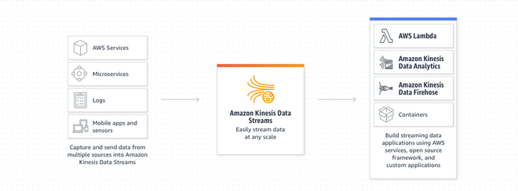
    ```


    * [Kinesis Data Analytics](https://aws.amazon.com/kinesis/data-analytics/): real-time analytics on streams using SQL
    
      * Data Analytics will take data from Firehose or Data Streams, perform modifications using SQL and send it to analytic tools 
      * Used to **streaming ETL**, continues metric and reponsive analytics (_filtering_)
      
      * Machine Learning on Kinesis Data Analytics  (_two algorithms_)
        
        * **RANDOM_CUT_FOREST** (Used for **anomaly detection** on numeric columns, use recent history to compute model)
        * **HOTSPOTS** (locate and return information about dense regions)
      
    ```{r, echo = FALSE, out.width="80%"}
    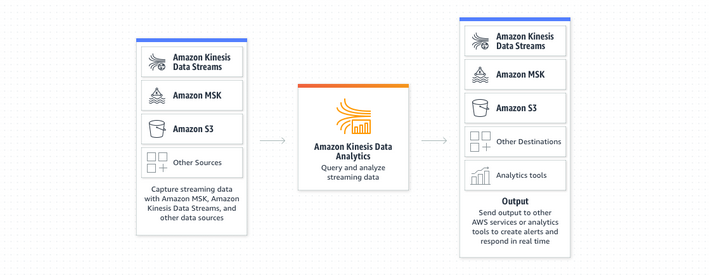
    ```
      
    
    
    * [Kinesis Firehose](https://aws.amazon.com/kinesis/data-firehose/): load stream into S3, Redshift, ElasticSearch and splunk
    
      * To store data in two target destination, it reads data up to 1MB, can be transformed by lambada function and write in batches into **S3, RedShift, ElasticSearch**, custom destionation or 3rd party (splunk, mongo, etc) 
      * It is **near real-time** to ingest massive data, auto-scale, supporting many formats (csv, json, orc)
      
    ```{r, echo = FALSE, out.width="80%"}
    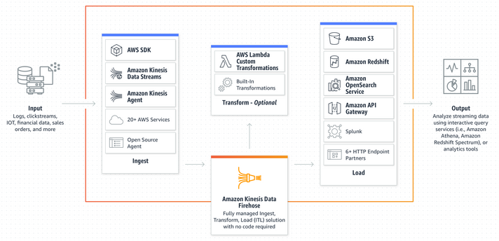
    ```
    
    
    
    * [Kinesis video Stream](https://aws.amazon.com/pt/kinesis/video-streams/?amazon-kinesis-video-streams-resources-blog.sort-by=item.additionalFields.createdDate&amazon-kinesis-video-streams-resources-blog.sort-order=desc): stream video in real-time
 
      * real-time video stream to create ML applications
      
    ```{r, echo = FALSE, out.width="80%"}
    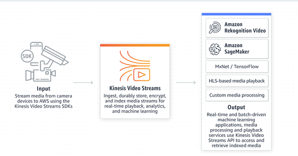
    ```     
      


<br>


**GLUE DATA CATALOG**

[GLUE Documentation](https://docs.aws.amazon.com/glue/index.html)

> Metadata repository for all tables

  * Automated schema inference
  * Schema visioned
  * Integration with Athena or RedShift (_schema & data discovery_)
  * Glue Crawlers can help build the **Data Catalog**


**GLUE DATA CRAWLERS**

  * Go through the data to infer schema and partitions, works in JSON,CSV and PARQUET
  * Will extract partition based on how S3 is organized
  
  
**GLUE ETL**

  * **Transform data**, clean, modify (_Join, filter, dropfields, map_), generate code in python or spark and the target can be S3, JDBC, RDS, RedShift or Glue Catalog
  * ML Transformation : **FindMatches ML** identify duplicated or matching records in database
  * Jobs run on Spark Platform
  * Formats (csv, json, avro, parquet, orc and xml)
  * Also can use any apache spark transformatino (like k-means)


<br>


**DATA STORE IN MACHINE LEARNING**

* **RedShift** : Data warehouse, OLAP processing
* **RDS, Autora** : Relation store OLTP
* **DynamoDB** : NoSQL data store
* **S3**: Object store, serveless
* **OpenSearch** (previously Elastic Search) : Indexing data
* **ElastiCache** : Caching mechanism


<br>


  
  


---


## GCP - Professional Machine Learning Engineer

### Big Data and ML Fundamentals

* Compute power

  * We can easy create a server, execute the job, pause or delete the server


* Storage

  * Big Data and Machine Learning are on top of **Compute power**, **storage** and **Networking** that are on top of **security**

  * To create a storage bucket from UI is very simple by command line we can

```
gsutil mb -p [PROJECT_NAME] -c [STORAGE_CLASS] -l [BUCKET_LOCATTION] gs://[BUCKET_NAME]/
```

  * Types of Storage


```{r, echo = FALSE, out.width="60%"}
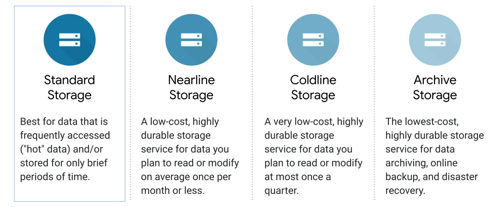
```


* Networking

  * GCP datacenter are interconnected 
  * Every machine can talk with each other with 10GBps


* Security

  * Communication to GCP are encrypted in transit
  * Stored data are encrypted
  * BigQuery data are encrypted 

```{r, echo = FALSE, out.width="60%"}
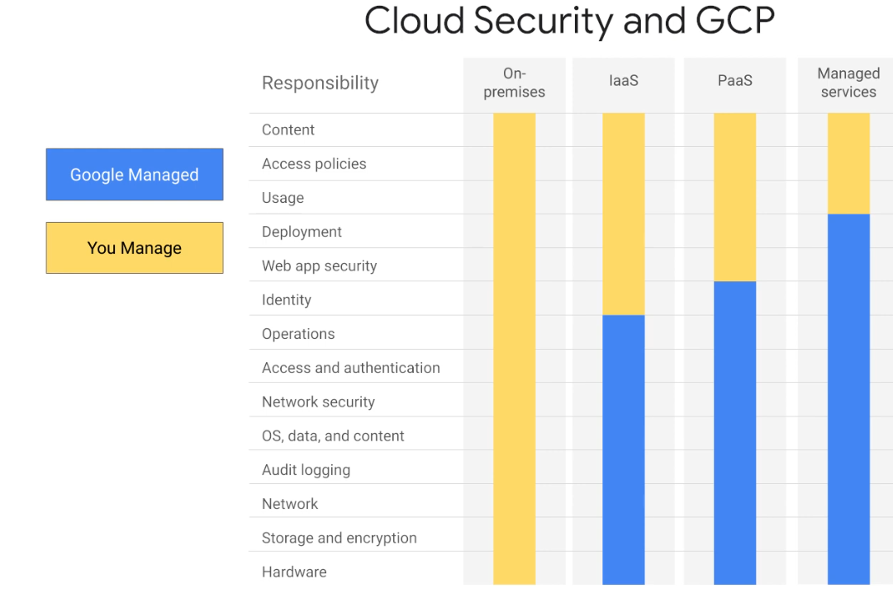
```


* GCP Offers


```{r, echo = FALSE, out.width="60%"}
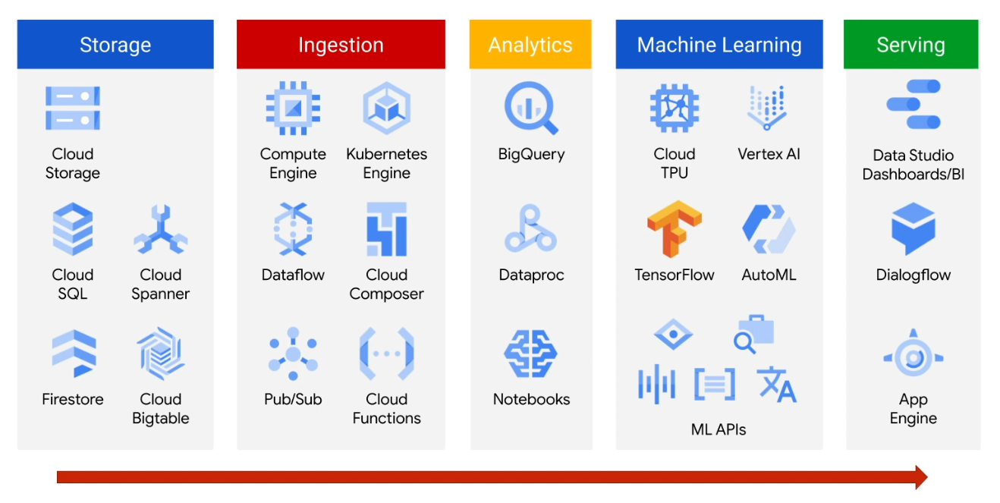
```


### Recommending Products using Cloud SQL and Spark


```{r, echo = FALSE, out.width="60%"}
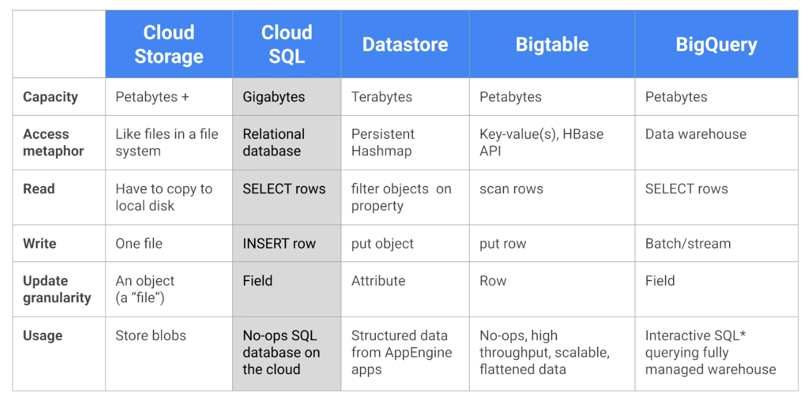
```

```{r, echo = FALSE, out.width="60%"}
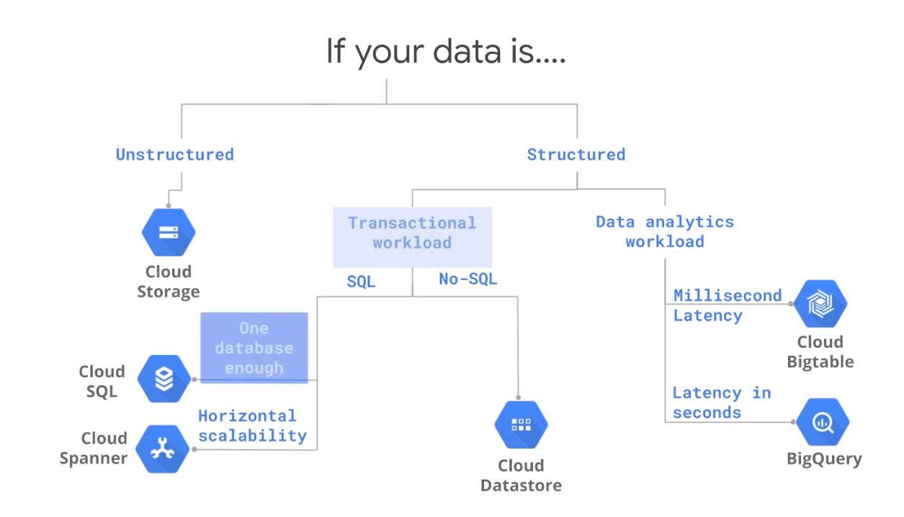
```

* Cloud SQL : Google managed RDBMS Mysql


---

## Kyndryl Data Science Roudmap

### Data Science- Project Management Methodology - CRISP-DM

#### KDD
  
1. **Select**
  *  Interpret the data
  *  Select data relevant to analysis

2. **Preprocessing**
  * Outliers
  * Missing Values
  
3. **Transform**
  * Useful features
  * Smoothing (- binning  - cluster)
  * Aggregation (- Weekly - month)
  * Normalization

4. **Data Mining**
  * Explore
  * Graph
  * Predict
  * Models


5. **Evaluating**
  * Check
  * Evaluate the results
  * Analysis


#### SEMMA

**S**ample : Subset of data (train, test validation)

**E**xplore: Understand the data

**M**:odify: Clean, feature engineering

**M**odel: data mining, modeling

**A**ssess: Model performance


#### CRISP-DM


1. Business Understand 
2. Data Understand 
3. Data Preparation
4. Modeling
5. Evaluation
6. Deploy


##### 1. Business Understand  _initial plan_

Steps:

1. **Define Business Problem** : Define the objective, the analitical problem, the expectations, success criteria, pain points
2. **Assess and Analyze Scenarios **
3. **Define Data Mining Problem**
4. **Project plan** : Deliverable (timeline, costs, success criteria, assumptions, constraints, etc)


##### 2. Data Understand 

1. **Data Collection** : Primary data source (survery, experiments) or secondary data source (ERP, CRM, database)

2. **Data Preparation / Description**
  
 * Quantitative (count, continuous ) vs Qualitative (categorical)
 * Balance vs Imbalance (one class less than 30% = Imbalance)
 * Structure (tabular) vs Unstructured(video, img, audio, text) vs Semi-structure
 
3. **Exploration - Data Analysis **

 * **Inferencial stats**
    * Sampling - Balacing vs Imbalancing 
      * Balancing : random sampling, sampling
      * Imbalancing: stratified sampling, K-fold, smote, msmote, leve-one-out


 * **Descriptive stats**
    * Meam , media, mode
    * variance, std, range
    * skewness
    * kurtoses
    
  * **Graphical **
    * Univariant
        * Boxplot - Outliers, shape of distribution
        * Histogram - Shape, outliers
        * QQ Plot
    _check train and test dataset if they are in the same distribution_
    
    * Bivariant
       * Scatter : correlation, coeficient (+1, -1) , strong (r > 0.85 ) weak (r < 0.4), cluster, linear
       
      
    


4. **Data Quality Analysis**

 * Idenfity outliers, missing values
 * Levels of granularity
 * Inconsistence
 * Wrong data errors
 * Meta info
 
 
 
##### 3. Data Preparation 


In this step we clean, curate, wrangle and prepare the data

 * **Outliers** : 3R Techniques (Rectify, Remove, Retain)
 
 * **Missing Data**: Imputation (mean, median, mode, regression, knn, etc)
 
 * **Data Transform** : Log, exp, boxcox, etc, done when data are non-normal
 
 * **Data Normalization / Standartization**
 
    * Normalization (mean = 0 , std =1 )
    * Standardization (min = 0 , max = 1) - MinMaxScaller
    
 * Discretization, Binning, **Grouping**
 
 * Dummy variable - **OneHotEncoding**
 
 * **Apply domain knowledge to generate more features**
 
 
##### 4. Modeling


* Select model techniques
* Model building
* Model evaluation and tuning
* Model Assessment

* **Supervised Learning**
  * Predict Y based on X
  * Categorical (2 class or multiclass)
  * numerical - Prediction
  * User preference - Recommendation
  * Relevance - Retrival

<br>

  * **Regression Analysis**
  
    1. y = continuous : Linear Regression
    2. y = discrete (2 categories) : Logistic Regression
    3. y = discrete (> 2 categories) : Multinominal / Ordinal Regression
    4. y = Count : Poisson / Negative Binominal REgression (_var > mean_)
    5. Excessive Zero : 
      
        * ZIP (Zero Inflated Position)
        * ZINB (Zero Inflated Negative Binomial)
        * Hurdle


  * KNN
  
  * Naive Bayes
  
  * **Black Box**
  
    * Neural Network
    * Support Vector Machine
    
  * **Ensemble**
  
    * **Stacking** : Multi Techniques (Linear + DT + KNN) mean or majority
    
    * **Bagging** : Randon Forest - good for discrete
    
    * **Boosting**: Decistion tree, Gradient boosting, XGB, AdaBoost

<br>


* **Unsupervised Learning**


  * **Cluster / Segmentation**  - _reduce Row_
  
    1. **Kmeans** - non hierarchical - elbow curve
    2. **Hierarchical** - agglomerative - deprogram
    3. **DBSCAN** - application with noise
    4. **OPTICS** - ordering points to identify cluster structure
    5. **CLARA** - cluster large application - for large datasets
    6. **K-medians / K-medoids** (for lot of outlines) / **K-modes** (lot of categorical variables)


  **Dimension Reduction**  - _reduce columns_
  
    * PCA
    * SVD


  * **Association Rules / Market Basket Analysis / Affinity Analysis**
  
    * Support
    * Confidence
    * EFT Ration > 1
    
  * **Recommended system**
  
  * **Network Analysis**
  
    * 1. Degree
    * 2. Page rank
    * 3. others


  * **Test Mining / NLP**
  
    * Bow
    * TDW / DTW
    * TF / TDIDF


  * **Forecasting / Time Series**
  
    * Model Based Approaches
    
      1. Trend: Linear, Exponential , Quadratic
      
      2. Seasonality : additive or multiplicative
      
      
   * Data Base Approaches
   
      1. AR - Auto regressive
      2. MA - Movie average
      3. ES - Exponential smoothing
      
        a. SES
        b. HOHS / Double Exponential Smoothing
        c. Winters, others
        
   * Overtiffing (_variance_)  vs Underfitting (_Bias_)


<br>


* Reinforcement Learning (_learning from rewards_)

<br>


* Semi-supervised learning

<br>


* Active learning, transfer learning, structure prediction


##### 5. Evaluation


There are no better type of evaluate need to analyze the problem and data / results to select the best metric

  * Mean Error
  * Mean Absolute deviation
  * Mean Squared Error
  * Root Mean Squared Error
  * Mean Percentage Error
  * Mean Absolute percentage error
  

For Categorical we also have the **Confustion Matrix**


```{r, echo = FALSE, out.width="80%"}
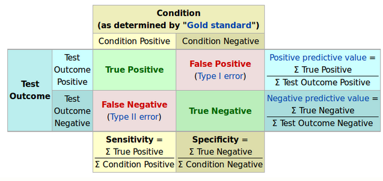
```

  * **TP** : Correct Predictive Positive
  * **TN** : Correct Predictive Negative
  * **FP** : Incorrect Predictive Positive
  * **FN** : Incorrect Predict Negative
  

**Precision** : Prob of correctly identify a random patient with disease have a disease. (_Positive Correct predicted_)

**Sensitive** (_Recall_ or _Hit Rate_):  Proportion of people with disease who are correctly identified as having disease

**Specificity** (_True Negative Rate_) : Proportion of people with NO disease being characterized as not have disease

**FP Rate ** (_Type 1 error_) :  1 - Specificity

**FN Rate ** (_Type 2 error_) : 1 - Sensitivity

**F1** : 1 to 0 Measure that balance precision and recall


<br>

**ROC**


```{r, echo = FALSE, out.width="80%"}
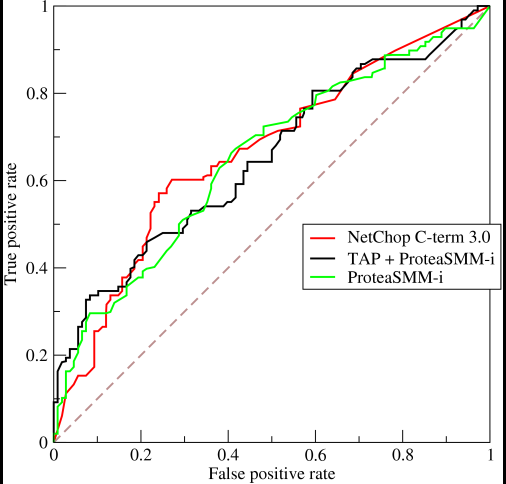
```


**AUC** : Are under the curve

  * 0.9 - 1.0 : outstanding
  * 0.8 - 0.9 : good
  * 0.7 - 0.8 : acceptable
  * 0.6 - 0.7 : poor
  * 0.5 - 0.5 : no discrimination
  

<br>


**Model Assessment**

  * Model performance and success criteria agreed upon early are in sync 
  * Model should be repeatable and reproducible
  * Model is in line with Non-functional requirements, such as scale, robust, maintainable, easy to deploy
  * Model evaluation gives satisfactory results
  * Model is meeting business requirements 
  
  
  
<br>


* Rank final models based on the quality of results and relevance

* Any assumptions or constants that were invalidated by the model ? 

* Cost of deploy the entire pipeline

* Any pain points

* Data Sufficiency report 

* Final suggestions, feedback

**Monitoring** : PEST or SWOT


##### 6. Deploy

> DEV to PROD


* Proper resources - Hardware, server, software , human 
* model saved and then deployed
* Maintenance and monitoring (_PEST_)


### Statistics for Data Analysis Using Python
#### Descriptive Statistics


**Central Tendency**

  * _Mean_ : Average
  * _Mode_ : Most occuring number
  * _Median_ : Moddle value when arranged in asc or desc order


**Dispersion**

  * _Range_ : highest - lowest value
  * _Standard Deviation_ : squared root of variance
  * _Variance_ 
  * _Inter Quartile Range **IQR**_ : If divide the data into four parts (Q1, Q2 and Q3)
    * Quantiles, if we divide the data into _n_ parts, we get (n-1) points of split called quantiles


#### Distributions


**BINOMIAL**

  * The experiment consist of n repeated trials
  * Each trial can result in just two possible outcomes(success and failure)
  * The probability of success, denoted by p, is the same on every trial
  * The trials are independent, that is, the outcome on one trial does not affect the outcome of other trials


_In Python_

```
from scypy.stats import binom

binom.cdf(k , n , p) # cumulative distibution function - for less than or equal to 2
binom.pmf(k , n , p) # Probability mass function - for specific number of, defects
binom.sf(k , n , p)  # for more than 2 (similar 1 - cdf)
binom.mean(n, p)     # for mean of the dist
binom.std(n, p)      # for standard deviation of the dist
binom.var(n, p)      # for the variance of the dist

```

<br>

**POISSON**

* The possibilities of success are infinite (_Number of people in a queue, Number of accident in a city_)  are sample of this distribution

* Measure the number of success similar to binomial

* As binomial are for discrete distribution

* Properties : 
  * The experiment results in a success or failure
  * The **mean** of success occurs in a specific region **is known**
  * Outcomes are random
  * The outcomes of interest are rare relative to the possible outcomes
  * The variance is equal to mean
  
  
  
_In Python_


```

from scypy.stats import binom

poisson.cdf(k , mu) # cumulative distribution function - for less than or equal to 
poisson.pmf(k , mu) # probability mass function - for exact value
poisson.sf(k , mu)  # for more than (similar 1 - cdf)
poisson.mean(mu)    # for mean of the distr
poisson.var(mu)     # for variance of the distr
poisson.std(mu)     # for standard deviation of the distr


```

<br>

**NORMAL**


Most common distribution for continuous data


```{r, echo = FALSE, out.width="80%"}
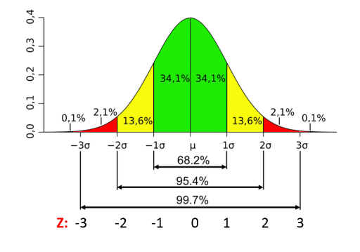
```


* Properties :
  * Normal distribution is **symmetrically**
  * Long Tails / **Bell shaped**
  * Mean, mode and median are the same
  * **68%** of area under the curve falls with `1` std of the mean
  * **95%** of area under the curve falls with `2` std of the mean
  * **99.7%** of area under the curve fall with `3` std of the mean
  * The total area under the normal curve is equal to `1`
  * The probability of any particular value is `0` 
  * The probability that X is greater than or less than a value = area


```
norm.cdf(x,mu,sigma) # Cumulative distribution function - for less than or equal to 
norm.pdf(x,mu,sigma) # Probability density function (not Probability mass function) - for exact value
norm.sf(x,mu,sigma)  # For more than (similar to 1-cdf)
norm.mean(mu)        # For mean of the distribution
norm.var(mu)         # For variance of the distribution
norm.std(mu)         # For standard deviation of the distribution
```


#### Inferencial and Hypothesis Testing

_Inferencial Stats_ 


 * We infer about the population based on sample data


```{r, echo = FALSE, out.width="80%"}
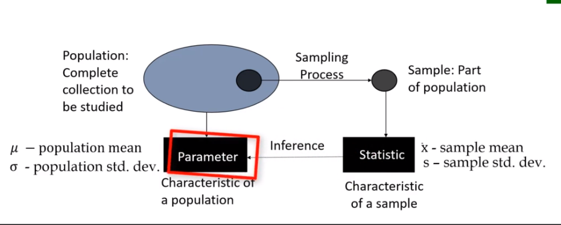
```

<br>

_Central Limit Theorem_ 

  * For almost all porpulations, the **sampling distribution of the mean** can be **approximated** closely by a **normal distribution**, provided the sample size sufficiently large
  
  * If a variable has a mens of µ and the variance $σ^{2}$, as the sample size increase, the sample mean approaches a normal distribution with mean µ$\overline{x}$ and variance σ$\frac{2}{x}$


<br>

_Hypothesis Testing_

 * Hypothesis testing is a method of statistical inference
 * Commonly used tests include
   * Comapre sample statistics with the population parameter
   * Compare two datasets
  
  
<br>


_Steps for Hypothesis Testing_

> Taking a sample and based on that sample we are predictin about the population 

1. State the **alternative hypothesis**
2. State the **null hypothesis**
3. Select a probability of **error level** (_alpha_). generally **0.05**
4. Calculate the **test statistics**(e.g t or z score)
    * z = (x-μ)/σ  (_Basic one sample_)
    * z = (x – μ) / (σ / √n) (_multiple samples_)
5. Critical test statistic
    * Use the $\alpha$ and check on Test Table
6. **Interpret** the results


  * **Null Hypothesis** : Basic assumption, for example : _The person is innocent_
  
  * **Alternate Hypothesis** : You need to provide proof of this, for example :  _The person is guilty_

  * In Statistical terms you: 
    * Reject the _Null Hypothesis_, or
    * Fail to reject the _Null Hypothesis_ (not accept the Null Hypothesis)


```{r, echo = FALSE, out.width="80%"}
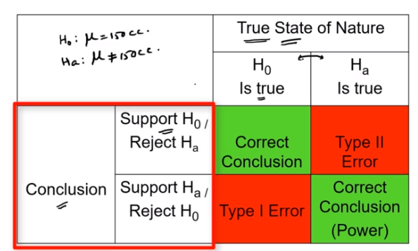
```

 * **Type I Error** : 
   * False Alarm
  
 * **Type II Error** :
   * Something change and we fail to detect the change

```{r, echo = FALSE, out.width="80%"}
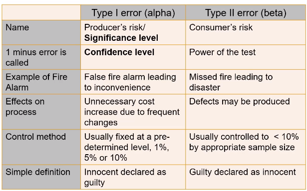
```

 * **Confidence level** : C = 0.90, 0.95, 0.99 (90%, 95%, 99%)
 * **Level of Significance or Type I Error** : $\alpha$ = 1 - C(0.10, 0.05, 0.01)


<br>

 * **Power**
   * Power : 1 - $\beta$ (_or 1 - type II error_)
   * Type II Error : Fail to reject null hypothesis when null hypothesis is false
   * Likelihood of rejecting null hypothesis when null hypothesis is false
   * Or : Power is the ability of a test to correctly reject the null hypothesis

<br>

 * **P-value**
   * _**p-value**_ is the lowest value of alpha for which the null hypothesis can be rejected. (_Probability that the null hypothesis is correct_)
   * For example, **if p = 0.045 you can reject the null hypothesis** at $\alpha$ = 0.05
  
> **p** is low the null must go (_null get rejected_), if **p** is high the null fly (_null stay_)
 


<br>


_Proportions & Variances_


* Conditions for z Test

  * **Random** samples
  * Each observation should be independent of other
    * Sample **with replacement**, or
    * If sample without replacement, the sample size should **not be more than 10% of population**
  * Sampling **distribution approximates Normal** Distribution
    * Population is Normally distributed and the population **standard deviation is known** , or
    * Sample **size >= 30**

<br>

```{r, echo = FALSE, out.width="80%"}
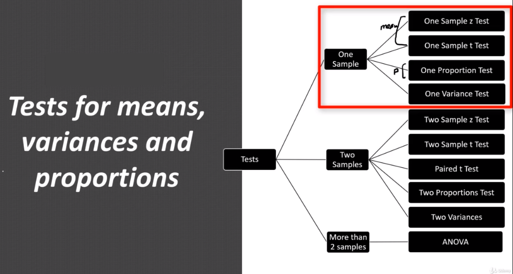
```


* _**One Sample**_
 
  * **One Sample z Test** : Used when we have one sample from one machine
    * Conditions for **z** test:
      * Random Samples
      * Each observation should be independent of each other (_sample with replacement_) or (_if sample without replacement_ sample size should not be more than 10% or population)
      * Sample distribution approximates Normal Distribution (_Population is Normally distributed and the population std dev is <u>**known**</u> or size **>= 30**_)


  * **One Sample t Test** : When we have _less than 30 numbers of sample_ and we do not _know the population standard deviation_
    * Conditions for **t** test:
      * Random samples
      * Each observation should be independent of each other (_sample with replacement_) or (_if sample without replacement_ sample size should not be more than 10% or population)
      * Sample distribution approximates Normal Distribution (_Population is Normally distributed and the population std dev is <u>**unknown**</u> or size **< 30**_)


  * **One Proportion Test** : Compare proportions 
    * Conditions for **One Proportion** test
      * Random samples
      * Each observation should be independent of each other (_sample with replacement_) or (_if sample without replacement_ sample size should not be more than 10% or population)
      * The data contains only two categories, such as <u>**pass / fail**</u> or <u>**yes / no**</u>
      * For Normal Approximation (both np >= 10 and n(n-p) >= 10 - data should have at least 10 "successes" and at least 10 "failures")


  * **One Variance Test** : Check if variance has changed 
    * Conditions for **One Variance** test
      * Random samples
      * Each observation should be independent of each other (_sample with replacement_) or (_if sample without replacement_ sample size should not be more than 10% or population)
      * The data follows a _Normal Distribution_
      * <u>Variance Tests</u>
        * **Chi-square** Test
          * For testing the population variance against a specified value
          * Testing goodness of fit of some probability distribution
          * Testing for independence of two attributes (_Contingency Tables_)
        * **F-test**
          * for testing equality of **two** variances from different population
          * for testing equality of several means with technique of **ANOVA**


* _**Two Samples**_

  * **Two Sample z Test** : Compare the sample (_mean_) from two machines
    * Conditions for **z** test:
      * Random Samples
      * Each observation should be independent of each other (_sample with replacement_) or (_if sample without replacement_ sample size should not be more than 10% or population)
      * Sample distribution approximates Normal Distribution (_Population is Normally distributed and the population std dev is <u>**known**</u> or size **>= 30**_)
      * _Sample of Z test hypothesis for two sample_:
        * Null Hypothesis : μ1 = μ2
        * Alternative hypothesis : μ1 != μ2
        * [R sample](https://cran.r-project.org/web/packages/distributions3/vignettes/two-sample-z-test.html)
        * [Python sample](https://www.geeksforgeeks.org/z-test/)
        
  * **Two Sample t test** 
    * Conditions for **t** test:
      * Random Samples
      * Each observation should be independent of each other (_sample with replacement_) or (_if sample without replacement_ sample size should not be more than 10% or population)
      * Sample distribution approximates Normal Distribution (_Population is Normally distributed and the population std dev is <u>**unknown**</u> or size **< 30**_)
      * How to calculate ? 
        * Variance equal
          * Since we have a small size of sample we going to use t test independent `stats.ttest_ind()` function
        
        ```
        import scipy.stats as stats
        
        machine1 = [150,152,154,152,151]
        machine2 = [156,155,158,155,154]
        
        stats.ttest_ind(machine1, machine2, equal_var=True)
        
        #Output
        # Statistics = -4.0055
        # pvalue     =  0.0039
        
        ```
        **Result**
        _Since the value of pvalue is less than 0.05 we will reject the Null Hypotheses H0 since there is no significant difference in the variance of two machines_
        
        * Variance unequal
          * Since we have a small size of sample we going to use t test independent `stats.ttest_ind()` function
        
        ```
        import scipy.stats as stats
        
        machine1 = [150,152,154,152,151]
        machine3 = [144,162,177,150,140]
        
        stats.ttest_ind(machine1, machine3, equal_var=False)
        
        #Output
        # Statistics =  0.4146
        # pvalue     =  0.6992
        
        ```
        **Result**
        _Since **pvalue** is high than 0.05 we will fail reject the Null Hypotheses H0 since there is significant difference in the variance of two machines_
        

      

  * **Paired t test**  : Compare when you have before and after results
    * _If the value in one sample affect the value in the other sample, then **the samples are dependent** : (Ex: Blood pressure before and after specific medicine)_
    * How to calculate ? 
      * Find the difference between two set of readings as d1, d2..dn
      * Find the mean and _std dev_ of these differences
      * Using Python we can use the package `scipy.stats` and `ttest_rel` function
      
      ```
      import scipy.stats as stats
      
      before = [120,122,143,100,109]
      after  = [122,120,141,109,109]
      
      stats.ttest_rel(before, after)
      
      # output
      # statistics = -0.068
      # pvalue     =  0.530
      ```
      **Results:**
      _Since **pvalue** is high to 0.05 we fail to reject the H0 (null hypothesis), which means there are no significant difference between the values before and after_

  * **Two Proportions Test** : Compare the _proportions_ from two samples
    * Conditions for **Proportions test** 
      * Random Samples
      * Each observation should be independent of each other (_sample with replacement_) or (_if sample without replacement_ sample size should not be more than 10% or population)
      * The data contains only two categories, such as pass/fail or yes/no 
      * For Normal approximation :
        * both np >= 10 and np(1-p) >= 10 : Data should have at least 10 successes and at least 10 failures for each sample (_some books it is 5_)
    * Methods to calculate
      * Pooled : H0 : p1 = p2 and Ha p1 != p2 
      * Un-pooled : H0 p1 - p2 = d(difference) and Ha p1 - p2 != d(difference)
    * How to calculate ? 
      
      ```
      # H0 = p = p0
      # Ha = p != p0
      # From vendor A we test 200 pieces and find 30 defects
      # From vendor B we test 100 pieces and find 10 defects
      # Is there a significant difference in quality of those 2 vendors? (95% confidence level)

      from  statsmodels.stats.proportion import proportion
      
      proportion.test_proportions_2indep(30,200, 10, 100, method='score')
      
      
      #output
      # Statistics = 1.198
      # pvalue     = 0.230
      
      
      ```
      **Results:**
      _Since the pvalue is higher than 0.05 we fail to reject the null hypotheses , we cannot say there is any significant difference in the proportion of this two samples_
  

  * **Two Variances** : Compare the _variances_ from two samples
    * Conditions and test used for two variance test:
      * **F-test**
        * for testing equality of **two** variances from different population
        * for testing equality of several means with technique of **ANOVA**
    * How to calculate ?
    
    ```
    * 8 samples from machine A : STDEV 1.1
    * 5 samples from machine B : STDEV 11  
    * Is there a difference in variance at (90% confidence level) ?
    
    
    from scipy.stats import f
    
    # find f calculated
    F_cal = 11/ (1.1**2)
    # output 9.09
    
    
    # find critical values on right dfn =  n - 1
    f.isf(0.05, dfn = 4, dfd = 7)
    # output : 4.12
    
    
    # find critical value on left
    f.isf(0.95,4,7)
    # output 0.16
    
    
    
    
    ```
    **Results:**
    _Since the F_calc(9.09) is in the reject zone higher than right value (4.12), we reject the null hypotheses, there is a significant difference between the machines_
    
    We also can use `stats.bartlett(machine1, machine2)` or `stats.levene(machine1 , machine2)`
    
    **Levene test is a robust test** compared with Bartlett
    
* _**More Than 2 Samples**_

> ANOVA is Analysis of Variance
  
  * **ANOVA** : If we have 3 or more machines to compare
  _To analyze the variance we have **chi-square test** for 1 variance test and **F-test** for two variance test_
    * For testing equality of _several means_ with technique of **ANOVA**
    * H0 : μ1 = μ2 = μ3 = μ4 ...  = μn        _(means are equal)_
    * Ha : At least one of the means is different from others  _(means are NOT equal)_
    
    * How to calculate ?
    
    
    ```
    from scipy.stats as stats
    
    
    m1 = [150,151,152,152,151,150]
    m2 = [153,152,148,151,149,152]
    m3 = [156,154,155,156,157,155]
    
    
    stats.f_oneway(m1,m2,m3)

    #output:
    #statistics : 22.264
    #pvalue     : 3.23e-05
    
    ```
    
    **Results:**
     _As the pvalue is very small we conclude that at least one machine is different from others_
     
     We can also use the package `statsmodels.stats` with method `oneway.anova_oneway()`
    
  
  * **ANOVA Concept**
    * _Variation within_ : Variation of the values in the same machine _(inside or ERROR)_
    * _Variation between_: Variation of the values between machines _(treatment)_
    * To check we take the ration of these variations using **F test** to conclude if there are variation of not


<br>

  * **Post Hoc Tests**
    * Post Hoc Tests attempt to control the experimentwise error rate _(usually alpha = 0.05)_ just like one-way ANOVA is used instead of multiple t-test 

    * **Tukey's Test** from `statsmodels.stats.multicomp` method `pairwise_tukeyhsd`
    
    ```
    import statsmodels.stats.oenway as oneway
    from statsmodels.stats.multicomp import pairwise_tukeyhsd
    
    df = mpg[mpg['cylinders'] == 4][['mpg', 'origin']]
    
    result = pairwise_tukeyhsd(endog = df['mpg'] , groups = df['origin'] , alpha = 0.05 )
    
    print(result)
    #output
    # p-adj (pvalue) = 0.7995
    
    # Based on result we going to see the there are no significant different between europe and usa
    
    
    ```

<br>

* **Goodmess of Fit Test**

  * Use _Chi Square_ as test statistics
  * To test if the sample is coming from a population with specific distribution
  * Other goodness-of-fit tests are: 
    * Anderson-Darling
    * Kolmogorov-Smirnov
    
  * H0 : The data follow a specified distribution
  * Ha : The data do not follow the specified distribution
    * Sample
    ```
    A coin is flipped 100 times. Number of heads (40) and tails(60) . Is this coin biased ? (95% confidence level)
    
    H0 : Coin is not biased
    Ha : Coin is biased
    alpha = 0.05
    
    # Using python
    
    
    import scipy.stats as stats
    
    exp = [50,50]
    obs = [40,60]
    
    stats.chisquare(f_obs = obs, f_exp = exp)
    #output
    pvalue = 0.0455
    
    
    ```
    **Result** : _We reject the null hypotheses which means the coin are biased_


<br>

* **Contingency Tables**

  * Help to find relationship between two discrete variables
  * H0 : Is that there is no relationship between the row and column variables
  * Ha : is that there is a relationship (Ha does not tell what type of relationship exists)

  * Using python we can use `scipy.stats`
  
  ```
  import scipy.stats as stats
  
  sh_op = np.array([[22,26,23], [28,62,26], [72,22,66]])
  
  
  stats.chip2_contingency(sh_op)
  
  # output : 
  pvalue = 3.45e-10
  
  ```
  **Results** : Reject the null hypothesis which means there is a relationship between rows and columns
  
  

