# Data Science

## DataCamp Python Skills for Data Science 
### Introduction to Python
#### Python Basic

Version 3.x - [https://www.python.org/downloads](https://www.python.org/downloads)

We can save the script with .py and use python as calculator or usa ipython or python shell

```
# Addition and subtraction
print(5 + 5)
print(5 - 5)

# Multiplication and division
print(3 * 5)
print(10 / 2)

# Exponentiation
print(4 ** 2)

# invest
print(100 * 7.1)

# Modulo
print(18 % 7)

# How much is your $100 worth after 7 years?
print(100*1.1**7)
```


<br>

**Variable**

* Specific, case-sensitive
* `type(<variable>)` to check the type of variable
* Types
  
  * int - integer numbers
  * float - real numbers
  * bool - True , False
  * str - string, text


<br>


**Lists**

* [a,b,c, 1, True, 1.2 [a,b]]
* Collection of values, contain any type
* Slicing
  * First element index 0
  * -1 last element
  * Range [3:5]  , last element not included [start : end(excluded)]
  * Subsetting list of list [][]


---

## DataCamp R Skills for Data Science


---

## Azure Data Science Certification


---

## AWS Data Science Certification


### Demystifying AI / ML / DL


**What is AI ?**

  Ability to scan and interpret the physical devices, for that we need to provide info of real world

  * Knowledge (_data_) + Software programs = decisions  

  * Transfer human expertise to solve a specific problem (_model_)
  
  * Machine learning and Deep learning are subset of AI
  
  * **ML** :  Data -> processing -> Predictions
  
    * Machine learning can do : 
      
      * Make predictions
      * Optimize utility functions
      * Extract hidden data structures
      * Classify data
      
  * **DL**
  
    * Enable the machine define the features itself, for instance, you show the machine several samples of rectangle and machine will be able to extract the features and recognize a probably rectangle. 

<br>

  * How to Establish an Effective AI Strategy

    * Fast computing environments
    * Data gathering from several sources, ubiquitous data
    * Advanced learning algorithms
  
  
  _The Flywheel of Data_

```{r, echo = FALSE, out.width="90%"}
knitr::include_graphics("img/flywheel_of_data.png")
```


  * **AI on AWS**


```{r, echo = FALSE, out.width="90%"}
knitr::include_graphics("img/ai_on_aws.png")
```


**What is Machine Learning**


* Subset of AI
* Process that takes data and use that to make predictinos and support decisions


* Types of Machine Learning

```{r, echo = FALSE, out.width="90%"}
knitr::include_graphics("img/types_of_ML_AWS.png")
```


**Suggestion**

_Intro to ML video 1:_


Complete sequence of videos [here](https://www.youtube.com/watch?v=CzdWqFTmn0Y&list=PLfYUBJiXbdtSyktd8A_x0JNd6lxDcZE96)


```{r, eval=knitr::is_html_output(excludes = "epub"), results = 'asis', echo = F}
cat(
'<iframe width="560" height="315" src="https://www.youtube.com/embed/CzdWqFTmn0Y"  frameborder="0" allow="accelerometer; autoplay; encrypted-media; gyroscope ; picture-in-picture"></iframe>'
)

```


**What is Deep Learning**


* Deep Learning is a subset of Machine Learning
* Use many layers of non-linear processing units, for feature extraction and transformation
* Algorithms can be supervised and unsupervised 


```{r, echo = FALSE, out.width="90%"}
knitr::include_graphics("img/nn_aws_ml.png")
```


* Types of Neural Networks
  
  * Feedforward
  * Recurrent
  
  
* AWS Deep Learning Based Managed Services

  * **Amazon Lex** : conversational engine
  
  * **Amazon Polly** : lifelike speech
  
  * **Amazon Rekognition** : Image analysis


* AWS Deep Learning AMI (_custom models_)

  * AMI is pre-configured with : MXNet, TensorFlow, Microsoft Cognitive Engine, Caffe, Theano, Torch and Keras
  
  * Support auto-scaling cluster of GPU for large training


**Suggestion**

_Intro to DL video 1:_


Complete sequence of videos [here](https://www.youtube.com/watch?v=_QUEXsHfsA0&list=PLfYUBJiXbdtRL3FMB3GoWHRI8ieU6FhfM)

```{r, eval=knitr::is_html_output(excludes = "epub"), results = 'asis', echo = F}
cat(
'<iframe width="560" height="315" src="https://www.youtube.com/embed/_QUEXsHfsA0"  frameborder="0" allow="accelerometer; autoplay; encrypted-media; gyroscope ; picture-in-picture"></iframe>'
)

```


### Machine Learning Essentials for Business and Technical Decision Makers


**What is Machine Learning(ML) ? ** : Process of training computers, using math and statistical processes, to find and recognize patterns in data.

**Iterative process**


```{r, echo = FALSE, out.width="90%"}
knitr::include_graphics("img/ml_process_aws.png")
```


**How Amazon uses ML in products ? **

  * Browsing and purchasing data to provide recommendations
  * Use voice interactions with `Alexa` using NLP
  * Use ML to ship 1.6M packages per day


**How is machine learning helping AWS customers?**

  * Amazon Forecast 
  * Amazon Fraud Detector
  * Amazon Personalize (_product recommendation,direct marketing_)
  * Amazon Polly (TTS - _text-to-speech_) uses advanced deep learning technologies to synthesize natural-sounding human speech
  * Amazon Transcribe (STT - _speech-to-text_)
  * Amazon SageMaker
  
  * [Machine Learning on AWS](https://aws.amazon.com/machine-learning/?nc2=h_ql_prod_ml)


<br>

**How does machine learning work?**

  * What is AI ? : any system that is able to ingest human-level knowledge to automate and accelerate tasks performable by humans through natural intelligence.
    * _Narrow AI_  : where an AI imitates human intelligence in a single context  (**Today's AI**)
      
    * _General AI_ : where an AI learns and behaves with intelligence across multiple contexts (**Future AI**)


**What kind of solutions can ML provide?**

  * **Regression** : Prediction a numerical value , [Zillow case](https://aws.amazon.com/solutions/case-studies/zillow-zestimate/)
  * **Classification** : Predicting label, [duolingo case](https://aws.amazon.com/machine-learning/customers/innovators/duolingo/)
  * **Ranking** : Ordering items to find most relevant , [Domino's case](https://aws.amazon.com/solutions/case-studies/dominos-case-study/)
  * **Recommendation** : Finding relevant items based on past behavior [Hyatt Hotels](https://aws.amazon.com/solutions/case-studies/hyatt-hotels-case-study/)
  * **Clustering** : Finding patterns in examples [NASA](https://www.amazon.science/how-nasa-uses-aws-to-protect-life-and-infrastructure-on-earth)
  * **Anomaly detection** : Finding outliers from examples, [Fraud.net case's](https://aws.amazon.com/solutions/case-studies/fraud-dot-net/)


```{r, echo = FALSE, out.width="90%"}
knitr::include_graphics("img/sk_guide_algo.png")
```

<br>

**What are some potential problems with machine learning ? **

  * Ingestion of poor quality data
  * Explain complex models


### Machine Learning for Business Leaders

**When is ML an option ?**
  
  * If the problem is persistent
  * If the problem challenges progress or growth
  * If the solution needs to scale
  * If the problem requires personalization ir order to be solved

**What Does a successfull ML solution require ? **

  * People (_Data Scientist, Data Engineer, ML Scientist, Software Engineers, etc_)
  * Time
  * Cost


**Ask the right questions to team**

  * What are the made assumptions ? 
  * What is your learning target (hipotesis)? 
  * What type of ML problem is it ? 
  * Why did you choose this algorithm ? 
  * How will you evaluate the model performance ? 
  * How confident are you that you can generalize the results ? 
  
  


**How to define and scope a ML Problem**

  * What is the specific business problem ? 
  * What is the current state solution ?
  * What are the current pain points ? 
  * What is causing the pain points ? 
  * What is the problems impact ? 
  * How would the solution be used ? 
  * What is out of scope ? 
  * How do you define success (_success criteria_)? 
  

_Input Gathering_

  * Do we have sufficient data ? 
  * Is there labeled examples ? 
  * If not , how difficult would it be to create/obtain ? 
  * What are our features ? 
  * What are going to be the most useful inputs ? 
  * Where is the data ? 
  * What is the data quality ? 
  
  
_Output Definitions_  

  * What business metric is defining success ? 
  * What are the trade-offs ? 
  * Are there existing baselines ? 
  * If not, what is the simplest solutions ? 
  * Is there any data validation need to green light the project ? 
  * How important is runtime and performance ? 
  
  
With those inputs and outputs we can formulate the problem as a **Learning Task**, is this a classification or regression problem ? What are the risks ? etc ...


**When should you consider using machine learning to solve a problem ? **

  * Use ML when software logic is too difficult to code
  * Use ML when the manual process is not cost effective
  * Use ML when there is ample training data
  * Use ML when the problems is formalizable as an ML Problem (_reduce to well known ML problem regression, classification, cluster_)
  
  
**When is Machine Learning NOT a Good Solution?**

  * No data
  * No Labels
  * Need to launch quickly
  * No tolerance for mistakes
  


**When is Machine Learning is a Good Solution ?**

  * Difficult to directly code a solution
  * Difficult to scale a code-based solution
  * Personalized output
  * Functions change over time


  


### Process Model : CRISP-DM on the AWS Stack


**Into**

> CRISP-DM "Cross Industry Standard Process - Data Mining", excelent framework to build data science project


```{r, echo = FALSE, out.width="60%"}
knitr::include_graphics("img/crisp-dm-aws.png")
```

There are 6 phases and the first (_Business Understanding_) one is the most important one, in that phase you going to understand the problem and know if this suitable for ML or not.


**Phase 1: BUSINESS UNDERSTANTING**

This phase there are 4 tasks :

1. _Understating business requiriment_ : Important to totally **understand the customer needs** and think on the **questions from a business perspective** that need to be answered (_areas and business that need to improve_) and convert that a problem that need to be solved or a problem that need to be answered, also **high the critical features** of projects (_people, resources, etc_) 


2. _Analyzing support information_ : **Collect information** necessary based on the business question from task 1, make sure to **list all the required resources and assumptions**, analyze the risks, make a **plan for contingencies** and compare the **costs and benefits** for the project

3. _Converting to a Data Mining problem_: Get the business question from task 2 and convert in machine learning objective **(_classification ? ; regression ?; clustering ? _)** problem and define a **criteria for successful**

4. _Preparing a preliminary plan_: That plan should describe the project and steps to achieve the goal:

    * Timeline with number of stages and duration
    * Dependencies
    *  Risks
    * Business and Data Mining Goals
    * Evaluation methods
    * Tools and techniques necessary for each stage
  
  

<br>

**Phase 2: DATA UNDERSTANTING**

This phase there are basically 3 tasks : 

1. _Data Collection_ : Need to **analyze which data should be be used** for the project, detail the **sources** and **steps to extract data**, having the data analyze for additional requirements (_checking missing values, if data need to be encode or decode, if need to be normalized, check if are the specific fields that are more important to solve the problem ?_) and consider **other data sources** (_customer is an important resource because they know the domain knowledge_). 


2. _Data properties_ : **Describe the data** (_Structured / Unstructured_), amount of data used and **metadata properties**, including the complexity of data relationships and key features, also include the **basics statistics** (_mean, median, etc_), check the correlation of the main attributes, we can use python, sql, R and reporting tools using graphs to **update the assumptions is necessary**    


3. _Quality_ : How many attributes contain **errors** ? , There are **missing data** ? Check the meaning of the attributes and complete the missing data, also check the **inconsistencies** and report all problems on this task and list the steps to solve this problem


On AWS we can perform this task using **Amazon Athena**, **Amazon QuickSight** and **AWS Glue**

* **Glue** _Manage ETL service_
  
  * Step 1 : Build data catalog
  * Step 2 : Dev env to test and Generate and edit transformations
  * Step 3 : Schedule and run your jobs
  
  
* **Athena** _interact query service to run SQL queries on Amazon S3_
  
  * Serveless where only pay for the queries
  * Integrated with quicksight
  * Support ANSI SQL operations and functions
  
  
* **QuickSight**

  * Fast cloud powered BI service
  * We can scale 
  * 1/10th of the cost of traditional BI solutions
  * Secure and collaboration
  

  


**Phase 3 & 4: DATA PREPARATION TASK & MODELING**

**Phase 3** consist in two tasks

* **_Final dataset selection_** : Here we should analyze the size, record selection and data types, also include and exclude columns based on data understand phase 


* **_Preparing the data_**:

  1. **Clean** for quality
  
      * Working on **missing data** : Dropping rows with missing values or adding a default value (_mean, median_) or work with imputation to add the missing data, we can also use statistical methods to calculate the value. It is also important to clean the corrupt data or variable noise
  
  
  2. **Transforming** for the best performance of model
  
      * **Derive additional** attributes from the original (_Datatime to hour, month, day ..._), use **one-hot encoding** to convert the strings , also recommend to **normalize** the data
  
  
  3. **Merging** all datasets in one final dataset
  
      * Create the final dataset using joins and concatenations , recommend to revisit the Data Understanding phase to review the attributes
  
  4. **Formatting** to properly work on model
  
      * Reformatting the data types and attributes (covert variables), randomly shuffle the data and remove unicode if necessary


**Phase 4** Modeling

_This phase work together with Data Preparation phase_

Modeling have 3 steps:

  * _Model selection and creation_ : Here we will **select a model to address the ML problem** (_Regression for numeric problems and Random forest for Classification_)
  
  * _Model testing plan_ : Before create the model we need to define **how to test** the model accuracy, split the data in Test and Training dataset (**30/70**), also there are other techniques, such as **k-fold**, for the model **evaluation criterion** we can use MSE, ROC, Confusion matrix, etc
  
  * _Model parameter tuning/testing_ :  **build the model** , train the model and tweak the best performance (document the hiperparameters and reason), build multiple models with different parameters and report the findings
  

Tools for Data Preparations and Modeling : 

  * **Amazon EMR + Spark**
  
    * We can use EMR and the package **Spark MLlib** to create DataFrame based APIs for ML, using ipython notebooks, zepplin or R studio
    * Support **Scala, Python, R, Java and SQL**
    * Cost savings : Leverage spot instance for the task nodes
  
  * **Amazon EC2 + Deep Learning AMI**
  
    * The two main EC2 base ML environments are **R studio** and **AWS Deep Learning AMI**, this one preinstalled with GPU and frameworks ( _MXNet, TensorFlow, Caffe2, Tourch, Keras, etc_ ) , also include Anaconda Data Science platform with popular libraries like numpy, scikit-learn, etc
  
  * [To install R studio in EC2](https://aws.amazon.com/blogs/big-data/running-r-on-aws/)
  


**Phase 5: EVALUATION**

In this phase we have two main tasks :

1. Evaluate how the model is performing related to business goals

    * Dependens on : 
    
      * Accuracy of model or evaluation criteria on planning phase
      * Converte the assessments to business need (monetary cost)
      * Make a summary of results, ranking the models based on successfully criteria
      
    
    

<br>

2. Make final decision to deploy or not

    * Review the project and the assess the steps taken in each phase and perform quality assurance checks (_is the data available for future training, model performance is using the determinated data_)

    * If the process fail to deploy due the successfully criteria, analise the business goals and try different approache or update the business goals and try again


**Phase 6: DEPLOYMENT**

Tasks : 


  1. Planning deployment
  
      * Runtime : Identity where it going to run (_EC2, EC2 Container Service, AWS Lambda_)
      * Application deployment : AWS Code deploy (_EC2_), AWS OpsWorks (_use chef_), AWS Elastic Beanstalk (_run the models on virtual servers_)

  
  2. Maintenance and monitoring
      * Infrastructure deployment : AWS CloudFormation, AWS OpsWorks, AWS Elastic Beanstalk
      * Code Management : AWS CodeCommit, AWS CodePipeline (_CI/CD_) and AWS Elastic Beanstalk
      * Monitoring: Amazon CloudWatch, AWS Cloud Trail and AWS Elastic Beanstalk

  
  
  3. Final report
      * Document all steps and highlight processes used 
      * Goals met the project goals ?
      * Detail the findings 
      * Identify and explain the model used and reason behind using the model
      * Identify the customer groups to target using this model
  
  4. Project review
  
      * Outcomes of the project : Summarize results and write thorough documentation and generalize the whole process to make it useful for the next iteration
  
  


* Task : create EC2 install packages and access from browser ssh `<connection> -L localhost:8888:localhost:8888`


**Setup EC2 to run notebook**


1. Create EC2 instance

2. Connect to instance via ssh

3. Install python

```
sudo yum update
sudo yum install python
```

4. Create a virtual environment and activate

```
python3 -m venv basic
source ~/basic/bin/activate
```

5. Install basic database science packages

```
pip install pandas numpy matplotlib seaborn scikit-learn statsmodels jupyter jupyterlab
```

6. Configure the jupyter password

```
jupyter notebook --generate-config
jupyter notebook password
```

7. Open a tunnel and Start jupyter notebook

```
ssh -i "<key>.pem" ec2-user@<ec2 machine>m -f -N -L 8888:localhost:8888

jupyter notebook --no browser

```

8. Access the notebook from browser http://localhost:8888/


### Machine Learning Terminology and Process

> End to End Machine Learning Process and common ML Terminoly

**ML Terminology**

* **Training** : How ML use historical dataset to build prediction algorithm(_model_)
* **Model** : Core of ML process, enable the machine to determine an output variable(_prediction_) from an input variable
* **Prediction** (_inference_): Best estimate of a given input would be


**Process**

1. The Business Problem
2. The Machine Learning framing (_Transform the business problem into ML problem_), define the type of ML
3. Data Collection and Integration (_Collect data from multiple sources_)
4. Data Preparation (_steps before ML algorithm use the data_)
  
    * Data Cleaning
    * Impute missing values (_new variable indication the missing value, remove rows, imputation(mean, media, other)_)
    * Shuffle training data (_stract a fraction of data for training_) `train_data = train_data.sample(frac = 1)`
    * Test-validation-train split (_20% test  ,  10% validation,  70% train_)
    * Cross validation (_Validation(30/70 or 20/10/70), Leave-one-out, k-fold_)

5. Data Visualization and Analysis (_better understand of data_)
  
    * Statistics
    * Scatter-plots
    * Histograms
  
6. Feature Engineering

     * Binning : To introduce non-linearity into linear models
     * Combine features together to create complex feature
     * Take the log of feature or polinomial power of target
     * Text-Features : 
        
        * Stop-words removal / Steamming
        * Lowercasing, punctuation removal
        * Cutting off very high/low percentiles
        * TF-IDF normalization
        
      * Web-page features
      
        * multiple fields of text : URL, title, frames, body
        * relative style and position
        
7. Model training

  * **Loss Function**  (_How far predictions are from objective_)
  
    * Square : regression, classification
    * Hinge : classification only (_robust to outliers_)
    * Logistic : Classification only (_better for skewed class distribution_)
    
  
  * **Regularization**
  
    * Prevent overfitting by constraining weights to be small
  
  * **Learning Parameters** (_decay rate_)  _How fast the algorithm learn_
  
    * Decaying too aggressively - algorithm never reaches optimum
    * Decaying too slowly - algorithm bounces around, never converge to optimum
    
    
    
8. Model Evaluation

  * **Overfitting & Underfitting**
    
    * Don't fit data to obtain maximum accuracy
    
    ```{r, echo = FALSE, out.width="90%"}
    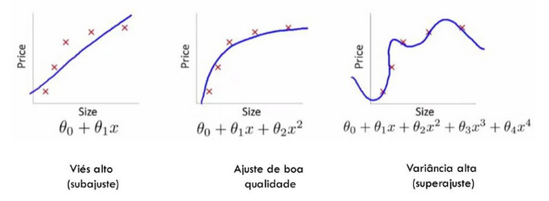
    ```

    * **Bias-Variance Tradeoff**
    
      * Bias : Difference between average model predictions and true target values
      * Variance : Variation in predictions across different training data samples

    ```{r, echo = FALSE, out.width="90%"}
    knitr::include_graphics("img/bias_variance_trade_off_aws.png")
    ```
    
    
    * **Evaluation Metrics**  
    
      * Regression : 
          
          * RMSE - Root Meam Squared Error
          * MAPE - Mean Absolute Percent Error
          * R^2 - How much better is the model compared to just pick the best constrant (R^2 = 1 - (model MSE / variance))


      * Classification : 
      
          * Confusion Matrix
          * ROC Curve
          * Precision-Recall
          
            * **Precision** : How correct we are when we what to predict be positive
            * **Recall** (_Sensitivity_) : Fraction of negative that was wrongly predicted
          
          
          
          
    ```{r, echo = FALSE, out.width="90%"}
    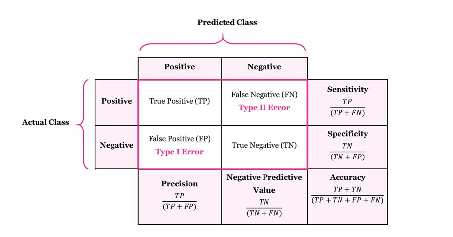
    ```
          


9. Business Goal Evaluation

  * Evaluate how the model is performing related to **business goals**
  * Make the final decision to deploy or not
  
Evaluation depends on: 
  
  * Accuracy
  * Model generalization on unseen/unknown data
  * Business success criteria
    
    
    
If we need more data or have more data we can add data (**Data Augmentation**) or feature (**Feature Augmentation**)
  
  
  * Prediction : The production data MUST have the same distribution as the training data
  
    


### Exploring Machine Learning Toolset

**INTRO TO AMAZON SAGEMAKER**

Amazon [**SageMaker**](https://docs.aws.amazon.com/sagemaker/index.html) is a fully managed service that enables data scientists and developers to quickly and easily build, train, and deploy machine learning models

* Components

  * Notebooks : No setup required and we can install ML and DL frameworks, Spark and so on.
  * Training Service : High on-demand trainnig enviroment can select the EC2 to run the experiment
  * Hosting Service : Easy to deploy with auto-scaling API, A/B Testing and more
  
  
**SAGEMAKER NEO**

This is a new sageMaker capabilities helps developers take models train on any framework and run on any plataform


```{r, echo = FALSE, out.width="90%"}
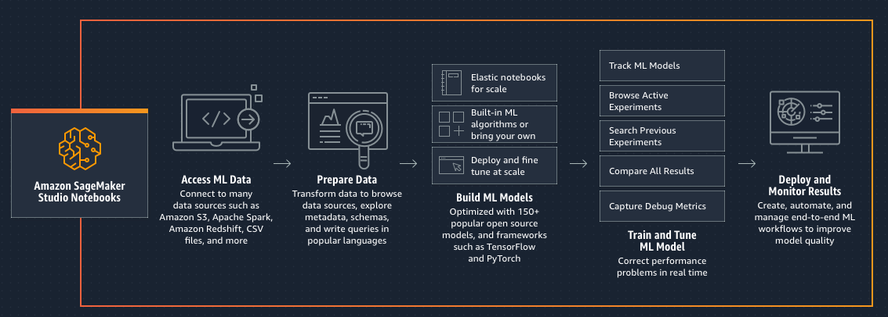
```


* Neo Components
  
  * Compiler Container :  read models in several formats (Tensorflow, pytorch, mxnet, xgboost) and convert to perform optimization
  
  * Runtime library 


**SAGEMAKER GROUND TRUTH**


Tool on SageMaker to label the dataset, auto label part of dataset and send the rest to human perform the task.

Can setup end to end label job using [Ground truth](https://docs.aws.amazon.com/sagemaker/latest/dg/sms.html) 


Ground Truth use **active learn** that identify the data that is well understood and can be labeled automatically and which data is not well understood and need to be revised by humans


**REKOGNITION**

> Image and facial recognition service, deep learning based, no experience required.


* Key features

  * Object and scene detection
  * Facial analysis
  * Face comparison
  * Face recognition
  * Confidence Score and Processed Images
  
  
**DEEPLENS**

> DeepLens is wireless-enabled camera and development plataform integrated with AWS Cloud


[DeepLens Workflow](https://docs.aws.amazon.com/deeplens/latest/dg/how-it-works.html)


```{r, echo = FALSE, out.width="90%"}
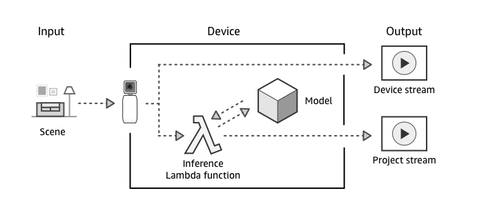
```


* Step 1 : When turned on, the AWS DeepLens captures a video stream.
* Step 2 : Your AWS DeepLens produces two output streams:
  * Device stream – The video stream passed through without processing.
  * Project stream – The results of the model's processing video frames

* Step 3 : The Inference Lambda function receives unprocessed video frames.
* Step 4 : The Inference Lambda function passes the unprocessed frames to the project's deep learning model, where they are processed.
* Step 5 : The Inference Lambda function receives the processed frames from the model and passes the processed frames on in the project stream


* Frameworks (MXNet, Tensorflow and Caffe)


**POLLY**

> Text to Speech service help you application to talk and increase accessibility, with independent solution and high quality voices, supporting 24 languages


* [Polly](https://docs.aws.amazon.com/polly/latest/dg/what-is.html) is compliant with SSML (_Speech Synthesis Markup Language_), XML based starts with `<speech> ... </speech>` 


**LEX**

> Service to build conversation interfaces between application using voice and text, same tecnology of Alexa

* [Lex](https://docs.aws.amazon.com/lexv2/latest/dg/getting-started.html) works with [Amazon CloudWatch](https://docs.aws.amazon.com/AmazonCloudWatch/latest/monitoring/WhatIsCloudWatch.html) to monitoring the number of requests, latency and errors


* [Chatbots do Amazon Lex](https://aws.amazon.com/pt/connect/connect-lexchatbot/)


```{r, echo = FALSE, out.width="90%"}
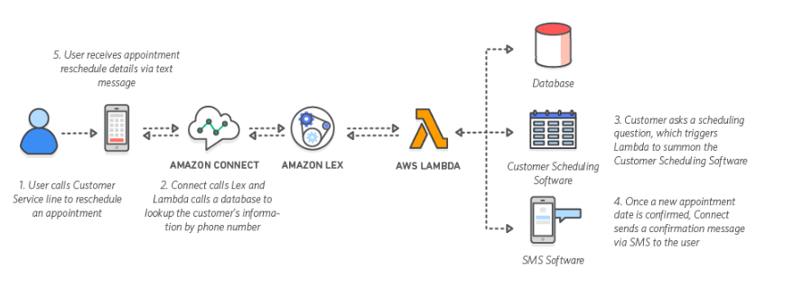
```

1. User calls customer service line to reschedule an appointment
2. Amazon connect calls Lex and AWS Lambda calls a database
3. Once customer ask to reschedule, Lambda calls schedule software
4. Once reschedule is confirmed Lambada send a text message to customer


**TRANSCRIBE**

> Convert audio to text (Speech-To-Text)

[Amazon Transcribe](https://docs.aws.amazon.com/transcribe/latest/dg/what-is.html) is ASR (_Automatic Speech Recognition_) service designed to **Speech-To-Text** applications


**TRANSLATE**

> Neural machine translation service (batch, real-time, and on-demand translations)

[Amazon Translate](https://docs.aws.amazon.com/translate/latest/dg/what-is.html)

Use Cases : 

  * Translating Web-authored content in real time and on demand
  * Batch translating pre-existing content for analysis and insights
  
  
**COMPREHEND**

5 Main capabilities

  * **Sentiment** : understand what user say (pos, neg, neutral)
  * **Entities** : extract and categorize entities from unstructured text
  * **Languages** : detect the language
  * **Key phrases** : know phrases
  * **Topic modeling** : help organize the text in topics


Social Abalytics : 

```{r, echo = FALSE, out.width="90%"}
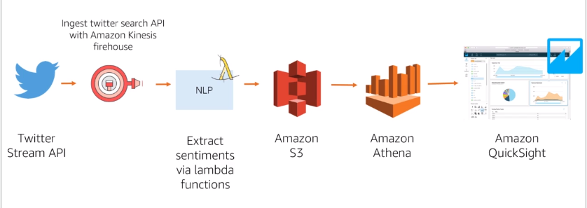
```


**COMPREHEND MEDICAL**


> ML APIs specific to healthcare domain, an extend to Comprehend

```{r, echo = FALSE, out.width="90%"}
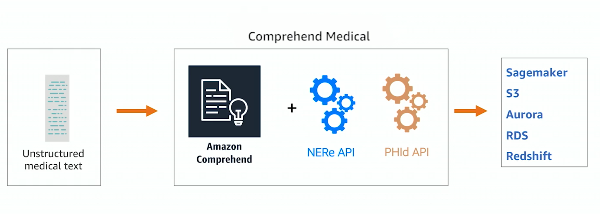
```


APIs : 
  
  * NERe: Json with all extract entities and relationship
  * PHId: Protect health information on the text
  

**FORECAST**

> Science of predicting future points in a time series based on historical data

* **Accuracy** is the most important factor in forecast
* **Amazon Forecast** is a fully managed accuracy forecast solution that uses deep learning models from over 10 years of ML experience


**ELASTIC INFERENCE (_EI_)**


```{r, echo = FALSE, out.width="90%"}
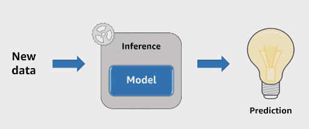
```


Amazon EI Accelerator sizes : 

```{r, echo = FALSE, out.width="90%"}
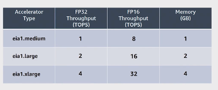
```


**MARKETPLACE INTRODUCES ML CATEGORY**


### The Elements of Data Science

**INTRO TO DATA SCIENCE**

What is Data Science ? _processes and systems to extract knowledge or insights from data (structured or unstructured)_


What is Machine Learning ? _set of algorithms used to improve predictions by learning from large amounts of input data_

  * **Learning** : estimating function **f** by mapping data attribtes to some target value
  * **Training set** : labeled examples (**x, f(x)**) 
  * **Goal** : find the _best_ approximation **f_hat** that best generalizes
  * **Types**: 
    
    * Supervised Learning : Models learn from training data that has been labeled.
    * Unsupervised learning :  Models learn from test data that has not been labeled.
    * Semi-supervises learning (_mix of label and un-label data_)
    * Reinforcement learning : Models learn by taking actions that can earn rewards.


```{r, echo = FALSE, out.width="90%"}
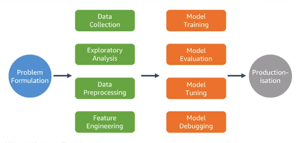
```


Key Issues in ML

  * Data Quality
  
    * Consistency of the data
    * Accuracy of the data
    * Noisy data
    * Missing data
    * Outliers
    * Bias
    * Variance


  * Model Quality
  
    * **Overfitting** : failure to generalize, model memorize the noise, high variance (_small change in the training data lead to big changes in the results_)
    * **Underfitting** : Failure to capture important patterns, too simple, high bias (_the results show systematic lack of fit in certain regions_)


<br>

Linear methods

  * Optimized by learning weights by applying (_stochastic_) gradient descent to minimize loss function
  * Methods (_Linear Regression_ and _Logistic Regression_)


<br>


Linear Regression

  * The basic and simplest is univariant Linear Regression
  * For Multiple linear regression includes N explanatory variables with N >= 2, scikit-learn implementation `sklearn.linear_model.LinearRegression`
    * Sensitive to correlation between features, resulting in high variance of coefficients 

```{r, echo = FALSE, out.width="90%"}
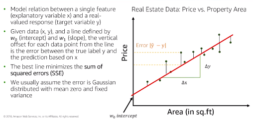
```


<br>

Logistic Regression

  * Response is binary, Logistic Regression is estimate the probability of one of two classes
  * Sigmoid function good representation of probability 
  * Logistic Regression does not well with outliers
  
```{r, echo = FALSE, out.width="60%"}
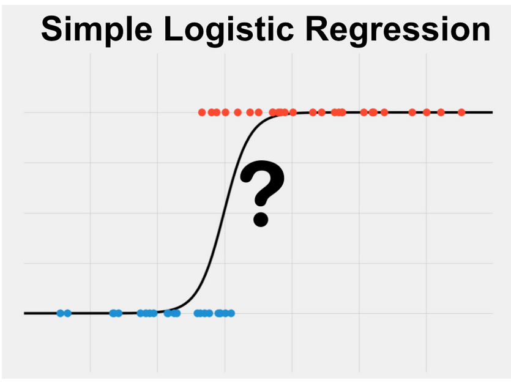
```


<br>


**PROBLEM FORMULATION AND EXPLORAROTY DATA ANALYSIS**

> Transform business problem in a machine learning problem

* Problem Formulation: _The start point for any ML project_

  1. What is the problem you need to solve ? _Precisely describe the business problem that you are trying to solve._

  2. What is the business metric ? _Determine the appropriate metric (Quality, Impact),  **convert the ML metric to Analytics metric**_

  3. Is ML the appropriate approach ? _Always good idea start simple, can the problem be solved with standard code ?, Do we have the data ? _

  4. What data is available ? _Summary the data available, determine the gaps, what are the data sources ?_

  5. What type fo ML problem is it ? _Decompose the business problem into a few models_

  6. What are your goals ? _Establish ML goals and criteria for success_


<br>

* Data Collection: _The process of acquiring training and/or test data_

  * Does not only occur on start of Data Science project / process, it is a procedure during the entire process/project and after
  * Before put the model into production need to collect A/B test data
  * After put the model in production need to collect more data to analyze the model performance

<br>

  * Open Data : 
    
    * AWS provides a comprehensive tool kit for sharing and analyzing data at ny scale, when organizations make data open on AWS, the public can analyze it quickly and easily with AWS scale computing and analytics services 

<br>


  * **Sampling** : Selecting a subset of instances for training and testing
    
    * Representativity : sample needs to be representative of the expected population, ie, _unbiased_ 
    
    * Random sampling : each source data point has equal probability of being selected*
    
    * Stratified Sampling : 
    
      * **Issue : ** With random sampling, rare subpopulations can be under-represented
      * **Stratified Sampling** apply random sampling to each subpopulation, the sampling probability usually is the same for each stratum
  
  
    * Doing sampling need to pay attention on others things that may create bias on data: 
    
      * _Seasonality_ : Time of day, day of week, holidays, etc ... Stratified sampling across these can minimize bias
      
      * _Trends_ : Patterns can shift over time, and new patterns can emerge, compare models trained over different periods to detect.
      
      
    * Leakage : 
    
      * Same point on train and test data (**Train/Test bleed**) _inadvertent overlap of training and test data when sampling to create datasets_
      
      * _Using information during training or validation that is not in production_
      
  
  * **Labeling** : Obtaining **gold-standard** answers for supervised learning
  
    * The first step on any Supervised learning problem
    * Labeling tools
    
      * Excel
      * Amazon Mechanical Turk
      * Custom-built tools


<br>

**EXPLORATORY DATA ANALYSIS**

  * ML Workflow
  
```{r, echo = FALSE, out.width="90%"}
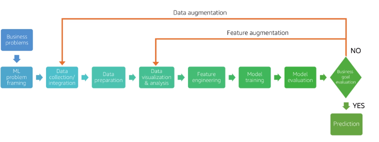
```


  * **Domain Knowledge** : Is critical for success of the exploratory data analysis, understand relationships, constraints, how data is generated
  * **AWS domain experts** is a team that can help you with your ML project, on _Amazon ML Solutions Lab_ : 
      
    * Brainstorming
    * Custom modeling
    * Training
    * On-site with Amazon experts

<br>


  * **Data Schema** : 
  
    * Data from multiple source
    
    
```{r, echo = FALSE, out.width="90%"}
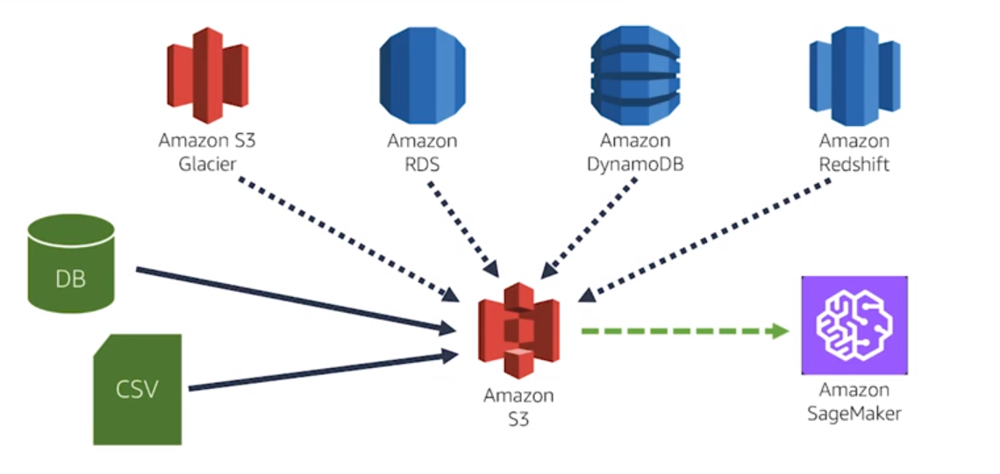
```
    
  
  * Merge/join Data,swe can use pandas to marge two data frames `df.merge(<df_1>, on=<key>, how = <'inner'> )` 
    
<br>

  * **Data Statistics**
    
    * _Descriptive Statistics_
      
      * Overall stats : number of instance (_rows_), attribute (_columns_)
      * Attribute stats (_univariate_)
      
        * Numeric : mean, median, variance using  `df.describe()`
        * Categorical : histogram, most/last frequent values,  `distplot()`
        * Target stats : Class distribution `df.<attribute>.value_counts()` or `np.bincount(y)`

      * Multivariate Stats
      
        * Correlation
        * Contingency table/Cross Tabulation

      * Sample
```{r, echo = FALSE, out.width="90%"}
knitr::include_graphics("img/brest_cancer_class_problem_explorer.png")
```
    * Basic Plots
    
      * Density Plot
      * Histogram
      * Boxplot
      
```{r, echo = FALSE, out.width="90%"}
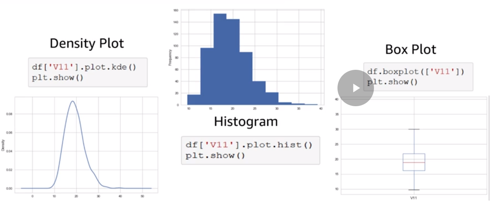
```
      * Scatterplot
      * Scatterplot Matrix
      

      
```{r, echo = FALSE, out.width="90%"}
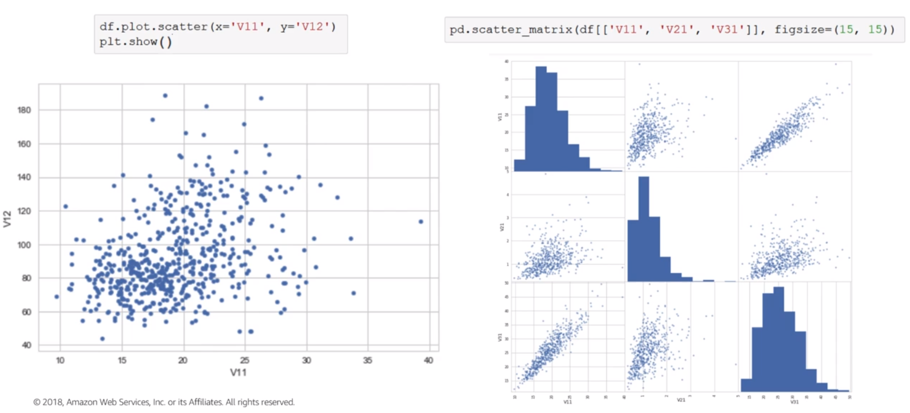
```
   
  * Correlation _how we quantify the relationship ?_
    
    * 1 = there is a perfect linear relationship between the variables 
    * 0 = there is no linear relationship between the variables
    * -1 = there is a perfect negative linear relationship between the variables
    
  * Correlation Matrices 
      
      
    
```{r, echo = FALSE, out.width="90%"}
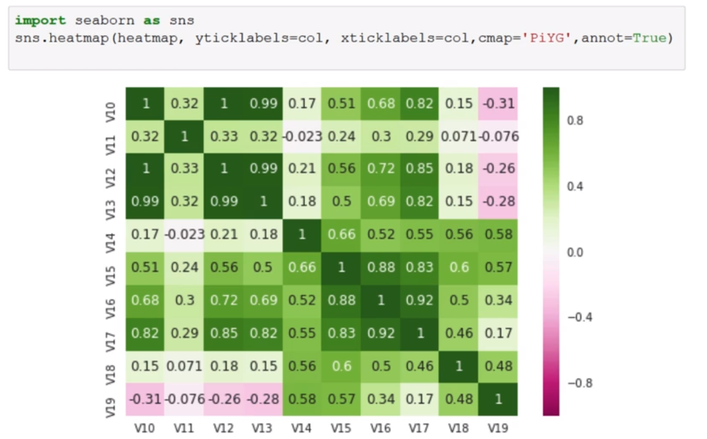
```
    
  * Data Issues
      
    * Messy data

        * Data on different scale
        * Different languages
        * Mixed type of data
  
    * Noisy data
    * Biased data
    * Imbalanced data
    * Correlated data
    
> Highly correlated features can cause collinearity problems and numerical instability    
    
    


**DATA PROCESSING AND FEATURE ENGINEERING**

> Algorithms typically expect to see numerical values, however, there are a lot categorical variables that can also be used.


_Data Preprocessing_ : Encoding Categorical (_discrete_) Variables

  * Examples : **Color** (Green, Red, Blue)  ;  **isFraud** (false, true)
  
  * Categorical Types : 
  
    * Ordinal (_ordered_) : Size (L > M > S)
    * Nominal (_unordered_): Color (blue, green, orange)


**Encoding Ordinals** : When mapping features variables to a predefined map, _use the **map** function in pandas_ 
    
```{r, echo = FALSE, out.width="90%"}
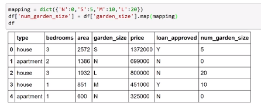
```

  * Encoding labels / Predictor Variable using [LabelEncoder](https://scikit-learn.org/stable/modules/generated/sklearn.preprocessing.LabelEncoder.html) for labels
  
  ```
  from sklearn import preprocessing
  le = preprocessing.LabelEncoder()
  le.fit(["paris", "paris", "tokyo", "amsterdam"])
  
  list(le.classes_)
  # ['amsterdam', 'paris', 'tokyo']

  le.transform(["tokyo", "tokyo", "paris"])
  # array([2, 2, 1]...)

  list(le.inverse_transform([2, 2, 1]))
  # ['tokyo', 'tokyo', 'paris']

  ```

<br>

**Encoding Nominals** : One-Hot encoding is a better option, explode nominal attributes into many binary attributes, one for each discrete value, we can use [OndeHotEncoder](https://scikit-learn.org/stable/modules/generated/sklearn.preprocessing.OneHotEncoder.html) from sklearn or [get_dummies](https://pandas.pydata.org/docs/reference/api/pandas.get_dummies.html) from pandas


```{r, echo = FALSE, out.width="90%"}
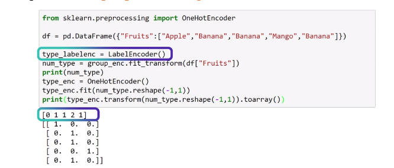
```


**Encoding** with many classes : we can define a hierarchy structure or group the levels by similarity


**Missing Values**

* To identify we can use `df.isnull().sum()`

* How deal with missing values 

  * Remove using `df.dropna()`, risk to losing too much data, overfitting, IC, bias
  * Drop columns can result in underfitting and lose features
  

Before drop or imputing missing values, ask : 

  * What were the mechanisms that cause the missing values ? 
  * Are these missing values missing at random ? 
  * Are there rows or columns missing that you are not aware of ? 
  
  
Imputing missing values :

  * Mean
  * Median
  * Most frequent (_for categorical_)
  * Advanced Methods
    
    * MICE (_Multiple Imputation by Chained Equations_) : `sklearn.impute.MICEImputer`
    
    * Python `fancyimpute` package
      
      * KNN impute
      * SoftImpute
      * MICE
      * ...


```{r, echo = FALSE, out.width="90%"}
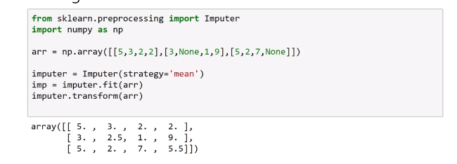
```

<br>


_Feature Engineering_ : Create novel features to use inputs for ML models using domain and data knowledge, on scikit-learn we can use `skelarn.feature_extraction` package.

  * Consider : 
    
    * Square
    * Multiplication


  * **Filtering Selection** : Selecting **relevant features** to use for model training
  
    * Remove channels from image
    * Remove frequencies from audio
  
  * **Scaling** : when we want value between -1 and +1 or 0 to 1, the range of features should be similar, same scale
  
    * Common choices in sklearn
    
      * Mean / Variance standardization  : `sklearn.preprocessing.StandardScaler` mean = 0 , stdev = 1 for each data column
      * MinMax Scale : `sklearn.preprocesing.MinMaxScaler` min = 0 , max =1 
      * Maxabs Scale : `skpearn.preprocessing.MaxAbsScaler`
      * Robusts Scale : `skpearn.preprocessing.RobustScaler`
      * Normalizer (_for row_) :  `sklearn.preprocessing.Normalizer` stedv = 1
      
        * L1 norm
        * L2 norm
        * Max norm


<br>

_Transformation_ : 

  * Polynomial : `sklearn.preprocessing.PolynomialFeatures`, beware of **overfitting** if degree is too high, consider _log_ and _sigmoid_ transformations too
  
  * Radial Basis Function : Widely used in SVM as a kernel and Radio Basis Neural Networks (_RBNNs_), Gaussian RBF is the most common RBF used
  

<br>

_Text-Based Features_ : 

  * **Bag-of-words model** : Represent document as vector of numbers, one for each word (tokenize, count and normalize), can be extended to _bag of n-grams_
  
  * **Count Vectorizer** : Also called as _Term frequency_, includes lowercasing and tokenization on white space and punctuation, on skelarn the package is `sklearn.feature_extraction.text.CountVectorizer`
  
  * **TiidfVectorizer** : Term-Frequency Times Inverse Document frequency,it down weighted for common terms (e.g., 'the'), we can use `sklearn.feature_extraction.text.TfidfVectorizer`

  * **Hasing Vectorizer** : stateless mapper from text to term index, using `sklearn.feature_extraction.text.HashingVectorizer`
  


**MODEL TRAINING, TUNING, AND DEBUGGING**


_Supervised Learning : Neural Networks_

  * Perceptron : The simplest neural network, a single layer neural network
  
```{r, echo = FALSE, out.width="90%"}
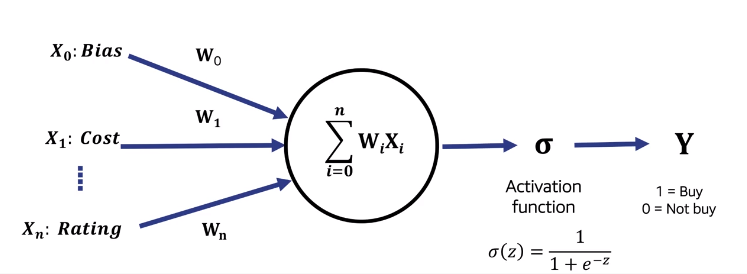
```
  
<br>    
  
  
  * Neural network architecture : When we have multiple layers it become neural network
  
    * Generally hard to interpret and expensive to train
    * Sckit-learn : `sklearn.neural_network.MLPClassifier`
    * Deep Learning Frameworks : MXNet, TensorFlow, Caffe, Pytorch
  
  
```{r, echo = FALSE, out.width="90%"}
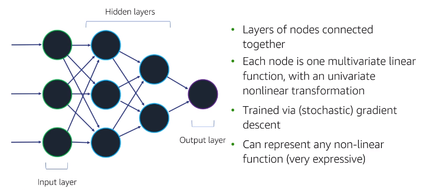
```  

<br>  
  
  * Convolutional neural networks : Very useful for image analysis 
  
    * Convolution layer : is to create next layer (_Conv1D, Conv2D_)
    * Pooling layer : dimension reduction process (_Max Pooling or Avg Pooling_)
  
  
```{r, echo = FALSE, out.width="90%"}
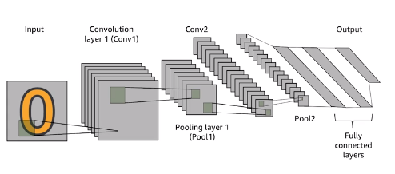
```  
  
  
<br>  

  * Recurrent neural networks : used for time series and sequential features

```{r, echo = FALSE, out.width="90%"}
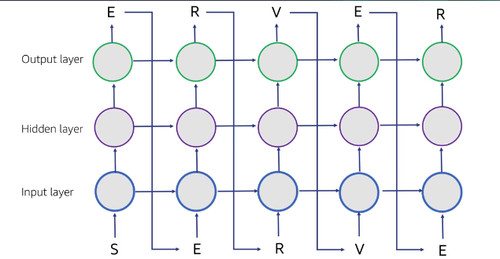
```  


<br> 

_Supervised Learning : K-Nearest Neighbors_

  * Define a distance metric (_Euclidean_, _Manhattan_, _Any vector norm_)
  * Choose the number of _K_ neighbors
  * Find the _K_ nearest neighbors fo the new observation that we want to classify

  * KNN is : 
  
    * Non-parametric, instance-based, lazy, ie, model is not defined by fixed parameters and it memorizing training data
    * Require to keep original data set
    * scikit-learn : `sklearn.neighbors.KNeighborsClassfier`


```{r, echo = FALSE, out.width="70%"}
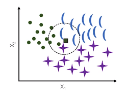
```  


<br>


_Supervised Learning : Linear and Non-Linear Support Vector Machines_

* Linear SVM

  * Maximize the margin - the distance between the decision boundary (_hyperplane_) and the support vectors
  * Scikit-learn : `sklearn.svm.SVC`


```{r, echo = FALSE, out.width="90%"}
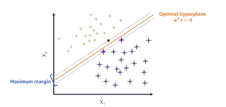
```  


<br>

_Supervised Learning: Decision Trees and Random Forests_


  * **Entropy**  :  Relative measure of disorder in the data source
  
  

```{r, echo = FALSE, out.width="90%"}
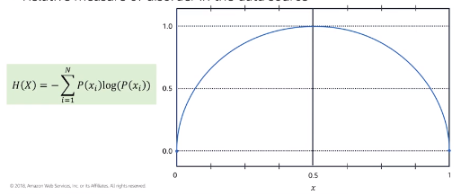
``` 


  * **Decision Tree**
  
    * Nodes are spited based on the feature that has the largest **information gain** (_IG_) between parent node and split nodes
    * One metric to quantify **IG** is to compare entropy before and after splitting
    * In binary case : 
    
      * _Entropy is 0_ if all samples belong to the same class for a node
      * _Entropy is 1_ if samples contain both classes with equal proportion
    * Scikit-learn : `sklearn.tree.DecisionTreeClassifer`
    * Must _prune_ the tree to reduce overfitting
  
  

```{r, echo = FALSE, out.width="90%"}
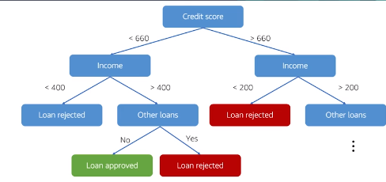
``` 


  * **Ensembles** : LEarn multiple models and combine their results, usually via majority vote or averaging
  

```{r, echo = FALSE, out.width="90%"}
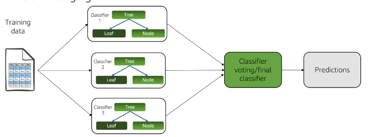
``` 
  

  * **Random Forest**
  
    * Set of decision trees, each learned from a different randomly sampled subset with replacement
    * Prediction : Average output probabilities
    * scikit-learn : `sklearn.ensemble.RandomForestClassifier`


<br>

_Model Training : Validation Set_

> Training and Tuning are iterative process

  * **Model Training** : Improve the model by optimizing parameters or data
  * **Model Tuning** : Analyze the model for generalization quality and sources of underperformance such as overfitting.
  * Validation Set : 
  
    * Split training data in two parts (_training_ and _validation set_)
    * Use training set to train models
    * Validation set to be used on debugging and tuning phase
    * **Test set** will be used for measuring the generalization of your final model


```{r, echo = FALSE, out.width="90%"}
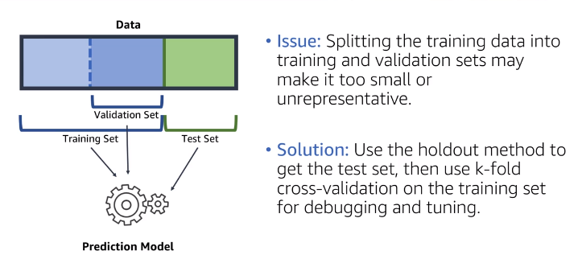
``` 


<br>

_Model Training: Bias Variance Tradeoff_

**Bias**: an error from flawed assumptions in the algorithm. High bias can cause an algorithm to miss important relationships between features and target outputs resulting in **underfitting**.


**Variance**: an error from sensitivity to small variations in the training data. High variance can cause an algorithm to model random noise in the training set, resulting in **overfitting**.


```{r, echo = FALSE, out.width="60%"}
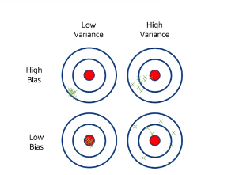
``` 

<br>


_Model Tuning: Regularization_

Regularization : Adding penalty score for complexity to cost function


  * L1 : _Lasso_  - perform feature selection, in sklearn `sklearn.linear_model.Lasso`
  
  * L2 : _Ridge_  - reduce the weight, in sklearn `sklearn.linear_model.Ridge`
  
  * _Elastic Net_ : Linear regression with both `sklearn.linear_model.ElasticNet`
  

<br>


_Model Tuning: Hyperparameter Tuning_


Model Tuning Choices

  * Neural Network : 
    
    * What Learning Rate ? 
    * How many nodes ? 
    * How many layers ? 
    
  * Decision Tree or Random Forest : 
  
    * What is the minimum number of samples ? 
    * What I should use at the leaf node ? 
    
  * SVM models : 
  
    * What is the optimum C parameter ? 


<br>

Hyperparameter Techniques : 

  * Grid search (`sklearn.grid_search.GridSearchCV`)`: Search for the best parameter combination over a set of parameters
  
  
```{r, echo = FALSE, out.width="90%"}
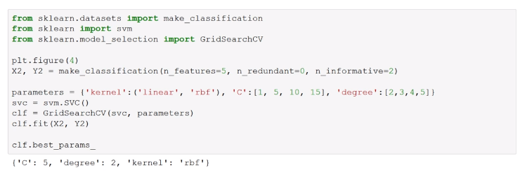
```   
  
  
  * Random search (`sklearn.grid_search.RandomizedSearchCV`) : Each setting is sampled from a distribution over possible parameters values


<br>

_Model Tuning : Feature Extraction_


Techniques : 

   * **PCA** (_Principal component analysis_)
    
      * **Unsupervised** linear approach to feature extraction
      * Finds patterns based on correlations
      * scikit-learn : `sklearn.decomposition.PCA`

<br>

   * **LDA** (_Linear discriminant analysis_)
   
      * **Supervised** linear approach to feature extraction
      * Transform to subspace that maximizes **class separability**
      * Assumes data is **normally distributes**
      * Used for dimensionality reduction of features
      * Sklearn : `slkearn.discriminant_analysis.LinearDiscriminantAnalysis`
      
<br>      
      
_Model Tuning: Bagging/Boosting_

* **Bagging** (_Bootstrap Aggregating_)  : Randomly sampling original dataset with replacement

  * High variance but low bias ? Use **bagging**
  * Training many models on random subsets of data and average or vote on the output
  * Reduce variance, keep bias the same
  * Sklearn : `sklearn.ensemble.BaggingClassifier` , `sklearn.ensemble.BaggingRegressor`

<br>

* **Boosting** : Assign strengths to each weak learner, iteratively train learners using misclassified example by the previous weak learners

  * High bias  ? **Use boosting**
  * Training a sequence of samples to get a strong model
  * Sklearn : `AdaBoostClassifier` , `AdaBoostRegressor` and `GradientBoostingClassifier`
  * XGBoost 


**MODEL EVALUATION AND MODEL PRODUCTIONIZING**


_Using ML Models in Production_

Consider :

  * Model hosting, deployment
  * Pipeline to provide feature vector
  * Model and data updating and versioning
  * Monitoring and alarming
  * Data and model security
  * Customer privacy, fairness and trust
  
  
Types : 

  * Batch predictions
  * Online predictions
  * Online training 
  
  
<br>  


_Model Evaluation Metrics_


> Need to link Business Metrics with ML Metrics


```{r, echo = FALSE, out.width="90%"}

```

* Accuracy : How close of far we are from true values
* Precision : Proportion of positive predictions that are actually correct
* Recall : Proportion of positive set that are identified as positive
* F1-Score : Combination (_harmonic mean_) of precision and recall


<br>


_Cross-Validation_


**K-fold** cross-validation : 

  * Good for small training set
  * Randomly partition data into k folds
  * For each fold, train model on other k-1 folds and evaluate on that
  * Train on all data
  * AVG metric across K folds estimates test metric for trained model

<br>

**Leave-one-out cross validation**
  
  * K = number of data points
  * Used for very small datasets
  
<br>

**Stratified k-fold cross validation**

  * Preserve class proportions in the folds
  * Used for imbalanced data
  * There are seasonality or subgroups


<br>

_Metrics for Linear Regression_


* _Mean squared Error_ : Average squared error over entire dataset, how close the prediction is to the outcome
  


* _R squared_ : R² is close to one indicates that lot of variability in the data can be explained by the model, Adjusted-R² is better metric for multiple variates regression


<br>

_Using ML Models in Production: Monitoring and Maintenance_

It's important to monitor quality metrics and business impacts with dashboards, alarms, user feedback, etc.:

  * The real-word domain may change over time
  * The software environment may change
  * High profile special cases may fail
  * There may be a change in business goals
  

Performance deterioration may require new tuning : 

  * Changing goals may require new metrics
  * A changing domain may require changes to validation set
  * Your validation set may be replaced over time to avoid overfitting


**Amazon SageMaker**

Train, build and deploy ML models at scale


```{r, echo = FALSE, out.width="90%"}
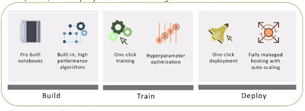
```
    
  
<br>

_Common Mistakes_


* Solve the wrong problem
* The data was flawed
* The solution did not scale
* Final result does not match with the prototype's results
* It takes too long to fail
* The solution was too complicated
* There were not enough allocated engineering resources to try on long term ideas
* There was a lack of a true collaboration
    
    
    
    
    
    


### Data Engineering

**S3**

  * Buckets must have a _global unique name_ 
  * Objects (file) have a key. The key is the FULL path : `<my_bucket>/my_folder/my_file.txt`
  * Max 5TB
  * Backbone for ML services
  * Perfect use case for **Data Lake**, with infinite size , 99.999999999%  durability across multiple AZ and 99.99% availability (_not available 53 min a year_)
  * Obejct storage supports any file format (_CSV, JSON, Parquet, ORC, Avro, Protobuf_)
  * We can partition the data by date, by product or any strategy we would like, some tools perform this task forus (Glue and Kinises)
  
<br>

_[Amazon S3 Storage Classes](https://aws.amazon.com/s3/storage-classes/)_: 
    
| Classes 	| Details 	| Use Case 	|
|---	|---	|---	|
| S3 Standard - General purpose 	| * 99.99% availability (53min a year not available)<br>* Used for frequently accessed data<br>* Low latency and high throughput<br>* Sustain 2 concurrent failures 	| Big data analytics, mobile and gaming applications 	|
| S3 Standard-Infrequent Access IA 	| * For data that is less frequently accessed, but requires rapid access when needed<br>* Low cost than S3 standard, cost on retrieval<br>* 99.9% availability <br>  	| Used for Disaster recovery 	|
| S3 One Zone-Infrequent access 	| * High durability 99.999999999% in a single AZ, data lost when AZ distroied<br>* 99.5% availability 	| Storing secondary backup copies of on-prem data, or data you can recriate 	|
| S3 Glacier Instant Retrieval<br><br>Low cost for archive/backup 	| **Instant retrieval** : ms retrieval , min storage duration 90 days<br><br>**Flexible Retrieval** : Expedite 1 to 5min , Standard 3 to 5 hours, min duration 90 days<br><br>**Deep Archive** : Standard 12hrs, bulk 48hrs, min duration 180 days, for long archive 	|  	|
| S3 Intelligent Tiering 	| * Small monthly monitoring and auto-tiering fee<br>* Move objects automatically between Tiers based on usage<br>* No retrieval charge<br><br>* **Frequent Access** : default<br>* **Infrequent Access**  > 30 days<br><br>* **Archive Instant Access** > 90 days<br>* **Archive Access** 90 to 700+ days<br>* **Deep Archive Access** 180 to 700+ days<br><br>  	|  	|


* We can move files between storage classes manually or via configuration using **Lifecycle Rules**


* Security : _Encryption for objects_

  * **SSE-S3** : encrypt using keys managed by AWS
  * **SSE-KMS** : use Key Management Service  (_Customer Master Key_)
  * **SSE-C** : when we want to manage the keys
  * **Client Side Encryption**
  
_On ML , **SSE-S3** and **SSE-KMS** will be most likely be used_
_SS3 means Service-side-encryption_

  * S3 Bucket policies : We can use the policies to grant access (_including Cross Account_) to bucket or force objects to be encrypted on upload

    * Today we can use the **default encryption** option on S3 and every document sent to bucket will be encrypted by default


<br>


**AWS Kinesis**

**Kinesis** is a managed alternative to Apache Kafka, it is used to _real-time_ streaming process of big data, used for application logs, metrics, IoT, clickstreams and data replicated on 3 AZs

  * Services :
  
    * [Kinesis Data Streams](https://aws.amazon.com/kinesis/data-streams/) : low latency streaming ingest at scale
    
      * Stream are divided into Shards/Partitions and by default data retention is 24hrs, multiple appls can use the same stream and once data is inserted it cannot be deleted (**immutability**)
      * It is for **real-time**
    
    ```{r, echo = FALSE, out.width="80%"}
    knitr::include_graphics("img/kinesis_stram_overview.png")
    ```


    * [Kinesis Data Analytics](https://aws.amazon.com/kinesis/data-analytics/): real-time analytics on streams using SQL
    
      * Data Analytics will take data from Firehose or Data Streams, perform modifications using SQL and send it to analytic tools 
      * Used to **streaming ETL**, continues metric and reponsive analytics (_filtering_)
      
      * Machine Learning on Kinesis Data Analytics  (_two algorithms_)
        
        * **RANDOM_CUT_FOREST** (Used for **anomaly detection** on numeric columns, use recent history to compute model)
        * **HOTSPOTS** (locate and return information about dense regions)
      
    ```{r, echo = FALSE, out.width="80%"}
    knitr::include_graphics("img/kinesis_data_analytics_aws.png")
    ```
      
    
    
    * [Kinesis Firehose](https://aws.amazon.com/kinesis/data-firehose/): load stream into S3, Redshift, ElasticSearch and splunk
    
      * To store data in two target destination, it reads data up to 1MB, can be transformed by lambada function and write in batches into **S3, RedShift, ElasticSearch**, custom destionation or 3rd party (splunk, mongo, etc) 
      * It is **near real-time** to ingest massive data, auto-scale, supporting many formats (csv, json, orc)
      
    ```{r, echo = FALSE, out.width="80%"}
    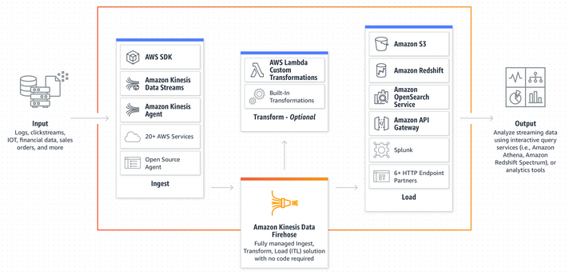
    ```
    
    
    
    * [Kinesis video Stream](https://aws.amazon.com/pt/kinesis/video-streams/?amazon-kinesis-video-streams-resources-blog.sort-by=item.additionalFields.createdDate&amazon-kinesis-video-streams-resources-blog.sort-order=desc): stream video in real-time
 
      * real-time video stream to create ML applications
      
    ```{r, echo = FALSE, out.width="80%"}
    knitr::include_graphics("img/kinesis_video_aws.png")
    ```     
      


<br>


**GLUE DATA CATALOG**

[GLUE Documentation](https://docs.aws.amazon.com/glue/index.html)

> Metadata repository for all tables

  * Automated schema inference
  * Schema visioned
  * Integration with Athena or RedShift (_schema & data discovery_)
  * Glue Crawlers can help build the **Data Catalog**


**GLUE DATA CRAWLERS**

  * Go through the data to infer schema and partitions, works in JSON,CSV and PARQUET
  * Will extract partition based on how S3 is organized
  
  
**GLUE ETL**

  * **Transform data**, clean, modify (_Join, filter, dropfields, map_), generate code in python or spark and the target can be S3, JDBC, RDS, RedShift or Glue Catalog
  * ML Transformation : **FindMatches ML** identify duplicated or matching records in database
  * Jobs run on Spark Platform
  * Formats (csv, json, avro, parquet, orc and xml)
  * Also can use any apache spark transformatino (like k-means)


<br>


**DATA STORE IN MACHINE LEARNING**

* **RedShift** : Data warehouse, OLAP processing
* **RDS, Aurora** : Relation store OLTP
* **DynamoDB** : NoSQL data store
* **S3**: Object store, serveless
* **OpenSearch** (previously Elastic Search) : Indexing data
* **ElastiCache** : Caching mechanism


<br>


**[AWS DATA PIPELINE](https://aws.amazon.com/datapipeline/)**

Service to move data from one place to another (S3, RDS, DynamoDB,Redshift, EMR), **ETL service** where we can manage the task dependencies, retry and notifies on failure

_What is the difference between GLUE and DATA PIPELINE ? _

  * Glue is Apache Spark focus , run Scala or Python jobs
  * Data Pipeline is an orchestration service where we have more control over the environment, compute resources and code and allow us access EC2 or EMR
  
  
  

<br>

**[AWS BATCH](https://aws.amazon.com/batch/)**


AWS Batch run jobs as Docker images, no need to manage cluster, fully **serveless** and we can schedule batch jobs using **Cloud Watch Events** or Orchestrate batch jobs using **AWS Step Functions**


<br>

**[DMS DATABASE MIGRATION SERVICE](https://aws.amazon.com/pt/dms/)**

Quickly and securely way to migrate databases to AWS, it supports Oracle to Oracle or  MSSQL to Aurora, we can use continuous Data Replication using CDC and it the replication must be performed EC2 instance 


<br>

**[AWS Step Functions](https://aws.amazon.com/step-functions/)**

Step Functions is used to Orchestrate and design workflows 

* [Train a Machine Learning Model](https://docs.aws.amazon.com/step-functions/latest/dg/sample-train-model.html)


<br>


### Exploratory Data Analysis

**PANDAS**

  * Data Frames : Similar table structure
  * Series :  1D structure
  * Numpy : arrays and math
    
    * [100-numpy-exercises](https://jovian.ai/brunodeabreu/100-numpy-exercises)
    * [100-numpy-exercises - solutions](https://github.com/rougier/numpy-100/blob/master/100_Numpy_exercises_with_hints_with_solutions.md)


**[MATPLOTLIB](https://matplotlib.org/)**

  * Data Visualization 
  
    * Boxplot
  
    ```{r, echo = FALSE, out.width="90%"}
    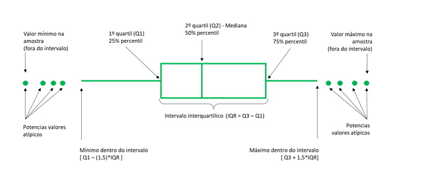
    ```
    
    * [Histogram](https://matplotlib.org/stable/gallery/statistics/hist.html)
    
    
    ```{r, echo = FALSE, out.width="90%"}
    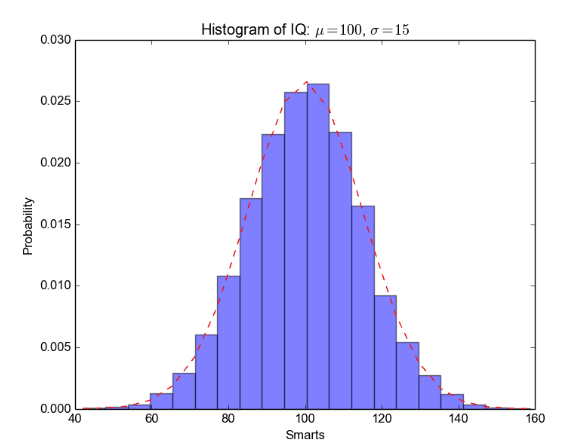
    ```

  * [Seaborn](https://seaborn.pydata.org/) : Python data visualization library based on matplotlib
  
    * [Visualizing statistical relationships](https://seaborn.pydata.org/tutorial/relational.html)
    * [Visualizing distributions of data](https://seaborn.pydata.org/tutorial/distributions.html)
    * [Plotting with categorical data](https://seaborn.pydata.org/tutorial/categorical.html)
    * [Visualizing regression models](https://seaborn.pydata.org/tutorial/regression.html)
  


**[Scikit_learn](https://scikit-learn.org/stable/)**
  
  * [Jupyter notebooks](https://jupyter.org/)


**Type of Data**

  * Numerical (_discrete_  5  , 20  **or** _continuous_  2.56, 545.67)
  * Categorical (_qualitative_  Gender)
  * Ordinal (_Categorical with math meaning_  Ranking)


**Data Distribution**


  * **Normal**
  
```{r, echo = FALSE, out.width="90%"}
    knitr::include_graphics("img/normal_dist_aws_course.png")
```

  * **Probability Mass Function**
  
    * Working with **Discrete data**, visualize the probability of discrete data occur
  
    ```{r, echo = FALSE, out.width="60%"}
        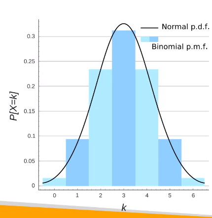
    ```


    * Poisson Distribution
    
      * Example of probability mass function, series of events (success or failure)
  
  
      ```{r, echo = FALSE, out.width="90%"}
          knitr::include_graphics("img/poisson_dist_aws.png")
      ```
      
    
  * **Binomial Distribution**
  
    * Work with **discrete data**
      
      
      ```{r, echo = FALSE, out.width="90%"}
          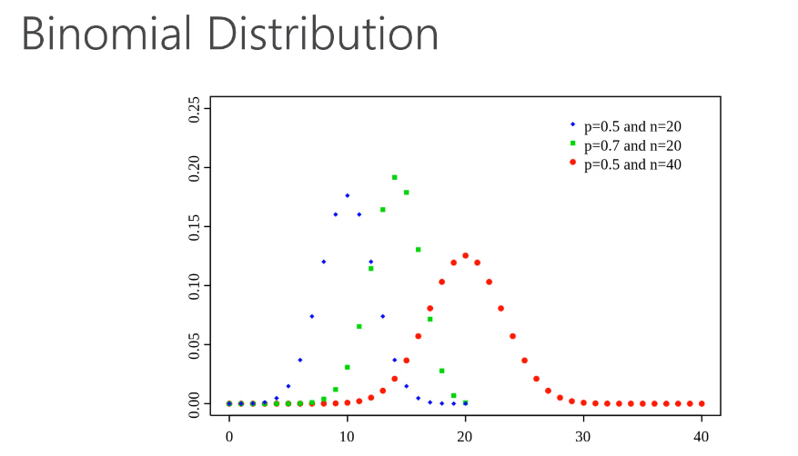
      ```
      
  

**Time Series**
  
  * Trends 
  * Seasonality 
  
  
  ```{r, echo = FALSE, out.width="90%"}
      knitr::include_graphics("img/trends_seasonality_aws.png")
  ```
  
  * Seasonality + Trends + Noise = Time series
  


**Amazon Athena**

> Serveless interactive queries of S2 data lake

  * Presto under the hood
  * Serverless
  * Supports (_CSV, JSON, ORC, PARQUET, AVRO_)
  * Pay-as-you-go
  * Save money using columnar formats (ORC, Parquet)


**Amazon QuickSight**

> Business analytics and visualizations in the cloud

  * Build visualizations
  * Perform ad-hoc analysis
  * Serveless
  * Data Sources : RedShift,  Aurora / RDS,  EC2, Athena, S3
  * **SPICE** : In-memory calculation makes QuickSight fast
  * ML Insights : Anomaly detection, Forecasting, Auto-narratives
  

**Amazon EMR _Elastic MapReduce_**

  * Managed Hadoop framework on EC2
  * Includes Spark , HBase, Presto, Flink, hive and more
  * EMR Notebooks
      
  ```{r, echo = FALSE, out.width="90%"}
      knitr::include_graphics("img/emr_cluster_aws.png")
  ```
  
  * [Spark](https://docs.aws.amazon.com/emr/latest/ReleaseGuide/emr-spark.html)
  
    * Components that runs on top of _spark core_:
  
      * Spark Streaming
      * Spark SQL
      * Graph X
      * MLLib
    
        * Classification : Logistic regression, naive bayes
        * Regression
        * Decision trees
        * Recommendation ALS
        * Cluster K-means
        * LDA (Topic modeling)
        * ML Workflow utilities (_pipeline, feature transformation, etc_)
        * PCA, SVD, statistics, others 
        
 
    ```{r, echo = FALSE, out.width="90%"}
      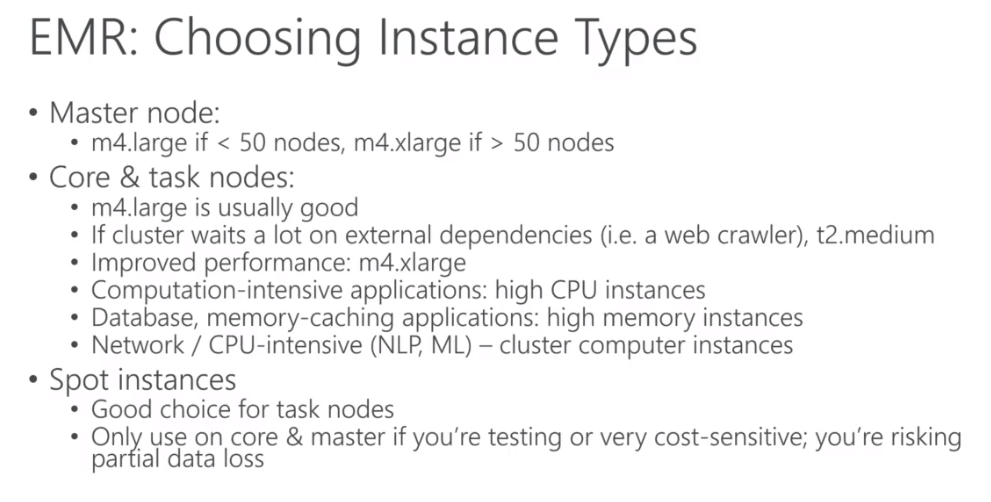
    ```
  
     
**Feature Engineering**

> "Applied machine learning is basically feature engineering" - Andrew Ng

  * Which features should I use ? 
  * Do I need to transform these feature ? 
  * How do I handle missing data ? 
  * Should I create new feature ? Transform ? Normalize ? 
  
  
**Imputing Missing Data**

  * Replace by mean ? median ?
  * Works on column level
  * Cannot use on categorical features
  * If not many rows and drop does not bias the data, maybe reasonable
  * Use Machine Learning
  
    * KNN , average of group of features
    * Deep Learning, build ML to impute the data, works well for categorical data
    * Regression (_MICE_)
  * **Get more data**
      
      

**Unbalanced Data**

> Large discrepancy between positive and negative cases

  * **Oversampling** : Duplicate samples from the minority class
  * **Undersampling** : Instead of creating more positive samples, remove negative ones, **remove data is not the right answer**
  * **SMOTE** : _**S**ynthetic **M**inority **O**ver-sampling **TE**chnique_ generate new samples using nearest neighbors
      
   
**Outliers**

  * We can use Stardard deviation to identify outliers
  * AWS Random Cut Forest : outlier detection


    ```{r, echo = FALSE, out.width="90%"}
        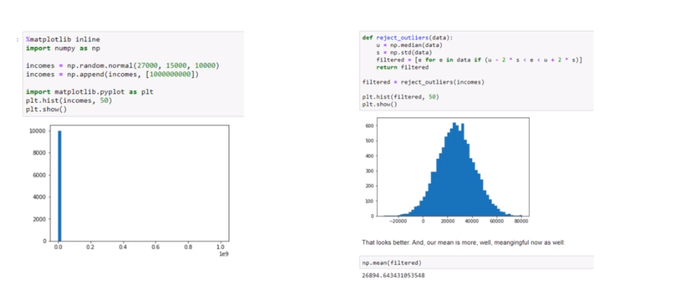
    ```
   

**Binning**

  * Bucket observations together based on ranges of values
  * Transform numeric data to ordinal data


**Encoding**

  * Transform data into some new representation
  * One-Hot encoding

* **Scalling / Normalization**

  * Some models prefer feature data to be normally distributed
  * Scikit learn _MinMaxScaler_


**Amazon SageMaker Ground Truth and Label Generation**

  * Ground Truth creates its own model as images are labeled by people


### Modeling Part 1 Basic

**DEEP LEARNING**

Frameworks

  * Tensorflow / Keras
  * MXNet
  
  ```
  model = Sequential()
  
  model.add(Dense(64, activation='relu', input_dim=20))
  model.add(Dropout(0.5))
  model.add(Dense(64, activation='relu'))
  model.add(Dropout(0.5))
  model.add(Dense(10, activation='softmax'))
  
  sgd = SGD(lr=0.01,decay=1e-6, momentum=0.9, nesterov=True)
  
  model.compile(loss='Categorical_crossentropy', optimizer=sgd, metrics=['accuracy'])
  
  ```

<br>

Types os Neural Network

  * Feedforward
  * Convolutional (_CNN_) : Image
  * Recurrent (_RNN_) : deal with sequence in time (stop price, words sequence, translation, etc) - LSTM, GRU

<br>

Activation Functions

  * It is a function inside the node
  * Types : 
  
    * Linear : do anything
    * Binary step function : on or off
    * Sigmoid / Logistic / TanH : Computational expensive and Vanishing Gradient problem
    * ReLU (_Rectified Linear Unit_) : Easy and fast, zero or negative problem with Dying ReLU
    * Leaky ReLU : Solve dying ReLU
    * Parametric ReLU (_PReLU_) : complicated 
    * Exponential Linear Unit (_ELU_)
    * Swish : for really deep neural network , developed by google
    * Maxout : not practical double the params
    * Softmax : used on final layer of multiple classification problem


  * Choosing an activation function
  
    * For multi clas : Softmax
    * RNNs : TanH
    * Others: Starts with ReLU, if need do better, Leaky ReLU, PReLU, Maxout, Swish

<br>

CNNs  

  * Data that does not neatly align into columns (images, translation, sentence classification, sentiment analysis)
  

  * CNN with Keras / TF
  
    * Source must be : width x length x color
    * Conv2D, Conv1D and Conv3D
    * MaxPooling2D used to reduce the 2D layer
    * Flatten convert 2D layer to 1D layer
    * Typical architecture : 
      
      * Conv2D -> MaxPooling2D -> Dropout -> Flatten -> Dense -> Dropout -> Softmax


    * Specialized CNN architectures
    
      * LeNet-5 : Good for handwriting recognition
      * AlexNet : Image classification
      * GoogLeNet : Deepr introduce the inception modules (_groups of convolution layers_)
      * ResNet (_Residual Network_) : Even deepr


  
```{r, echo = FALSE, out.width="90%"}
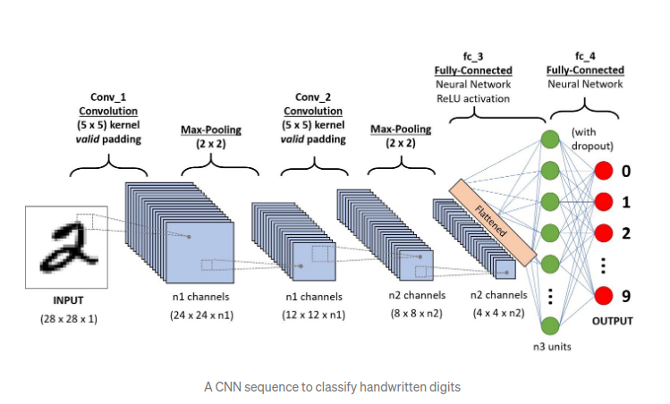
```

<br>

RNNs

  * Time-series data
  * Machine translation, image captions, machine-generated music

  
```{r, echo = FALSE, out.width="90%"}
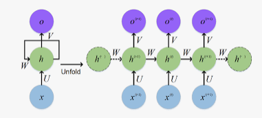
```

  * RNN Topologies
  
    * **Sequence to sequence** : predict stock price
    * **Sequence to vector** : wordsin a sentence to sentiment
    * **Vector to sequence** : create captions from an image
    * **Encoder -> Decoder** ( sequence -> vector -> sequence ) : machine translation


  * Architectures :  [_RNN vs GRU vs LSTM_](https://medium.com/analytics-vidhya/rnn-vs-gru-vs-lstm-863b0b7b1573)
  
    * **LSTM** (_Long Short-Term memory Cell_) 
    * **GRU** (_Gated Recurrent Unit_)

    
  
```{r, echo = FALSE, out.width="90%"}
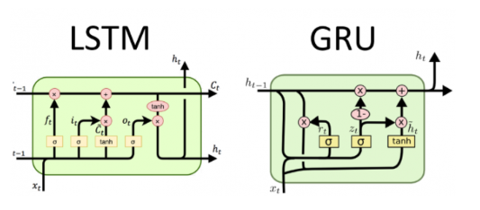
```

<br>

Deep Learning on EC2 / EMR

  * EMR supports Apache MXNet and GPU types
  * Types : 
    * **P3** : 8 Tesla V100 GPUs
    * **P2** : 16 K80 GPUs
    * **G3** : 4 M60 GPU
  * Deep Learning AMI's


<br>

Tuning Neural Networks   **(_IMPORTANT TOPIC ON EXAM_)**

  * Learning Rate  : _How far apart these samples are ? _
    
    * Large learning rates can overshoot the correct solution
    * Small learning rates increase the training time

```{r, echo = FALSE, out.width="90%"}
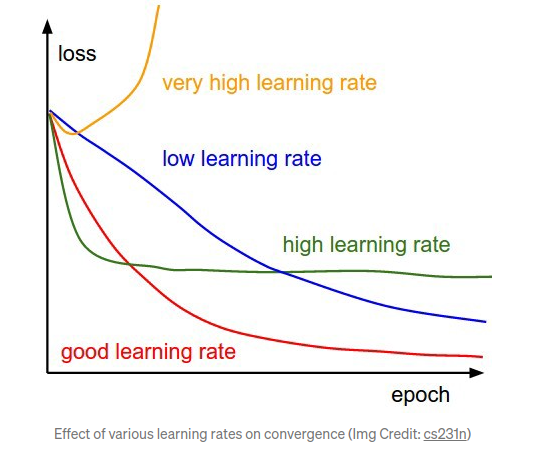
```


  * Batch Size : _How many trainig samples are used within each batch of each epoch_
  
    * Smaller batch tend get stuck in local minima
    * Large batch size can end up getting stuck and onverge on wrong solution


<br>


Regularization

  * Techniques to prevent overfitting, ie, high accuracy on training data, but lower on test or evaluation data

  * **Dropout** : Removing neurons at random , prevent specific neuron overfitting
  * **Early Stopping** : Stop the training after some epochs
  * L1 and L2
    * L1 : Sum of weights, _"feature selection"_ reduce dimensionality
    * L2 : Sum of square of weights
    

<br>

Gradients

  * Vanishing Gradient Problem : when the slope of the learning curve approaches zero
  * Fix : 
    
    * Use LSTM
    * Residual Networks
    * Better choice of activation function ReLU
    
    

<br>


Confusion Matrix, Precision , Recall, F1, AUC


```{r, echo = FALSE, out.width="80%"}

```

* **Recall** (_Sensitivity_) : Percent of positives rightly predicted, good when you care about false negatives (_fraud detection_)
* **Precision** : Percent of relevant results, correct positives, good when care about false positives (_medical screening, drug testing_)


```{r, echo = FALSE, out.width="80%"}
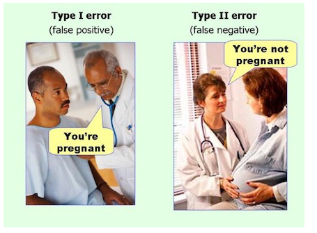
```

* **Specificity** : True negative rate
* **F1 Score** : Harmonic mean of precision and sensitivity (_recall_)
* **RMSE** : Root mean squared error, accuracy measurement
* **ROC** : Recall vs false positive rate
* **AUC** : Are under the curve, used to comparing classifiers

```{r, echo = FALSE, out.width="80%"}
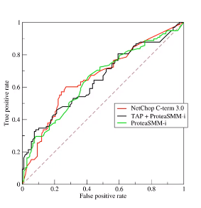
```


<br>

Ensemble Learning (_Bagging & Boosting_)

* Bagging : Generate N new training sets by random sampling with replacement, each resampled model can be trained in parallel, avoid overfitting


```{r, echo = FALSE, out.width="80%"}
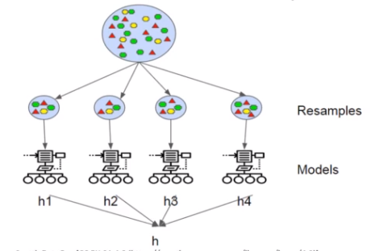
```


* Boosting : Observations are weighted, some will take part in new training more often, training is sequential , each classifier takes into account the previous one's success.


```{r, echo = FALSE, out.width="80%"}
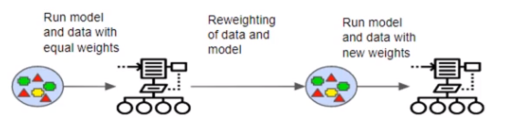
```


---


### Modeling Part 2 SageMaker

> SageMaker is built to handle the entire Machine LEarning workflow


```{r, echo = FALSE, out.width="90%"}
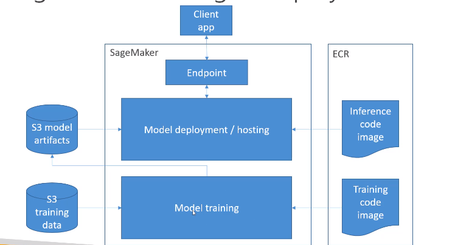
```


**Data Prep on SageMaker**

  * Data must come form S3
  * Spark integrates with SageMaker
  * Scikit_learn, numpy, pandas all at your disposal within a notebook

<br>

**Training on SageMaker**

* Create a training job

  * URL of S3 bucket with training data and output
  * ML compute resources
  * ECR (_Amazon Elastic Container Registry _) path to training code

<br>

* Training options
  
  * Built in training algorithms
  * Spark MLLib
  * Custom python tensorflow, pytorch, MXNet code
  * Your own docker image
  * Algorithm purchase from AWS marketplace
  
<br>  

* Deploying Trained Models

  * Save trained model on S3
  * Deploy endpoint for making individual predictions on demand or via Batch transform to get predictions for an entire dataset
  * Inference pipeline (_complex processing_)
  * Neo for deploying to edge devices
  * Elastic Inference, accelerating DL models
  * Auto-scaling increase the number of endpoint as needed


<br>


**SageMaker Built-In Algorithms**


* **Linear Learner**  : Can handle regression and classification, input format : RecordIO and CSV, support File or Pipe mode

  * Training data must be normalized and shuffled
  * Use SGD , Adam, AdaGrad and train multiple models in parallel tuning with L1 and L2
  * Hyperparameters : 
  
    * Balance_multiclass_weights : Gives each class equel importance in loss functions
    * Learning_rate
    * mini_batch_size
    * L1
    * Wd : weight decay - L2 regularization
  
  * Instance Types : Single or multi-machine CPU or GPU, multi GPU does not help
  
<br>

* **XGBoost** : e**X**treme **G**radient **B**oosting, boosted group of Decision trees, new trees correct the errors of previous one, use gradient decent to minimize loss

  * Hyperparameters : 
      
    * Subsample : Prevent overfitting
    * Eta : Step size shrinkage, prevents overfitting
    * Gamma : Minimum loss reduction to create partition
    * Alpha  : L1
    * Lambda : L2
    * eval_metric : optimize on AUC, error and rmse
    * scale_pos_weight : adjust balance of positive and negative weights
    * max_deph : max depth of the tree

  * Instance Types : CPU only, Memory-bound, M5 is a good choice, if using GPU training P3

<br>

* **Seq2Seq** : Input and output is a sequence of tokens, use for ML translation, text summarization and speech to text, implemented with RNNs and CNNs

  * Expect _RecordIO-Protobuf_ format
  * Must provide training and validation data,also vocabulary files
  * Pre-trained available
  * Hyperparameters : 
  
    * Batch_size
    * Optimizer ( _adam, sgd, rmsprop_ )
    * Learning_rate
    * Num_layers_encoder
    * Num_layers_decoder
    * Can optimize on Accuracy, BLEU score (_Compares against multiple reference tanslation_), perplexity (_cross-entropy_)
  
  * Instance Types : Can only use GPU - P3  


<br>


* **DeepAR** : Forecasting one-dimensional time series data, use RNNs, allows you to train the same model over several related time series and find frequencies and seasonality

  * Input JSON lines
  * Each record must contain start (_timestamp_) and target (_data time series_)
  * Hyperparameters : 
  
    * Contect_lenght
    * Epochs
    * mini_batch_size
    * Learning_rate
    * Num_cells
    
  * Instance Types : CPU or GPU
  
 <br>
 
* **BlazingText** : Used for text classification, predict labels for a sentence
 
  * Word2vec : create a vector of words, find similar words, can be used in some modes (Cbow - Continuous Bag of Words, Skip-gram, Batch skip-gram)
  * Hyperparameters : 
  
    * Word2Vec : 
    
      * Mode (_batch_skipgram, skipgram, cbow_)
      * Learning_rate
      * Window_size
      * Vector_dim
      * Negative_samples
      
    * Text Classification
    
      * Epochs
      * Learning_rate
      * Word_ngrams
      * Vector_dim
  
    * Instance Types : single  CPU - C5 or GPU - P2 or P3


 <br>
 
* **Object2Vec** : It is a word2vec, generalized to handle things other than words, compute nearest neighbors of objects
 
  * Input must be tokenized into integers
  * Process data into JSON
  * Train with two input channels (_encoders_) and a comparator
  * Encoders : (AVG pooled, CNN or LSTM)
  * Comparator : Feed-forward Neural Network
  * Hyperparameters : 
  
    * Dropout, epochs, early stopping, LR, Batch_size, layers, activation function, optimizer, WD
  * Instance Types : CPU or GPU


<br>


* **Object Detection** : Identify all objects in an image, can train from scratch or use pre-trained model based on ImageNet

  * Input : Image or RecordIO
  * Use CNN, base can be VGG-16 or ResNet-50
  * Transfer learning mode / Incremental training 
  * Hyperparameters : mini_batch_size, LR, Optimizer (_SGD, adam, rmsprop, adadelta_)
  * Instance types : CPU, CPU for inference


<br>


* **Image Classification** : Assign one or more lables to an image

  * MXNet use RecordIO format or raw jpg/png
  * Image format requires lst to associate image index, class labels
  * ResNet CNN under the hood
  * Transfer learning mode
  * Default image size 3-channel 224x224 (imageNets dataset)
  * Hyperparameters : batch size, LR, Optimizer
  * Optimizer : WD, beta 1, beta 2, eps, gamma
  * Instance : CPU - P2 or P3


<br>

* **Semantic Segmentation** : Image classification, produces a segmentation mask

  * Input: PNG or JPG
  * Built on MXNet Gluon and Gluon CV
  * Hyperparameters : Epochs, LR, batch size
  * Instance type : only GPU P2 or P3


<br>

* **Random Cut Forest** : AWS Algorithm for Anomaly detection, unsupervised and detect unexpected spikes in time series. It creates a forest of trees where each tree is a partition of training data

  * Input : CSV or RecordIO-protobuf
  * Can use File or Pipe mode
  * RCF is on Kinesis Analytics too, works on streaming data
  * Hyperparameters : number of trees and num_samples_per_tree
  * Instance type : CPU -  M4, C4, C5 for training
  

<br>

* **Neural Topic Model** : Organize docs into topics, classify or summarize docs based on topics, the algorithm is _Neural Variational Inference_

  * Input : CSV or RecordIO-protobuf
  * Words must be tokenized into integers
  * File or pipe mode
  * Topics : You define how many topics
  * Hyperparameters : batch_size, LR, num_topcs
  * Instance type : CPU  or GPU
  
<br>

* **LDA (_Latent Dirichlet Allocation_)** : Topic modeling not use DL, unsupervised and similar to Neural topic model

  * Input : CSV or RecordIO-protobuf
  * Pipe mode only support recordIO
  * Hyperparameters : num_topcs, apha0
  * Instance type : CPU
  
  
* **KNN (_K-Nearest-Neighbors_)**:  supervised classification or regression algorithm, 

  * Input : recordIO or CSV
  * File or pipe mode
  * Hyperparameters : K, sample_size
  * Instance type : CPU or GPU
  
<br>

* **K-Means** : Unsupervised clustering , divide data into K groups

  * Input : CSV and recordIO
  * File or pipe
  * Hyperparameters: K , mini_batch_size, Extra_center_factor, init_method
  * Instance type :  CPU or GPU
  
<br>

* **PCA (_Principal Component Analysis_) ** : Unsupervised, dimensionality reduction

  * Input :  recordIO or CSV, file or pipe mode
  * Hyperparameters: algorithm_mode and subtract_mean
  * Instance types: CPU or GPU
  
<br>

* **Factorization Machines** : Supervised method Specialized in Classification or Regression in _sparce_ data (_click prediction, item recommendations_)

  * Input : recordIO-protobuf with Float32
  * Hyperparameters: Initilization methods
  * Instance type : CPU or GPU
  
<br>

* **IP Insights** : Unsupervised learning of IP address usage patterns, identify suspicious behavior from IP addresses

  * Input : CSV
  * Hyperparameters: Num_entity_vectors, Vector_dim, Epochs, LR, Batch Size, etc
  * Instance type : CPU or GPU


<br>

* **Reinforcement Learning** : Use a DL framework with TensorFlow and MXNet, supports Intel Coach and Ray Rllib toolkits


<br>

* **Automatic Model tuning** : Define the hyperparameter we care about, the ranges we want to try and the metrics for optimizing

  * Best Practices : 
  
    * Do not optimize too many hyperparameters at once
    * Limit ranges to as small as possible
    * Use logarithmic scales
    * Use multiple instances


<br>

* **Spark** : Pre-process data as normal with Spark, generate _DataFrames_, we can use `sagemaker-spark` lib and `SageMakerEstimator` (_K-Means, PCA, XGBoost_)

  * Connect Notebook on EMR running Spark or Zeppelin
  * Combine pre-processing big data in Spark with training and inference in SageMaker

<br>

* **SageMaker Debugger** : Saves internal model state periodically, dasboards, auto generated training reports

  * Supports : TensorFlow, PyTorch, MXNet, XGBoost


<br>

* **Autopilot - AutoML** : Automates, algorithm selection, data processing and model tuning

  * Input : Data on S3 for training and select the target column for prediction
  * Automatic model creation
  * Deploy and monitor the model via notebook
  * Algorithm types : 
  
    * Linear Learner
    * XGBoost
    * Deep Learning (MLP)
  * Input : CSV
  * Integrate with SageMaker Clarify for transparency on how models arrive at predictions


<br>


* **SageMaker Model Monitor** : Get alerts on quality deviations on deployed model (via cloudwatch)

  * Visualize data drift
  * Detect anomalies and outliers
  * Detect new features
  * No code needed
  * Integrate with SageMaker Clarify (_detect potential bias_)
  * Input : data on S3
  * Integrates with Tensorboard, QuickSight and tableu
  * Monitoring Types : 
  
    * Drift in data quality
    * Drift in model quality
    * Bias Drift
  
  
<br>

* **SageMaker Canvas** : No code ML for business analysts, works on classification and regression and perform automatic data cleaning

<br>

* **SageMaker Training Compiler** : Integrated into AWS DL Containers (_DLCs_)

  * Compile & Optimize training jobs on GPUs, can accelerate training up 50%
  * Tested with Hugging FAce transformers lib


### Modeling Part 3 High Level ML Services


## GCP - Professional Machine Learning Engineer

### Big Data and ML Fundamentals


* **Compute power** : We can easy create a server, execute the job, pause or delete the server

* **Storage** : To create a storage bucket from UI is very simple by command line we can

```
gsutil mb -p [PROJECT_NAME] -c [STORAGE_CLASS] -l [BUCKET_LOCATTION] gs://[BUCKET_NAME]/
```

  * Types of Storage


    ```{r, echo = FALSE, out.width="80%"}
    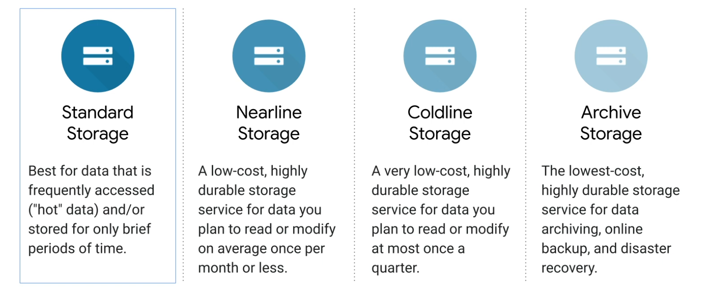
    ```


* **Networking** 

  * Google data centers are interconnected with network speed 1 Petabit/sec
  * Any machine communicate with any other in the data center at over 10 gigabytes for sec


* **Security** : _Base that covers all google applications_

  * Communication to GCP are encrypted in transit
  * Stored data are encrypted
  * BigQuery data are encrypted 

    ```{r, echo = FALSE, out.width="80%"}
    knitr::include_graphics("img/gcp_security_stack.png")
    ```


On top of security , network, storage and computer power google have a top layer **Big Data and ML Products**

```{r, echo = FALSE, out.width="80%"}
    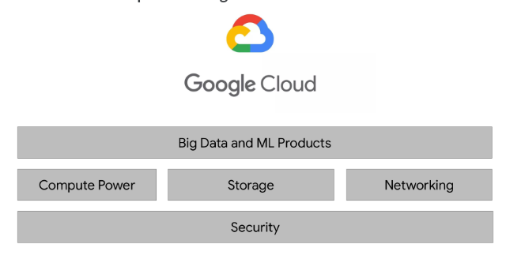
```


**GCP resource hierarchy**


```{r, echo = FALSE, out.width="80%"}
        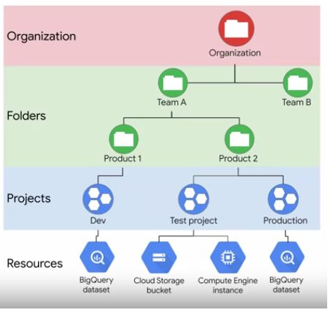
```


**GCP Offers**

  * Most popular : 
  
    * **Compute Engine** : GCP IaaS lets you run VM on-demand on cloud
    * **Kubernetes engine** (_GKE_): Clusters of machines running containers, this tools orchestrate the containers to enable the appls running on containers work properly 
    * **App Engine** : GCP fully managed PaaS , you create the code and google deal with all resources and infra
    * **Cloud Functions** : Serveless execution environment, execute your code in response _events_


Complete list of GCP offers : 

```{r, echo = FALSE, out.width="80%"}
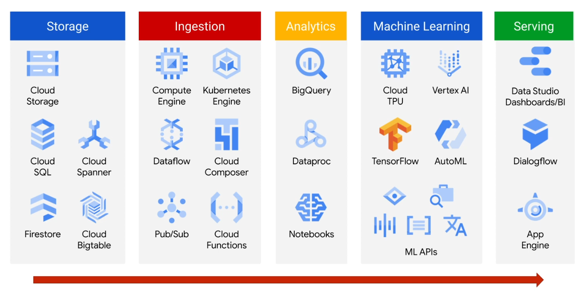
```


**Key roles in a data-driven organization**

```{r, echo = FALSE, out.width="80%"}
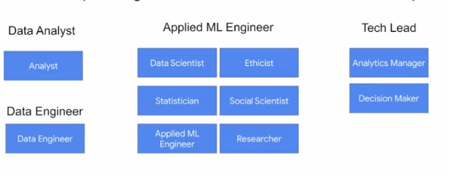
```  
  
  


### Recommending Products using Cloud SQL and Spark


Recommending Products : Model learns what you like, and dont like, what you buy and dont buy, and then starts suggest similar products

Recommendation systems require **data**, a **model** and training/serving **infrastructure**


**How recommendations works on GCP (_sample of housing rentals recommendation_)**

  Step 1 : Ingest the ratings fo all the houses
  Step 2 : Traing a ML model to predict a user rating of every house on database
  Step 3 : Pick the top five rated houses and present to user


* How often and where will you compute the predicted rating ? 
_Week? Day ? (Batch)_

* Where store the ratings ? 
_Cloud SQL is an option_


```{r, echo = FALSE, out.width="80%"}
knitr::include_graphics("img/database_options_on_GCP.png")
```


**Where to store the data in GCP ?**


```{r, echo = FALSE, out.width="80%"}
knitr::include_graphics("img/if_your_data_is.png")
```

* **Cloud SQL** : Google managed RDBMS, supports MySQL and PostgreSQL

  * _Advantages_  
  
    * Familiar 
    * Flexible price
    * Managed backups
    * Connect from anywhere
    * Automatic replication
    * Fast connection from GCE & GAE
    * Google security


* **Cloud Dataproc** Autoscaling provides flexible capability and you can store the data on Cloud Store (_HDFS_), Bigtable (_HBase_) or Big Query
  
  * Can use Preemptible VMs : suitable for fault tolerant
  * Hadoop without cluster management
  * Lift-and-shift existing hadoop workload
  * Connect with Cloud Storage to separate compute and storage
  * Re-size clusters effortlessly. Preemptible VMs for cost saving
  
  

```{r, echo = FALSE, out.width="80%"}
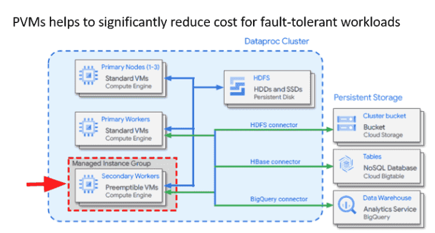
```


### Predict Visitor Purchases Using BigQuery ML

**Intro to BigQuery** _is a petabyte-scale fully-managed data warehouse_ 

  * Serverless
  * Flexible pricing model (_pay as you go_)
  * Data encryption and security
  * Geospatial data types & functions
  * Foundation for BI and AI


---


## Kyndryl Data Science Roudmap

### Data Science- Project Management Methodology - CRISP-DM

#### KDD
  
1. **Select**
  *  Interpret the data
  *  Select data relevant to analysis

2. **Preprocessing**
  * Outliers
  * Missing Values
  
3. **Transform**
  * Useful features
  * Smoothing (- binning  - cluster)
  * Aggregation (- Weekly - month)
  * Normalization

4. **Data Mining**
  * Explore
  * Graph
  * Predict
  * Models


5. **Evaluating**
  * Check
  * Evaluate the results
  * Analysis


#### SEMMA

**S**ample : Subset of data (train, test validation)

**E**xplore: Understand the data

**M**:odify: Clean, feature engineering

**M**odel: data mining, modeling

**A**ssess: Model performance


#### CRISP-DM


1. Business Understand 
2. Data Understand 
3. Data Preparation
4. Modeling
5. Evaluation
6. Deploy


##### 1. Business Understand  _initial plan_

Steps:

1. **Define Business Problem** : Define the objective, the analitical problem, the expectations, success criteria, pain points
2. **Assess and Analyze Scenarios **
3. **Define Data Mining Problem**
4. **Project plan** : Deliverable (timeline, costs, success criteria, assumptions, constraints, etc)


##### 2. Data Understand 

1. **Data Collection** : Primary data source (survery, experiments) or secondary data source (ERP, CRM, database)

2. **Data Preparation / Description**
  
 * Quantitative (count, continuous ) vs Qualitative (categorical)
 * Balance vs Imbalance (one class less than 30% = Imbalance)
 * Structure (tabular) vs Unstructured(video, img, audio, text) vs Semi-structure
 
3. **Exploration - Data Analysis **

 * **Inferencial stats**
    * Sampling - Balacing vs Imbalancing 
      * Balancing : random sampling, sampling
      * Imbalancing: stratified sampling, K-fold, smote, msmote, leve-one-out


 * **Descriptive stats**
    * Meam , media, mode
    * variance, std, range
    * skewness
    * kurtoses
    
  * **Graphical **
    * Univariant
        * Boxplot - Outliers, shape of distribution
        * Histogram - Shape, outliers
        * QQ Plot
    _check train and test dataset if they are in the same distribution_
    
    * Bivariant
       * Scatter : correlation, coeficient (+1, -1) , strong (r > 0.85 ) weak (r < 0.4), cluster, linear
       
      
    


4. **Data Quality Analysis**

 * Idenfity outliers, missing values
 * Levels of granularity
 * Inconsistence
 * Wrong data errors
 * Meta info
 
 
 
##### 3. Data Preparation 


In this step we clean, curate, wrangle and prepare the data

 * **Outliers** : 3R Techniques (Rectify, Remove, Retain)
 
 * **Missing Data**: Imputation (mean, median, mode, regression, knn, etc)
 
 * **Data Transform** : Log, exp, boxcox, etc, done when data are non-normal
 
 * **Data Normalization / Standartization**
 
    * Normalization (mean = 0 , std =1 )
    * Standardization (min = 0 , max = 1) - MinMaxScaller
    
 * Discretization, Binning, **Grouping**
 
 * Dummy variable - **OneHotEncoding**
 
 * **Apply domain knowledge to generate more features**
 
 
##### 4. Modeling


* Select model techniques
* Model building
* Model evaluation and tuning
* Model Assessment

* **Supervised Learning**
  * Predict Y based on X
  * Categorical (2 class or multiclass)
  * numerical - Prediction
  * User preference - Recommendation
  * Relevance - Retrival

<br>

  * **Regression Analysis**
  
    1. y = continuous : Linear Regression
    2. y = discrete (2 categories) : Logistic Regression
    3. y = discrete (> 2 categories) : Multinominal / Ordinal Regression
    4. y = Count : Poisson / Negative Binominal REgression (_var > mean_)
    5. Excessive Zero : 
      
        * ZIP (Zero Inflated Position)
        * ZINB (Zero Inflated Negative Binomial)
        * Hurdle


  * KNN
  
  * Naive Bayes
  
  * **Black Box**
  
    * Neural Network
    * Support Vector Machine
    
  * **Ensemble**
  
    * **Stacking** : Multi Techniques (Linear + DT + KNN) mean or majority
    
    * **Bagging** : Randon Forest - good for discrete
    
    * **Boosting**: Decistion tree, Gradient boosting, XGB, AdaBoost

<br>


* **Unsupervised Learning**


  * **Cluster / Segmentation**  - _reduce Row_
  
    1. **Kmeans** - non hierarchical - elbow curve
    2. **Hierarchical** - agglomerative - deprogram
    3. **DBSCAN** - application with noise
    4. **OPTICS** - ordering points to identify cluster structure
    5. **CLARA** - cluster large application - for large datasets
    6. **K-medians / K-medoids** (for lot of outlines) / **K-modes** (lot of categorical variables)


  **Dimension Reduction**  - _reduce columns_
  
    * PCA
    * SVD


  * **Association Rules / Market Basket Analysis / Affinity Analysis**
  
    * Support
    * Confidence
    * EFT Ration > 1
    
  * **Recommended system**
  
  * **Network Analysis**
  
    * 1. Degree
    * 2. Page rank
    * 3. others


  * **Test Mining / NLP**
  
    * Bow
    * TDW / DTW
    * TF / TDIDF


  * **Forecasting / Time Series**
  
    * Model Based Approaches
    
      1. Trend: Linear, Exponential , Quadratic
      
      2. Seasonality : additive or multiplicative
      
      
   * Data Base Approaches
   
      1. AR - Auto regressive
      2. MA - Movie average
      3. ES - Exponential smoothing
      
        a. SES
        b. HOHS / Double Exponential Smoothing
        c. Winters, others
        
   * Overtiffing (_variance_)  vs Underfitting (_Bias_)


<br>


* Reinforcement Learning (_learning from rewards_)

<br>


* Semi-supervised learning

<br>


* Active learning, transfer learning, structure prediction


##### 5. Evaluation


There are no better type of evaluate need to analyze the problem and data / results to select the best metric

  * Mean Error
  * Mean Absolute deviation
  * Mean Squared Error
  * Root Mean Squared Error
  * Mean Percentage Error
  * Mean Absolute percentage error
  

For Categorical we also have the **Confustion Matrix**


```{r, echo = FALSE, out.width="80%"}

```

  * **TP** : Correct Predictive Positive
  * **TN** : Correct Predictive Negative
  * **FP** : Incorrect Predictive Positive
  * **FN** : Incorrect Predict Negative
  

**Precision** : Prob of correctly identify a random patient with disease have a disease. (_Positive Correct predicted_)

**Sensitive** (_Recall_ or _Hit Rate_):  Proportion of people with disease who are correctly identified as having disease

**Specificity** (_True Negative Rate_) : Proportion of people with NO disease being characterized as not have disease

**FP Rate ** (_Type 1 error_) :  1 - Specificity

**FN Rate ** (_Type 2 error_) : 1 - Sensitivity

**F1** : 1 to 0 Measure that balance precision and recall


<br>

**ROC**


```{r, echo = FALSE, out.width="80%"}
knitr::include_graphics("img/roc.png")
```


**AUC** : Are under the curve

  * 0.9 - 1.0 : outstanding
  * 0.8 - 0.9 : good
  * 0.7 - 0.8 : acceptable
  * 0.6 - 0.7 : poor
  * 0.5 - 0.5 : no discrimination
  

<br>


**Model Assessment**

  * Model performance and success criteria agreed upon early are in sync 
  * Model should be repeatable and reproducible
  * Model is in line with Non-functional requirements, such as scale, robust, maintainable, easy to deploy
  * Model evaluation gives satisfactory results
  * Model is meeting business requirements 
  
  
  
<br>


* Rank final models based on the quality of results and relevance

* Any assumptions or constants that were invalidated by the model ? 

* Cost of deploy the entire pipeline

* Any pain points

* Data Sufficiency report 

* Final suggestions, feedback

**Monitoring** : PEST or SWOT


##### 6. Deploy

> DEV to PROD


* Proper resources - Hardware, server, software , human 
* model saved and then deployed
* Maintenance and monitoring (_PEST_)


### Statistics for Data Analysis Using Python
#### Descriptive Statistics


**Central Tendency**

  * _Mean_ : Average
  * _Mode_ : Most occuring number
  * _Median_ : Moddle value when arranged in asc or desc order


**Dispersion**

  * _Range_ : highest - lowest value
  * _Standard Deviation_ : squared root of variance
  * _Variance_ 
  * _Inter Quartile Range **IQR**_ : If divide the data into four parts (Q1, Q2 and Q3)
    * Quantiles, if we divide the data into _n_ parts, we get (n-1) points of split called quantiles


#### Distributions


**BINOMIAL**

  * The experiment consist of n repeated trials
  * Each trial can result in just two possible outcomes(success and failure)
  * The probability of success, denoted by p, is the same on every trial
  * The trials are independent, that is, the outcome on one trial does not affect the outcome of other trials


_In Python_

```
from scypy.stats import binom

binom.cdf(k , n , p) # cumulative distibution function - for less than or equal to 2
binom.pmf(k , n , p) # Probability mass function - for specific number of, defects
binom.sf(k , n , p)  # for more than 2 (similar 1 - cdf)
binom.mean(n, p)     # for mean of the dist
binom.std(n, p)      # for standard deviation of the dist
binom.var(n, p)      # for the variance of the dist

```

<br>

**POISSON**

* The possibilities of success are infinite (_Number of people in a queue, Number of accident in a city_)  are sample of this distribution

* Measure the number of success similar to binomial

* As binomial are for discrete distribution

* Properties : 
  * The experiment results in a success or failure
  * The **mean** of success occurs in a specific region **is known**
  * Outcomes are random
  * The outcomes of interest are rare relative to the possible outcomes
  * The variance is equal to mean
  
  
  
_In Python_


```

from scypy.stats import binom

poisson.cdf(k , mu) # cumulative distribution function - for less than or equal to 
poisson.pmf(k , mu) # probability mass function - for exact value
poisson.sf(k , mu)  # for more than (similar 1 - cdf)
poisson.mean(mu)    # for mean of the distr
poisson.var(mu)     # for variance of the distr
poisson.std(mu)     # for standard deviation of the distr


```

<br>

**NORMAL**


Most common distribution for continuous data


```{r, echo = FALSE, out.width="80%"}
knitr::include_graphics("img/normal_distr.png")
```


* Properties :
  * Normal distribution is **symmetrically**
  * Long Tails / **Bell shaped**
  * Mean, mode and median are the same
  * **68%** of area under the curve falls with `1` std of the mean
  * **95%** of area under the curve falls with `2` std of the mean
  * **99.7%** of area under the curve fall with `3` std of the mean
  * The total area under the normal curve is equal to `1`
  * The probability of any particular value is `0` 
  * The probability that X is greater than or less than a value = area


```
norm.cdf(x,mu,sigma) # Cumulative distribution function - for less than or equal to 
norm.pdf(x,mu,sigma) # Probability density function (not Probability mass function) - for exact value
norm.sf(x,mu,sigma)  # For more than (similar to 1-cdf)
norm.mean(mu)        # For mean of the distribution
norm.var(mu)         # For variance of the distribution
norm.std(mu)         # For standard deviation of the distribution
```


#### Inferencial and Hypothesis Testing

_Inferencial Stats_ 


 * We infer about the population based on sample data


```{r, echo = FALSE, out.width="80%"}
knitr::include_graphics("img/sampling_popu.png")
```

<br>

_Central Limit Theorem_ 

  * For almost all porpulations, the **sampling distribution of the mean** can be **approximated** closely by a **normal distribution**, provided the sample size sufficiently large
  
  * If a variable has a mens of µ and the variance $σ^{2}$, as the sample size increase, the sample mean approaches a normal distribution with mean µ$\overline{x}$ and variance σ$\frac{2}{x}$


<br>

_Hypothesis Testing_

 * Hypothesis testing is a method of statistical inference
 * Commonly used tests include
   * Comapre sample statistics with the population parameter
   * Compare two datasets
  
  
<br>


_Steps for Hypothesis Testing_

> Taking a sample and based on that sample we are predictin about the population 

1. State the **alternative hypothesis**
2. State the **null hypothesis**
3. Select a probability of **error level** (_alpha_). generally **0.05**
4. Calculate the **test statistics**(e.g t or z score)
    * z = (x-μ)/σ  (_Basic one sample_)
    * z = (x – μ) / (σ / √n) (_multiple samples_)
5. Critical test statistic
    * Use the $\alpha$ and check on Test Table
6. **Interpret** the results


  * **Null Hypothesis** : Basic assumption, for example : _The person is innocent_
  
  * **Alternate Hypothesis** : You need to provide proof of this, for example :  _The person is guilty_

  * In Statistical terms you: 
    * Reject the _Null Hypothesis_, or
    * Fail to reject the _Null Hypothesis_ (not accept the Null Hypothesis)


```{r, echo = FALSE, out.width="80%"}
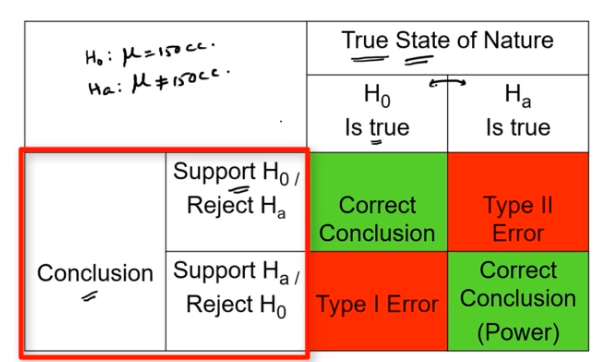
```

 * **Type I Error** : 
   * False Alarm
  
 * **Type II Error** :
   * Something change and we fail to detect the change

```{r, echo = FALSE, out.width="80%"}
knitr::include_graphics("img/type1_type2_error_table.png")
```

 * **Confidence level** : C = 0.90, 0.95, 0.99 (90%, 95%, 99%)
 * **Level of Significance or Type I Error** : $\alpha$ = 1 - C(0.10, 0.05, 0.01)


<br>

 * **Power**
   * Power : 1 - $\beta$ (_or 1 - type II error_)
   * Type II Error : Fail to reject null hypothesis when null hypothesis is false
   * Likelihood of rejecting null hypothesis when null hypothesis is false
   * Or : Power is the ability of a test to correctly reject the null hypothesis

<br>

 * **P-value**
   * _**p-value**_ is the lowest value of alpha for which the null hypothesis can be rejected. (_Probability that the null hypothesis is correct_)
   * For example, **if p = 0.045 you can reject the null hypothesis** at $\alpha$ = 0.05
  
> **p** is low the null must go (_null get rejected_), if **p** is high the null fly (_null stay_)
 


<br>


_Proportions & Variances_


* Conditions for z Test

  * **Random** samples
  * Each observation should be independent of other
    * Sample **with replacement**, or
    * If sample without replacement, the sample size should **not be more than 10% of population**
  * Sampling **distribution approximates Normal** Distribution
    * Population is Normally distributed and the population **standard deviation is known** , or
    * Sample **size >= 30**

<br>

```{r, echo = FALSE, out.width="80%"}
knitr::include_graphics("img/type_of_tests.png")
```


* _**One Sample**_
 
  * **One Sample z Test** : Used when we have one sample from one machine
    * Conditions for **z** test:
      * Random Samples
      * Each observation should be independent of each other (_sample with replacement_) or (_if sample without replacement_ sample size should not be more than 10% or population)
      * Sample distribution approximates Normal Distribution (_Population is Normally distributed and the population std dev is <u>**known**</u> or size **>= 30**_)


  * **One Sample t Test** : When we have _less than 30 numbers of sample_ and we do not _know the population standard deviation_
    * Conditions for **t** test:
      * Random samples
      * Each observation should be independent of each other (_sample with replacement_) or (_if sample without replacement_ sample size should not be more than 10% or population)
      * Sample distribution approximates Normal Distribution (_Population is Normally distributed and the population std dev is <u>**unknown**</u> or size **< 30**_)


  * **One Proportion Test** : Compare proportions 
    * Conditions for **One Proportion** test
      * Random samples
      * Each observation should be independent of each other (_sample with replacement_) or (_if sample without replacement_ sample size should not be more than 10% or population)
      * The data contains only two categories, such as <u>**pass / fail**</u> or <u>**yes / no**</u>
      * For Normal Approximation (both np >= 10 and n(n-p) >= 10 - data should have at least 10 "successes" and at least 10 "failures")


  * **One Variance Test** : Check if variance has changed 
    * Conditions for **One Variance** test
      * Random samples
      * Each observation should be independent of each other (_sample with replacement_) or (_if sample without replacement_ sample size should not be more than 10% or population)
      * The data follows a _Normal Distribution_
      * <u>Variance Tests</u>
        * **Chi-square** Test
          * For testing the population variance against a specified value
          * Testing goodness of fit of some probability distribution
          * Testing for independence of two attributes (_Contingency Tables_)
        * **F-test**
          * for testing equality of **two** variances from different population
          * for testing equality of several means with technique of **ANOVA**


* _**Two Samples**_

  * **Two Sample z Test** : Compare the sample (_mean_) from two machines
    * Conditions for **z** test:
      * Random Samples
      * Each observation should be independent of each other (_sample with replacement_) or (_if sample without replacement_ sample size should not be more than 10% or population)
      * Sample distribution approximates Normal Distribution (_Population is Normally distributed and the population std dev is <u>**known**</u> or size **>= 30**_)
      * _Sample of Z test hypothesis for two sample_:
        * Null Hypothesis : μ1 = μ2
        * Alternative hypothesis : μ1 != μ2
        * [R sample](https://cran.r-project.org/web/packages/distributions3/vignettes/two-sample-z-test.html)
        * [Python sample](https://www.geeksforgeeks.org/z-test/)
        
  * **Two Sample t test** 
    * Conditions for **t** test:
      * Random Samples
      * Each observation should be independent of each other (_sample with replacement_) or (_if sample without replacement_ sample size should not be more than 10% or population)
      * Sample distribution approximates Normal Distribution (_Population is Normally distributed and the population std dev is <u>**unknown**</u> or size **< 30**_)
      * How to calculate ? 
        * Variance equal
          * Since we have a small size of sample we going to use t test independent `stats.ttest_ind()` function
        
        ```
        import scipy.stats as stats
        
        machine1 = [150,152,154,152,151]
        machine2 = [156,155,158,155,154]
        
        stats.ttest_ind(machine1, machine2, equal_var=True)
        
        #Output
        # Statistics = -4.0055
        # pvalue     =  0.0039
        
        ```
        **Result**
        _Since the value of pvalue is less than 0.05 we will reject the Null Hypotheses H0 since there is no significant difference in the variance of two machines_
        
        * Variance unequal
          * Since we have a small size of sample we going to use t test independent `stats.ttest_ind()` function
        
        ```
        import scipy.stats as stats
        
        machine1 = [150,152,154,152,151]
        machine3 = [144,162,177,150,140]
        
        stats.ttest_ind(machine1, machine3, equal_var=False)
        
        #Output
        # Statistics =  0.4146
        # pvalue     =  0.6992
        
        ```
        **Result**
        _Since **pvalue** is high than 0.05 we will fail reject the Null Hypotheses H0 since there is significant difference in the variance of two machines_
        

      

  * **Paired t test**  : Compare when you have before and after results
    * _If the value in one sample affect the value in the other sample, then **the samples are dependent** : (Ex: Blood pressure before and after specific medicine)_
    * How to calculate ? 
      * Find the difference between two set of readings as d1, d2..dn
      * Find the mean and _std dev_ of these differences
      * Using Python we can use the package `scipy.stats` and `ttest_rel` function
      
      ```
      import scipy.stats as stats
      
      before = [120,122,143,100,109]
      after  = [122,120,141,109,109]
      
      stats.ttest_rel(before, after)
      
      # output
      # statistics = -0.068
      # pvalue     =  0.530
      ```
      **Results:**
      _Since **pvalue** is high to 0.05 we fail to reject the H0 (null hypothesis), which means there are no significant difference between the values before and after_

  * **Two Proportions Test** : Compare the _proportions_ from two samples
    * Conditions for **Proportions test** 
      * Random Samples
      * Each observation should be independent of each other (_sample with replacement_) or (_if sample without replacement_ sample size should not be more than 10% or population)
      * The data contains only two categories, such as pass/fail or yes/no 
      * For Normal approximation :
        * both np >= 10 and np(1-p) >= 10 : Data should have at least 10 successes and at least 10 failures for each sample (_some books it is 5_)
    * Methods to calculate
      * Pooled : H0 : p1 = p2 and Ha p1 != p2 
      * Un-pooled : H0 p1 - p2 = d(difference) and Ha p1 - p2 != d(difference)
    * How to calculate ? 
      
      ```
      # H0 = p = p0
      # Ha = p != p0
      # From vendor A we test 200 pieces and find 30 defects
      # From vendor B we test 100 pieces and find 10 defects
      # Is there a significant difference in quality of those 2 vendors? (95% confidence level)

      from  statsmodels.stats.proportion import proportion
      
      proportion.test_proportions_2indep(30,200, 10, 100, method='score')
      
      
      #output
      # Statistics = 1.198
      # pvalue     = 0.230
      
      
      ```
      **Results:**
      _Since the pvalue is higher than 0.05 we fail to reject the null hypotheses , we cannot say there is any significant difference in the proportion of this two samples_
  

  * **Two Variances** : Compare the _variances_ from two samples
    * Conditions and test used for two variance test:
      * **F-test**
        * for testing equality of **two** variances from different population
        * for testing equality of several means with technique of **ANOVA**
    * How to calculate ?
    
    ```
    * 8 samples from machine A : STDEV 1.1
    * 5 samples from machine B : STDEV 11  
    * Is there a difference in variance at (90% confidence level) ?
    
    
    from scipy.stats import f
    
    # find f calculated
    F_cal = 11/ (1.1**2)
    # output 9.09
    
    
    # find critical values on right dfn =  n - 1
    f.isf(0.05, dfn = 4, dfd = 7)
    # output : 4.12
    
    
    # find critical value on left
    f.isf(0.95,4,7)
    # output 0.16
    
    
    
    
    ```
    **Results:**
    _Since the F_calc(9.09) is in the reject zone higher than right value (4.12), we reject the null hypotheses, there is a significant difference between the machines_
    
    We also can use `stats.bartlett(machine1, machine2)` or `stats.levene(machine1 , machine2)`
    
    **Levene test is a robust test** compared with Bartlett
    
* _**More Than 2 Samples**_

> ANOVA is Analysis of Variance
  
  * **ANOVA** : If we have 3 or more machines to compare
  _To analyze the variance we have **chi-square test** for 1 variance test and **F-test** for two variance test_
    * For testing equality of _several means_ with technique of **ANOVA**
    * H0 : μ1 = μ2 = μ3 = μ4 ...  = μn        _(means are equal)_
    * Ha : At least one of the means is different from others  _(means are NOT equal)_
    
    * How to calculate ?
    
    
    ```
    from scipy.stats as stats
    
    
    m1 = [150,151,152,152,151,150]
    m2 = [153,152,148,151,149,152]
    m3 = [156,154,155,156,157,155]
    
    
    stats.f_oneway(m1,m2,m3)

    #output:
    #statistics : 22.264
    #pvalue     : 3.23e-05
    
    ```
    
    **Results:**
     _As the pvalue is very small we conclude that at least one machine is different from others_
     
     We can also use the package `statsmodels.stats` with method `oneway.anova_oneway()`
    
  
  * **ANOVA Concept**
    * _Variation within_ : Variation of the values in the same machine _(inside or ERROR)_
    * _Variation between_: Variation of the values between machines _(treatment)_
    * To check we take the ration of these variations using **F test** to conclude if there are variation of not


<br>

  * **Post Hoc Tests**
    * Post Hoc Tests attempt to control the experimentwise error rate _(usually alpha = 0.05)_ just like one-way ANOVA is used instead of multiple t-test 

    * **Tukey's Test** from `statsmodels.stats.multicomp` method `pairwise_tukeyhsd`
    
    ```
    import statsmodels.stats.oenway as oneway
    from statsmodels.stats.multicomp import pairwise_tukeyhsd
    
    df = mpg[mpg['cylinders'] == 4][['mpg', 'origin']]
    
    result = pairwise_tukeyhsd(endog = df['mpg'] , groups = df['origin'] , alpha = 0.05 )
    
    print(result)
    #output
    # p-adj (pvalue) = 0.7995
    
    # Based on result we going to see the there are no significant different between europe and usa
    
    
    ```

<br>

* **Goodmess of Fit Test**

  * Use _Chi Square_ as test statistics
  * To test if the sample is coming from a population with specific distribution
  * Other goodness-of-fit tests are: 
    * Anderson-Darling
    * Kolmogorov-Smirnov
    
  * H0 : The data follow a specified distribution
  * Ha : The data do not follow the specified distribution
    * Sample
    ```
    A coin is flipped 100 times. Number of heads (40) and tails(60) . Is this coin biased ? (95% confidence level)
    
    H0 : Coin is not biased
    Ha : Coin is biased
    alpha = 0.05
    
    # Using python
    
    
    import scipy.stats as stats
    
    exp = [50,50]
    obs = [40,60]
    
    stats.chisquare(f_obs = obs, f_exp = exp)
    #output
    pvalue = 0.0455
    
    
    ```
    **Result** : _We reject the null hypotheses which means the coin are biased_


<br>

* **Contingency Tables**

  * Help to find relationship between two discrete variables
  * H0 : Is that there is no relationship between the row and column variables
  * Ha : is that there is a relationship (Ha does not tell what type of relationship exists)

  * Using python we can use `scipy.stats`
  
  ```
  import scipy.stats as stats
  
  sh_op = np.array([[22,26,23], [28,62,26], [72,22,66]])
  
  
  stats.chip2_contingency(sh_op)
  
  # output : 
  pvalue = 3.45e-10
  
  ```
  **Results** : Reject the null hypothesis which means there is a relationship between rows and columns
  
  

